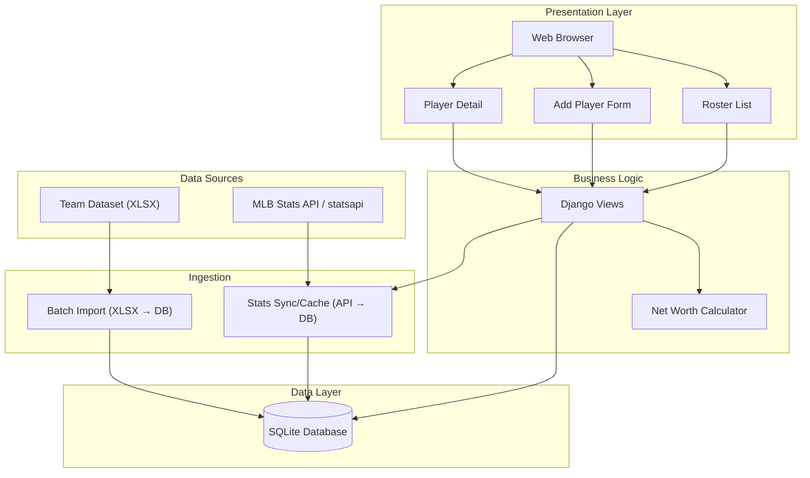
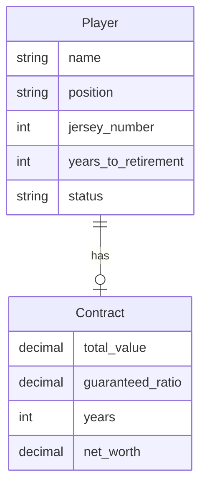
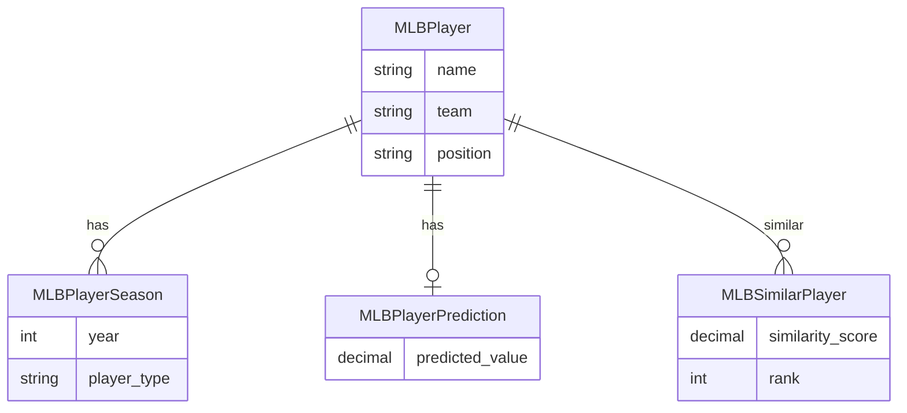
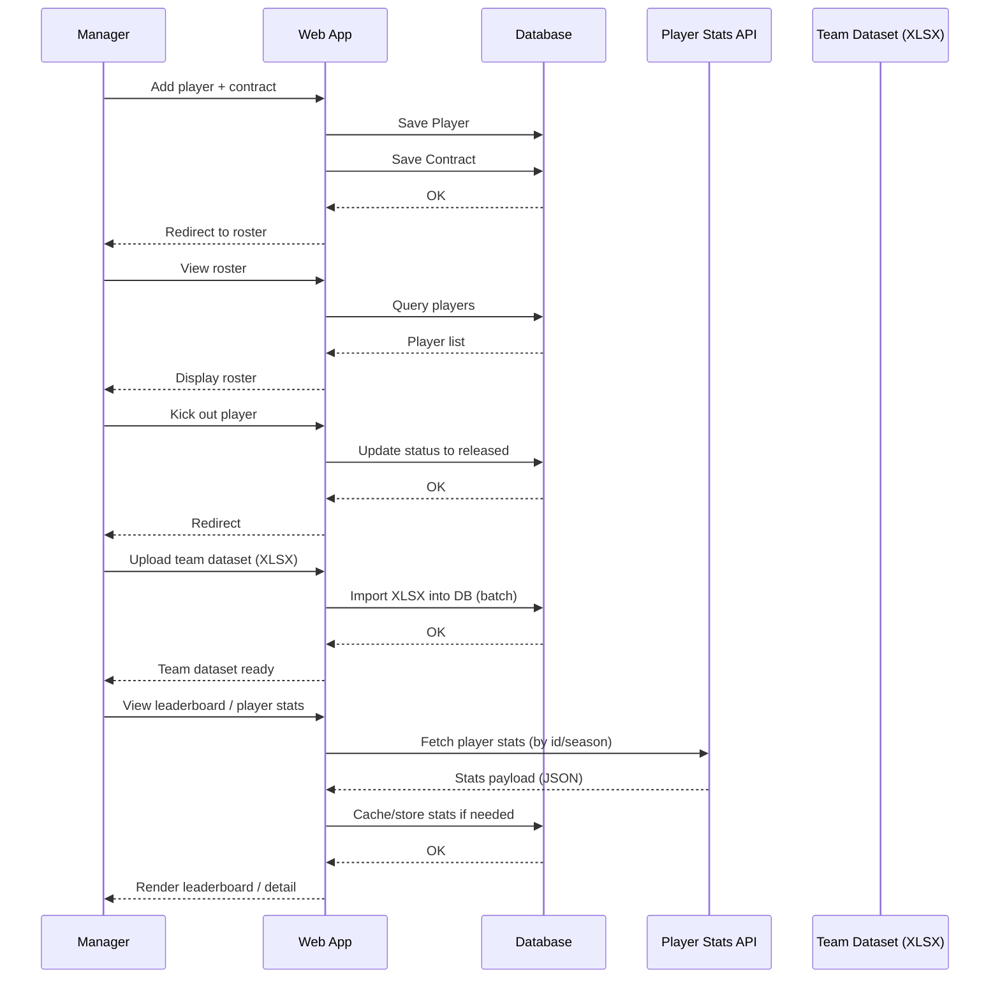
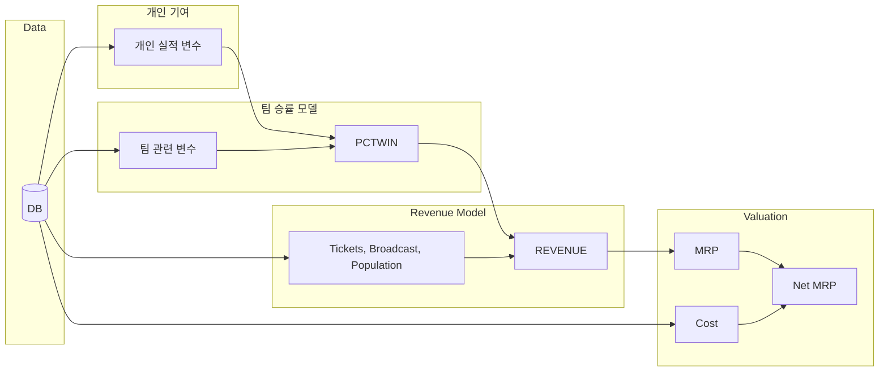
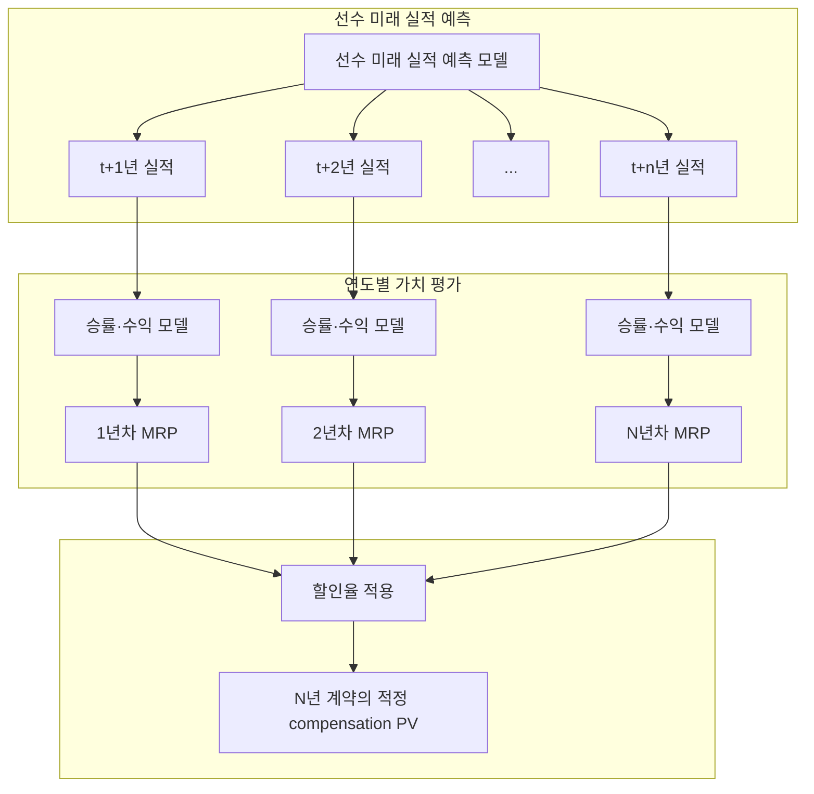
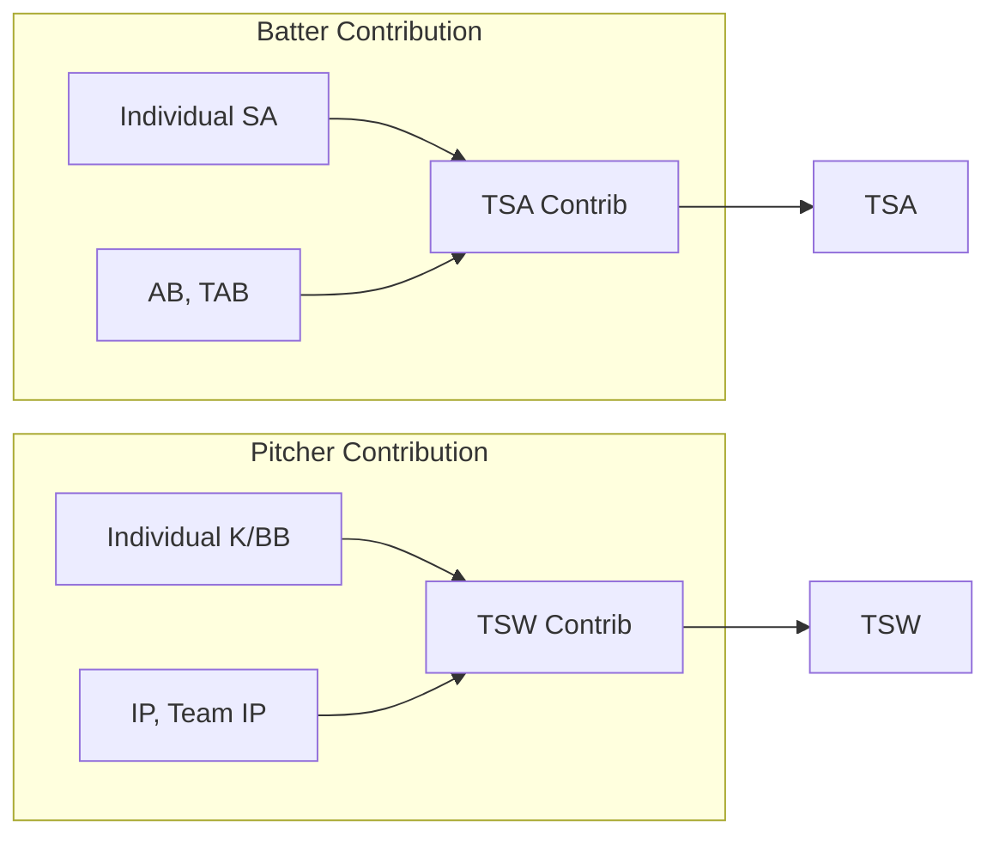
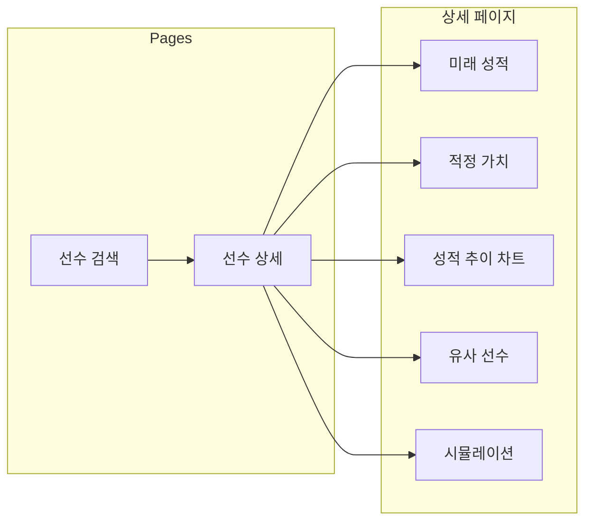

# 야구팀 매니저 — 아키텍처

## 1. 개요

이 Django 애플리케이션은 야구팀 매니저가 선수 명단 결정을 관리할 수 있도록 돕는다: **영입** (추가), **유지** (활성 선수 보유), **방출** (해임). 매니저가 선수별 보장 연봉 비율과 계약 연수를 설정하는 순자산 계산 모듈을 포함한다.

## 2. 서비스 배경

이 서비스의 주제는 선수의 **적정 가치**를 예측하는 것이다. 따라서 모델 학습에 사용하는 데이터의 타깃값인 보상(연봉+계약금+보너스+alpha)은 “적정” 가치여야 한다.

그러나 현실은 그렇지 않다. 시장 계약 가치에 모델을 학습시키면, 모델은 과소 또는 과대 지급된 급여를 학습할 가능성이 커서 **사용자**에게 편향된 정보를 제공할 수 있다.

이 서비스의 **사용자**가 추구하는 것은 구단 경영 수익성 향상이라고 가정하면, 결국 추구하는 것은 **적은 비용으로 최대 수익을 확보하는 것**이다.

따라서 사용자는 다음 결정을 내려야 한다:

- **과소평가된 선수** → 영입
- **과대평가된 선수** → 영입하지 않음
- **과대지급되는 선수**가 현재 팀에 있다면 → **방출**

## 3. 아키텍처 다이어그램

### 3.1. 시스템 레이어



### 3.2. 데이터 모델

#### 3.2.1. Roster 앱 (팀 매니저)



#### 3.2.2. MLB 앱 (선수 분석)



세부 필드 정의(타자/투수 세이버메트릭스, 예측 컬럼)는 `6.4 MLB 데이터 모델`에서 단일 기준으로 관리한다.

### 3.3. 요청 흐름



## 4. 데이터 흐름

1. **영입** — 매니저가 선수 추가 폼을 통해 새 선수를 등록한다. 선수 정보(이름, 포지션, 등번호)와 계약 조건(총액, 보장 비율, 연수)이 제출된다. 선수는 `active` 상태로 생성되고 연결된 `Contract` 레코드가 생성된다.

2. **유지** — 매니저가 선수 명단과 상세 정보를 조회한다. 상태(대기/활성/방출)별 필터링으로 팀 소속 선수를 확인한다. 선수를 유지하는 데 별도 동작은 필요하지 않다.

3. **방출** — 매니저가 활성 선수의 "방출" 버튼을 클릭한다. POST 요청으로 선수 상태가 `released`로 변경된다. 선수는 이력 관리를 위해 데이터베이스에 남는다.

4. **순자산** — `Contract` 모델은 `total_value`, `guaranteed_ratio`, `years`를 저장한다. `roster/services.py`의 `calculate_net_worth()` 함수가 `net_worth = total_value * guaranteed_ratio * years`로 계산한다. 이 값은 목록 및 상세 화면에 표시되며, 계약(비율, 연수) 수정을 통해 갱신할 수 있다.

5. **팀 데이터셋(XLSX)** — 팀 수준 데이터셋은 XLSX 파일로 관리한다. 사용자는 XLSX를 업로드하고, 시스템은 이를 파싱하여 데이터베이스에 적재한다(배치 임포트). 이 데이터는 팀 승률/수익 모델의 입력(또는 파생 변수 생성)의 기준이 된다.

6. **선수 스탯(API)** — 선수 시즌별 스탯은 외부 API에서 조회해 가져온다. 현재 기준 기본 후보는 **MLB Stats API**이며, Python 연동 시에는 `MLB-StatsAPI` 패키지(`statsapi`)를 우선 검토한다. 웹 요청 시 API를 호출해 최신 스탯을 수신하고, 조회 비용/속도를 위해 결과를 DB에 캐시(또는 스냅샷 저장)할 수 있다. 초기 구현은 `lookup_player`, `player_stat_data`, `schedule` 같은 고수준 함수 중심으로 시작하고, 필요한 경우 `get`으로 raw JSON 엔드포인트를 직접 호출한다.

### 참고: 외부 영상 메모

- YouTube: `https://www.youtube.com/watch?v=tR-WFirYXh4`
- 확인한 주제: MLB 구단이 FA(자유계약선수)를 평가할 때 과거 성적만 보는 것이 아니라, 미래 퍼포먼스와 예상 가치를 어떻게 투영하는지 설명하는 내용
- 우리 프로젝트와의 연결점: 선수의 시장 계약 금액을 그대로 따르기보다, 구단 관점에서 미래 성과 기반의 적정 가치를 추정해야 한다는 문제의식과 맞닿아 있음
- 비고: 영상 페이지 전문을 직접 확보한 것은 아니고, 공개 소개 문구를 바탕으로 핵심 주제를 요약한 메모임
- 비고: 팀원 **변준영** 조사 참고 자료

## 5. 선수 가치 평가 모델 (Player Valuation Model)

선수 가치 평가는 Scully(1974) 기반의 2단계 모델을 사용한다. 1단계에서 팀 성적 통계로 승률을 예측하고, 2단계에서 승률과 시장 요인으로 구단 수익을 예측한다. MRP(한계 수익 생산물, Marginal Revenue Product)는 선수가 팀 수익에 기여하는 한계적 가치를 나타낸다.

### 5.1. 가치 평가 파이프라인



위 파이프라인은 **1년 단위**로 선수의 `MRP`와, 비용 가정이 포함될 경우 `Net MRP`를 구하는 과정이다. 한편 실제 의사결정이 **N년 계약**이라면, 해당 선수가 계약 기간 **1, 2, …, N년 차**에 창출할 것으로 예상되는 `MRP`를 **현재가치로 할인**해, 구단이 그 선수에게 지급할 수 있는 **적정 compensation의 현재가치(PV)** 를 추정할 수 있다. 이때 **DCF(Discounted Cash Flow)** 모델을 사용한다. 6.4.2·6.7에서 언급한 **선수 미래 실적 예측 모델**로 t+1, t+2, … t+N년 실적을 예측하고, 각 연도별로 동일한 가치 평가 파이프라인(승률→수익→MRP)을 적용한 뒤, 할인율을 적용해 현재가치로 합산한다.



- **선수 미래 실적 예측 모델**: 6.7의 유사 선수 기반 예측 또는 시계열(LSTM) 모델로 t+1, t+2, … t+n 시즌의 성적 지표를 예측한다.
- **연도별 MRP**: 각 연도 예측 실적을 5.1과 동일한 승률·수익 파이프라인에 넣어 해당 연도 시점의 MRP를 구한다.
- **DCF**: 각 연도 MRP를 할인율로 현재가치로 환산한 뒤 합산하여, N년 계약 기준으로 구단이 선수에게 지급할 수 있는 적정 compensation의 현재가치(PV)를 구한다. 이 해석은 Solow & Krautmann (2020)의 `ex ante player value` 접근과도 맞닿아 있다.
- **계약 비교**: 실제 계약안이 있으면 해당 계약의 연도별 compensation도 현재가치로 할인하여, `적정 compensation PV - 실제 compensation PV`를 계약 surplus로 해석할 수 있다.

$$
\text{PV}_{\text{comp}} = \frac{\text{MRP}_1}{(1+r)} + \frac{\text{MRP}_2}{(1+r)^2} + \cdots + \frac{\text{MRP}_N}{(1+r)^N}
$$

(r: 할인율, N: 계약 연수, MRP_t: t=1,2,…,N인 해당 연도(1년차~N년차)의 MRP)

### 5.2. 팀 승률 모델 (Team Winning Function)

Scully(1974)는 팀의 타격력과 투수력이 승률에 미치는 영향을 측정하기 위해 다음 변수들을 사용했다. 이 연구의 식(1)은 Scully의 모델과 동일한 구성을 갖는다.

- **종속 변수**: PCTWIN (팀 승률)
- **독립 변수**:
  - TSA: 팀 슬러깅 평균 (Team Slugging Average)
  - TSW: 팀 삼진 대 볼넷 비율 (Strikeout to Walk ratio)
  - CONT: 시즌 막판 우승권 경쟁 여부를 나타내는 더미 변수
  - OUT20: 우승권에서 20경기 이상 뒤처진 팀을 나타내는 더미 변수
  - EXP: 신생 확장 구단 여부를 나타내는 더미 변수

구조 다이어그램은 `5.1 가치 평가 파이프라인`의 `Win Rate Model` 블록을 기준으로 본다.

### 5.3. 개인 기여도 추출 (개인 기여)

Scully 모델의 핵심은 `"팀의 전체 성적은 개별 선수 성적의 단순한 선형 합계"`라고 가정하는 것이다.

팀 지표의 회귀 계수를 바탕으로, 개별 선수가 팀 승률 상승에 기여한 '개인 성적'을 다음과 같이 계산한다.

#### 5.3.1. 타자 (Batter): 개인 SA → TSA 기여도

타자의 경우, 개인의 **장타율(SA)**이 팀 전체의 타수에서 차지하는 비중만큼 TSA에 기여한다고 계산한다.

- **공식**: `개인 기여분 = 개인 SA × (개인 타수(AB) / 팀 전체 타수(TAB))`
- **설명**: 모든 선수의 '개인 기여분'을 합하면 **TSA**가 된다. 이 값에 승률 계수와 수익 가치를 곱해 MRP를 산출한다.
- **예시 (이대호 2017년)**: 개인 SA(533점) × (개인 타수 540 / 팀 전체 타수 4944) = TSA에 대한 순수 기여도

#### 5.3.2. 투수 (Pitcher): 개인 K/BB → TSW 기여도

투수의 경우, 개인의 **삼진/볼넷 비율(K/BB)**이 팀 전체 투구 이닝에서 차지하는 비중만큼 TSW에 기여한다고 계산한다.

- **공식**: `개인 기여분 = 개인 K/BB × (개인 투구 이닝 / 팀 전체 투구 이닝)`
- **설명**: 모든 투수의 '개인 기여분'을 합하면 **TSW**가 된다.
- **예시 (양현종 2017년)**: 개인 TSW(351점) × (개인 이닝 193.10 / 팀 전체 이닝 1319) = 팀 투수 지표 기여도

예를 들어, 이대호 선수의 가치를 구할 때 그의 실제 기록(루타수 등)이 TSA에서 차지하는 비중을 계산하여 승률 모델의 계수(0.34)와 결합한다.



### 5.4. 팀 수익 모델 (Team Revenue Function)

팀의 승률이 실제 구단 수입에 미치는 영향을 분석하는 모델이다. Scully는 현대의 리그 단위 수익 연구보다 더 광범위한 재무 항목을 포함했다.

- **종속 변수**: REVENUE (구단 총 수익)
- **독립 변수**:
  - PCTWIN: 팀 승률 (승률 모델 예측값)
  - Tickets sold: 판매된 입장권 수 (실제 관중 수)
  - Broadcasting rights: 방송 중계권 수익
  - Population: 연고지 시장 규모 (인구)
- **REVENUE 데이터 출처(현 시점 계획)**:
  - `1995~2001`: SABR `BRPanelupd.htm`의 `Table 28`
  - `2016~2025`: Forbes `MLB Valuations` 리스트
  - `2002~2015`: 현재 문서 기준 별도 소스 보강이 필요하며, 연속 패널 구축 시 추가 공개 자료 또는 보간 정책을 정의한다.

구조 다이어그램은 `5.1 가치 평가 파이프라인`의 `Revenue Model` 블록을 기준으로 본다.

### 5.5. MRP (Marginal Revenue Product, 한계 수익 생산물)

MRP는 선수가 팀 수익에 기여하는 한계 수익이다. 선수 추가/제거 시 예상 수익 변화량으로 계산되며, 문서 내 "적정 가치(predicted_value)"는 기본적으로 이 MRP 기반 값을 의미한다. **Net MRP**는 MRP에서 비용(cost, 예: 연봉·계약 보상)을 차감한 순가치이다.

**흐름**: 개인 성적(SA, K/BB) → 개인 기여분(TSA/TSW) → 승률 계수 결합 → 수익 가치 → MRP → (MRP − cost) → Net MRP

#### 5.5.1. 실무 보완 관점: Win Curve와 시장 가격

FanGraphs의 `Win Curves and Player Pricing` 글은, 선수 가격 책정을 평가할 때 **선수가 추가하는 승수의 팀별 한계가치**와 **시장 전체의 승수 가격($/WAR 등)** 을 함께 봐야 한다는 점을 강조한다. 이는 우리 프로젝트에서 MRP를 단순히 "선수 실력의 절대 가치"로만 보지 않고, 팀 상황과 계약 의사결정 맥락까지 포함해 해석해야 함을 보완해 준다.

Solow & Krautmann (2020)은 이 문제를 더 직접적으로 다룬다. 이 연구는 **계약 체결 시점(ex ante)** 기준으로 선수의 미래 생산성을 예측하고, 이를 **팀별 한계 승리 가치(team-specific value of a marginal win)** 와 결합해 **기대 한계수익의 현재가치**로 변환한 뒤, **보장 연봉의 현재가치**와 비교한다. 이는 본 프로젝트에서 `N년 계약의 적정 compensation PV`를 정의하는 방식과 매우 가깝다.

- **Win Curve 관점**: 추가 1승의 가치는 선형적이지 않으며, 특히 플레이오프 경쟁권(예: 중상위 승수 구간)에 있는 팀에서 더 커질 수 있다.
- **시장 가격 관점**: 어떤 선수가 특정 팀에 매우 큰 가치를 주더라도, 실제 계약 판단은 FA 시장의 대체 옵션과 평균적인 승수 가격을 함께 고려해야 한다.
- **프로젝트 반영 방향**: 기본 모델은 Scully 기반 MRP/Net MRP를 유지하되, 향후 팀 상태(현재 예상 승수, 포스트시즌 경쟁 구간 여부)와 시장 가격 지표를 추가해 `상황 보정 가치` 또는 `의사결정 보조 지표`로 확장할 수 있다.
- **현대적 계약 가치 해석**: 다년 계약 평가는 사후 성과가 아니라 `계약 시점에 기대 가능한 가치`를 기준으로 해야 하며, `할인된 미래 MRP(또는 기대 한계수익)`와 `할인된 미래 compensation`의 비교로 surplus를 해석하는 것이 적절하다.
- **비고**: 이 참고 자료는 팀원 **이시윤** 제안으로 검토한 실무형 보조 자료다.

### 5.6. 데이터셋 구조

선수 가치 평가 모델 학습 및 MRP 산출을 위해 필요한 데이터셋 구조는 다음과 같다.

#### 5.6.1. 팀 수준 데이터 (Team-level)

| 변수 | 설명 | 용도 |
|------|------|------|
| team_id | 구단 ID | 식별 |
| year | 시즌 연도 | 시계열 |
| PCTWIN | 팀 승률 | 승률 모델 종속변수 |
| TSA | 팀 슬러깅 평균 | 승률 모델 독립변수 |
| TSW | 팀 삼진/볼넷 비율 | 승률 모델 독립변수 |
| TAB | 팀 전체 타수 | 타자 기여도 계산 |
| team_IP | 팀 전체 투구 이닝 | 투수 기여도 계산 |
| CONT | 우승권 경쟁 여부 (0/1) | 승률 모델 더미 |
| OUT20 | 20경기 이상 뒤처짐 (0/1) | 승률 모델 더미 |
| EXP | 신생 구단 여부 (0/1) | 승률 모델 더미 |
| REVENUE | 구단 총 수익 | 수익 모델 종속변수 |
| tickets_sold | 판매된 입장권 수 | 수익 모델 독립변수 |
| broadcasting_rights | 방송 중계권 수익 | 수익 모델 독립변수 |
| population | 연고지 인구 | 수익 모델 독립변수 |

`REVENUE`는 현재 기준으로 `SABR Table 28 (1995~2001)`과 `Forbes MLB Valuations (2016~2025)`를 결합해 구축하는 것을 기본안으로 둔다. 두 출처의 정의 차이는 ETL 단계에서 컬럼 정의 검증, 단위 통일, 필요 시 인플레이션 조정을 거쳐 정규화한다.

#### 5.6.2. 선수 수준 데이터 (Player-level)

**타자**

| 변수 | 설명 | 용도 |
|------|------|------|
| player_id | 선수 ID | 식별 |
| team_id | 소속 구단 | 팀 데이터와 연결 |
| year | 시즌 연도 | 시계열 |
| position | 포지션 | 타자/투수 구분 |
| AB | 개인 타수 | TSA 기여분 계산 |
| SA | 개인 장타율 | TSA 기여분 계산 |
| TB | 루타 수 (SA = TB/AB) | SA 계산용 |

**투수**

| 변수 | 설명 | 용도 |
|------|------|------|
| player_id | 선수 ID | 식별 |
| team_id | 소속 구단 | 팀 데이터와 연결 |
| year | 시즌 연도 | 시계열 |
| position | 포지션 | 타자/투수 구분 |
| IP | 개인 투구 이닝 | TSW 기여분 계산 |
| K | 삼진 수 | K/BB 계산 |
| BB | 볼넷 수 | K/BB 계산 |
| K_BB | 삼진/볼넷 비율 | TSW 기여분 계산 |

#### 5.6.3. 계약/보상 데이터 (Contract-level)

| 변수 | 설명 | 용도 |
|------|------|------|
| player_id | 선수 ID | 식별 |
| year | 시즌 연도 | 시계열 |
| compensation | 보상(연봉+계약금+보너스+alpha) | MRP와 비교하여 과소/과대 지급 판단 |
| total_value | 계약 총액 | (선택) |
| guaranteed_ratio | 보장 비율 | (선택) |
| years | 계약 연수 | (선택) |

#### 5.6.4. 데이터 관계

```
Team (team_id, year) ─┬─ 1:N ─ Player (player_id, team_id, year)
                      │
                      └─ 1:1 ─ Contract (player_id, year)
```

#### 5.6.5. 파생 변수

모델 학습 시 다음 파생 변수를 생성한다.

- **타자 TSA 기여분**: `SA × (AB / TAB)`
- **투수 TSW 기여분**: `K/BB × (IP / team_IP)`
- **TSA**: 모든 타자 기여분의 합
- **TSW**: 모든 투수 기여분의 합

#### 5.6.6. 데이터 출처 (MLB 기준)

- **선수 기록**: MLB 공식 기록, Baseball Savant, Baseball-Reference, MLB Stats API 등
- **팀 기록**: MLB 팀별 시즌 스탯, 구단 공시
- **수익·시장 데이터**: Forbes `MLB Valuations` 리스트(2016~2025), SABR `BRPanelupd.htm` Table 28(1995~2001), 티켓/관중 자료, 연고지 인구/시장 데이터

### 5.7. 구현 로드맵

- **Phase 1**: 데이터 적재 파이프라인 구축 및 DB 주입 (원천/경로는 6.2, 학습용 표준 데이터셋은 6.7.1 참조)
- **Phase 2**: 승률 예측 모델 학습 및 배포
- **Phase 3**: 수익 예측 모델 학습 및 배포
- **Phase 4**: MRP 계산 로직 및 Django 연동

> **참고**: 각 모델(승률 모델, 수익 모델, MRP)에는 향후 추가 기능을 도입할 수 있다.

### 5.8. 이론적 근거

- 선수 가치 평가는 `Scully (1974)`의 2단계 가치평가 구조를 기반으로 한다.
- 상세 서지 정보와 예측 모델 관련 참고 논문은 `6.7.7. 참고문헌`에 통합 정리한다.

## 6. MLB 플랫폼 확장

데이터 기반 MLB 선수 성적 분석 및 시장 가치 예측 플랫폼으로 프로젝트를 확장한다. MLB 통계 데이터를 활용하여 선수의 미래 성적과 적정 가치를 예측하고, 사용자가 활용할 수 있는 웹 서비스를 구축한다.

### 6.1. 고객 요구사항

| 요구사항 | 설명 |
|----------|------|
| 선수 검색 | 특정 MLB 선수 검색 시 미래 성적 + 적정 가치 표시 |
| E2E 파이프라인 | 데이터 수집 → 모델 추론 자동화 |
| 심화 통계 | 단순 성적 나열이 아닌 고급 지표 계산 및 활용 |
| 실시간 시뮬레이션 | 사용자가 스탯 임의 조정 시 예측 가치 실시간 계산 |
| 시각화 | 성적 변화 추이, 유사 선수 비교, 예측 가치 |

### 6.2. 데이터 파이프라인

- **데이터 소스**: `/data` 디렉터리에 업로드되는 파일 (CSV/JSON/XLSX 등) + Lahman Database 파생 파일 + MLB Stats API 응답(JSON)
- **수집 방식**: (1) 파일 기반 배치 임포트, (2) 선수 스탯은 `statsapi` 기반 API 호출로 온디맨드 조회(필요 시 캐시)
- **구현**: `scripts/import_data.py` — Python 스크립트로 `/data` → DB 적재 (팀 데이터셋 XLSX 포함)
- **모델 학습 연계**: 적재 구조와 학습 단계 연결은 5.7, 학습용 기준 데이터셋은 6.7.1을 따른다.

#### 6.2.1. API 연동 참고 자료

향후 선수/팀/일정/리더보드 데이터를 API로 불러올 때는 아래 자료를 기준으로 구현한다.

- **주 구현 기준**: [`toddrob99/MLB-StatsAPI Wiki`](https://github.com/toddrob99/MLB-StatsAPI/wiki) — `statsapi` 사용법, 함수 목록, 파라미터 정의 확인용
- **패키지 저장소**: [`toddrob99/MLB-StatsAPI`](https://github.com/toddrob99/MLB-StatsAPI) — 래퍼 구조와 이슈 확인용
- **한글 빠른 참고**: [`[MLB Stats API] 파이썬 패키지로 MLB Stats API 사용해보기`](https://minding-deep-learning.tistory.com/64) — 설치, 기본 예제, 자주 쓰는 함수 개요 확인용
- **영상 참고(라이브 스탯 확장)**: [`YouTube 영상`](https://www.youtube.com/watch?v=dy_8wKNhAgo) — 실시간 MLB stats 조회 흐름을 확인하는 보조 자료. 향후 경기 중 스코어보드, play-by-play, live boxscore 같은 실시간 기능 확장 시 참고 후보로 둔다.

초기 화면/API 연결 시 우선 검토할 함수는 다음과 같다.

- `statsapi.lookup_player`: 선수 검색 자동완성/이름 검색
- `statsapi.player_stat_data`: 선수 상세 페이지용 시즌/통산 스탯 조회
- `statsapi.schedule`: 날짜/팀 기준 경기 일정 조회
- `statsapi.league_leader_data`: 리더보드/랭킹 데이터 조회
- `statsapi.get`: 고수준 함수로 부족한 엔드포인트를 raw JSON으로 직접 조회

라이브 기능이 필요해지면 아래 범주의 엔드포인트도 추가 검토한다.

- 실시간 경기 상태(scoreboard)
- 경기 상세 feed / play-by-play
- 실시간 boxscore / linescore

### 6.3. UI 구조



### 6.4. MLB 데이터 모델

`3.2.2`의 개념 모델을 실제 서비스 컬럼 수준으로 확장한 정의다.

#### 6.4.1. MLBPlayerSeason (시즌별 성적)

선수 시즌별 기본 성적과 세이버메트릭스 지표를 저장한다.

**타자 기본 지표**

| 필드 | 설명 |
|------|------|
| ab, hits, hr, rbi | 타수, 안타, 홈런, 타점 |
| avg, obp, slg, ops | 타율, 출루율, 장타율, OPS |

**타자 세이버메트릭스**

| 필드 | 설명 |
|------|------|
| war | Wins Above Replacement |
| woba | Weighted On-Base Average |
| wrc_plus | wRC+ (100 = 리그 평균) |
| babip | Batting Average on Balls in Play |
| ops_plus | OPS+ (100 = 리그 평균) |

**투수 기본 지표**

| 필드 | 설명 |
|------|------|
| ip, era, so, bb, whip | 이닝, 평균자책점, 탈삼진, 볼넷, WHIP |

**투수 세이버메트릭스**

| 필드 | 설명 |
|------|------|
| war | Wins Above Replacement |
| fip | Fielding Independent Pitching |
| xfip | Expected FIP |
| k_per_9 | 9이닝당 탈삼진 |
| bb_per_9 | 9이닝당 볼넷 |

#### 6.4.2. 선수 상세 페이지 표시 항목 및 장기 실적 예측 모델

`6.3 UI 구조`의 상세 페이지 컴포넌트(Future/Value/Chart/Similar/Sim)에 바인딩되는 핵심 항목은 다음과 같다.

- **시즌별 성적 테이블**: 기본 지표 + 세이버메트릭스 (타자: WAR, wOBA, wRC+, BABIP, OPS+ / 투수: WAR, FIP, xFIP, K/9, BB/9)
- **성적 추이 차트**: 타자(AVG, OPS, HR, WAR, wRC+) / 투수(ERA, FIP, WAR)
- **미래 성적 예측 카드**: AVG, HR, OPS, WAR, wOBA, wRC+ (타자) / ERA, FIP (투수)

선수 상세 페이지에서는 해당 선수의 **N년치 장기 실적 지표 전망**을 보여줄 필요가 있다. 이를 위해 **장기 실적 예측 모델**을 둔다. 이 모델은 최근 스포츠 시계열 예측 연구의 방향을 반영해, 단일 지표 회귀보다 **멀티변수 시즌 시계열 기반 예측**을 기본 원칙으로 잡는다.

- **역할**: 선수별로 t+1, t+2, … t+N 시즌에 대한 주요 성적 지표(타자: AVG, OPS, HR, WAR, wOBA, wRC+ 등 / 투수: ERA, FIP, WAR 등) 및 필요 시 MRP·Net MRP 전망을 산출한다.
- **입력**: 과거 시즌별 성적(MLBPlayerSeason), 선수 속성(포지션, 나이, 경력 연차, handedness 등), 팀·리그 보정 요인. 학습/추론 시 팀 수준 데이터·계약 데이터를 보조 입력으로 사용할 수 있다.
- **출력**: N년치 연도별 포인트 예측(및 향후 분포 예측 P10/P50/P90 등). 이 출력은 상세 페이지의 “미래 성적 예측”·“장기 전망” 영역에 바인딩된다.
- **기본 설계 원칙**:
  - 시즌별 입력을 `2~4년 길이의 sliding window`로 구성해 다음 시즌(t+1) 또는 다년(t+1~t+N) 지표를 예측한다.
  - 타자/투수를 분리 학습하고, 각 포지션군에서 **다중 입력 변수(multivariate features)**를 함께 사용한다.
  - 포인트 예측뿐 아니라, 어떤 입력 변수가 예측에 영향을 주었는지 설명 가능한 구조를 유지한다.
- **구현 위치**: 6.7의 유사 선수 기반 예측·시계열(TFT/LSTM 등) 모델과 연계하거나, 이들의 결과를 다년으로 확장한 파이프라인으로 구성한다. 예측 결과는 DB에 저장하거나 API/캐시를 통해 상세 페이지에 제공한다.

### 6.5. 앱 구조

- **roster**: 기존 팀 매니저 (선수 명단, 영입/방출)
- **mlb**: MLB 선수 분석 (검색, 상세, 시뮬레이션, 시각화, 세이버메트릭스)

### 6.6. 참고 서비스(레이아웃) 및 장기 예측 아이디어

향후 MLB **팀 매니징(로스터 구성/계약/연봉 의사결정)** 경험을 고도화하기 위해, 다음 서비스들의 레이아웃과 지표/예측 구성 방식을 참고한다.

- **Baseball Prospectus**
  - 참고: [`https://www.baseballprospectus.com/`](https://www.baseballprospectus.com/)
  - 특징: 장기 실적 예측(예: **PECOTA**, 5년 이상 기간의 성과 분포/리스크를 포함하는 예측)과 깊이 있는 고급 지표 중심의 정보 설계
- **STATIZ**
  - 참고: [`https://www.statiz.co.kr/`](https://www.statiz.co.kr/)
  - 특징: 선수/팀 정보 탐색 동선, 랭킹/리더보드, 지표 중심 테이블 레이아웃

#### 6.6.1. 장기(다년) 예측의 의미

본 프로젝트의 “적정 가치(MRP)”는 단일 시즌(또는 t+1)만이 아니라 **다년(t+1, t+2, …)** 관점에서 의사결정에 활용될 수 있다.

- **스카우팅/영입**: 단기 폭발력 vs 장기 안정성을 비교
- **계약(연봉) 전략**: 다년 MRP 시나리오에 따라 적정 계약 총액/기간 추정
- **리스크 관리**: 분산(불확실성)까지 반영해 “기대값”뿐 아니라 “바닥/천장”을 함께 고려

#### 6.6.2. (향후) PECOTA 유사 접근을 위한 구현 방향

PECOTA 같은 다년 예측을 직접 재현하는 것은 범위가 크므로, 다음과 같은 단계적 접근을 고려한다.

- **Step A — 포인트 예측 확장**: t+1만이 아니라 t+2~t+5까지의 주요 지표를 예측(선수 노화/회귀 포함)
- **Step B — 분포 예측**: 한 값이 아니라 구간/분포(예: P10/P50/P90)로 성과와 MRP를 산출
- **Step C — 팀 매니징 통합**: 다년 MRP 분포와 계약(연봉/옵션)을 결합해 기대 surplus 및 리스크를 표시

### 6.7. 선수 미래 실적 예측 모델

선수별 미래 성적(예: AVG, OPS, WAR, ERA, FIP 등)을 산출하기 위해 **세 가지 예측 모델 계열**을 테스트하고, 그 결과를 서비스에 반영할 계획이다. 학습·평가 데이터는 **Lahman Database**를 사용하되, 최근 연구 사례처럼 시즌별 다변량 시계열 구성을 우선 검토한다.

#### 6.7.1. 학습 데이터 — Lahman Database

- **출처**: [Lahman Baseball Database](http://www.seanlahman.com/baseball-archive/statistics/) (역사적 MLB 선수·팀·시즌 기록)
- **용도**: 두 예측 모델 모두 Lahman 데이터를 전처리하여 학습·검증·테스트에 사용
- **연동**: 적재 경로는 6.2의 공통 배치 파이프라인을 사용하고, 학습 파이프라인에서 참조
- **학습 샘플 구성 원칙**:
  - 선수별 시즌 데이터를 시간순으로 정렬하고, `최근 2~4시즌 -> 다음 시즌` 형태의 샘플을 생성한다.
  - 타자와 투수는 지표 체계가 다르므로 별도 데이터셋과 모델로 관리한다.
  - 일정 경기 수/타석/이닝 미만 샘플은 제외하거나 가중치를 낮춰 표본 왜곡을 줄인다.
  - 데이터 누수 방지를 위해 train/validation/test는 연도 기준으로 분리한다.

#### 6.7.2. 모델 1 — 유사 선수 기반 예측 (PECOTA 유사)

- **방식**: 관심 선수와 **과거 선수들 중에서 가장 유사한 선수(들)**를 찾고, 그 유사 선수들의 **이후 시즌 실적 지표**를 참고하여 관심 선수의 미래 실적을 예측
- **특징**: PECOTA와 유사한 “비교 가능한 선수(comparables)” 기반 접근. 유사도는 성적·포지션·나이 등으로 정의
- **출력**: 선수별 t+1, t+2, … 에 대한 실적 지표(및 필요 시 분포)

#### 6.7.3. 모델 2 — 시계열 딥러닝 (TFT 우선, LSTM 계열 비교)

- **방식**: 선수별 **시즌 시계열**(과거 연도별 지표)을 입력으로 하여, **Temporal Fusion Transformer(TFT)** 를 1차 후보로 사용하고 LSTM/GRU/BiLSTM 계열을 비교 베이스라인으로 둔다.
- **연구 맥락**: Sun et al. (2022)은 MLB 타자의 홈런 수 예측에 대해 `과거 5시즌 -> 다음 시즌` 형태의 `sliding window + LSTM` 구성을 적용해 선형회귀 및 기존 예측 시스템 대비 경쟁력 있는 성능을 보고했다. 본 프로젝트는 이 접근을 `LSTM 계열 베이스라인` 참고 사례로 사용하되, 홈런 단일 지표를 넘어 타자/투수 다지표 예측으로 확장한다.
- **특징**:
  - 순차 패턴, 노화 곡선, 최근 시즌 가중치를 데이터로 학습한다.
  - 정적 변수(포지션, 나이대, 투타 정보)와 시계열 변수(시즌 성적)를 함께 다룰 수 있다.
  - attention 기반 구조와 feature importance 분석을 통해 예측 근거를 설명하기 쉽다.
- **입력 변수 예시**:
  - 타자: AVG, OBP, SLG, OPS, HR, RBI, WAR, wOBA, wRC+, BABIP, PA, age
  - 투수: ERA, FIP, xFIP, WHIP, SO, BB, K/9, BB/9, IP, WAR, age
  - 공통 보조 변수: 팀, 리그 평균 대비 보정치, 시즌 길이, 부상/결장 대리 변수(확보 가능 시)
- **평가 방식**:
  - 시퀀스 길이 `2, 3, 4시즌`을 비교한다.
  - 지표별 `RMSE`, `MAE`, `MAPE`를 기본 평가 지표로 사용한다.
  - 단순 직전 시즌 유지, 평균 회귀, LSTM 계열을 함께 비교해 TFT 채택 여부를 결정한다.
- **출력**: 선수별 t+1, t+2, … 에 대한 실적 지표(및 필요 시 불확실성 구간)

#### 6.7.4. 모델 3 — 설명 가능한 시계열 회귀

- **방식**: XGBoost/LightGBM 같은 트리 기반 회귀로 lag feature와 rolling feature를 입력받아 다음 시즌 지표를 예측한다.
- **특징**:
  - 적은 데이터에서도 안정적으로 동작할 가능성이 높다.
  - SHAP 기반 변수 중요도 해석이 용이하다.
  - 딥러닝 모델보다 서빙 비용이 낮아 초기 운영 모델로 적합할 수 있다.
- **역할**: 딥러닝 성능 검증용 강한 베이스라인이자, 해석 가능성 중심 운영 대안

#### 6.7.5. 모델 해석 및 서비스 반영

- **해석 도구**: TFT attention weight, SHAP, permutation importance 등을 활용해 선수별 예측 근거를 저장한다.
- **UI 반영**:
  - “왜 이렇게 예측했는가?”를 최근 3시즌 추세와 핵심 변수 변화로 요약한다.
  - 예: `최근 2년 WAR 하락`, `K/9 개선`, `출전 이닝 감소` 같은 설명 태그 제공
- **운영 원칙**: 예측값만 노출하지 않고, 핵심 근거 변수와 불확실성 범위를 함께 표시한다.

#### 6.7.6. 모델 선택 및 앙상블

- **성능 비교**: 검증/테스트 세트에서 두 모델의 예측 정확도를 비교하여, 더 성능이 좋은 모델을 단일 모델로 사용할 수 있음
- **앙상블 옵션**: 세 모델 계열 예측값의 **평균(또는 가중 평균)**을 사용하여, 안정성과 정확도를 동시에 고려할 수 있음
- **서비스 반영**: 최종 선택(단일 모델 vs 앙상블)에 따라 선수 상세의 “미래 성적 예측”, “성적 변화 추이” 전망, MRP/적정 가치 계산에 반영

> **연구 참고 방향**: 최근 야구 성적 예측 연구에서는 `과거 2~4시즌의 다변량 입력`, `sliding window 기반 다음 시즌 예측`, `RMSE/MAE/MAPE 기반 비교`, `SHAP를 통한 해석`이 유효한 설계로 제시된다. 특히 Sun et al. (2022)의 LSTM 기반 MLB 홈런 예측은 `시즌 시계열 + LSTM`이 실용적인 베이스라인이 될 수 있음을 보여준다. 본 프로젝트는 이를 참고하되, 단일 타깃 예측에 머물지 않고 타자/투수 다지표 예측과 장기 가치 산정으로 확장한다.

#### 6.7.7. 참고문헌 및 외부 참고자료

- Scully, G. W. (1974). *Pay and Performance in Major League Baseball*. **The American Economic Review**, 64(6), 915-930.
  - 적용 영역: 5장 MRP 산정 구조, 팀 승률 함수와 팀 수익 함수로 분리한 2단계 가치평가 프레임
  - 반영 포인트: `개인 성적을 팀 성적 지표에 연결하는 방식`, `한계 수익 생산물(MRP) 추정 아이디어`, `구단 관점의 적정 가치 추정 문제 설정`
- Forbes. *MLB Valuations*. https://www.forbes.com/mlb-valuations/list/
  - 적용 영역: 5.4 팀 수익 모델, 5.6.1 팀 수준 데이터, 5.6.6 수익 데이터 소스
  - 반영 포인트: `2016~2025 구단 revenue/valuation 공개 자료`, `현대 구간 팀 수익 데이터 소스`, `REVENUE 컬럼 구축 시 기준 출처`
- SABR. *BRPanelupd.htm*, `Table 28`. http://roadsidephotos.sabr.org/baseball/BRPanelupd.htm
  - 적용 영역: 5.4 팀 수익 모델, 5.6.1 팀 수준 데이터, 5.6.6 수익 데이터 소스
  - 반영 포인트: `1995~2001 구간 팀 revenue 데이터 소스`, `Forbes 이전 시기 historical panel 보강`, `REVENUE 장기 시계열 구성의 초기 구간 확보`
- Solow, J. L., & Krautmann, A. C. (2020). *Do You Get What You Pay for? Salary and Ex Ante Player Value in Major League Baseball*. **Journal of Sports Economics**, 21(7), 705-722. https://doi.org/10.1177/1527002520930259
  - 적용 영역: 5.5 MRP 해석, 다년 계약 가치 산정, 5.1 DCF 기반 compensation PV 해석
  - 반영 포인트: `계약 시점(ex ante) 기준 평가`, `팀별 한계 승리 가치의 현재가치화`, `할인된 미래 salary와 할인된 기대 가치 비교`, `장기 계약일수록 과지급 위험이 커질 수 있다는 해석 틀`
- Sun, H.-C., Lin, T.-Y., Tsai, Y.-L. (2022). *Performance Prediction in Major League Baseball by Long Short-Term Memory Networks*. arXiv. https://doi.org/10.48550/arXiv.2206.09654
  - 적용 영역: 6.7 시계열 예측 모델 설계
  - 반영 포인트: `선수별 시즌 시계열의 sliding window 구성`, `LSTM 계열 베이스라인 설정`, `다음 시즌 예측 문제 정의`, `RMSE/MAE 기반 비교 평가`
- Lee, W., Kim, J. H. (2025). *Pitcher Performance Prediction Major League Baseball (MLB) by Temporal Fusion Transformer*. **Computers, Materials & Continua**, 83(3), 5393-5412. https://doi.org/10.32604/cmc.2025.065413
  - 적용 영역: 6.7 TFT 기반 성능 예측 모델 설계
  - 반영 포인트: `Temporal Fusion Transformer(TFT) 적용`, `2~4시즌 길이 입력 시퀀스 비교`, `RMSE/MAE/MAPE 기반 성능 평가`, `설명 가능한 변수 중요도 분석`
- Barnes, S. L., & Bjarnadóttir, M. V. (2016). *Great Expectations: An Analysis of Major League Baseball Free Agent Performance*. **Statistical Analysis and Data Mining: The ASA Data Science Journal**, 9(5), 295-309. https://doi.org/10.1002/sam.11311
  - 적용 영역: 6.6 장기 예측 활용 관점, 6.7 유사 선수 및 FA 성과 해석 참고
  - 반영 포인트: `자유계약선수 성과 기대치와 실제 성과 비교`, `계약 의사결정에서 장기 성과 전망의 중요성`, `시장 계약과 선수 퍼포먼스 간 간극 해석`
  - 비고: 팀원 **조윤주** 조사 참고 자료
- SABR. *The Sultan of Swag: Babe Ruth as a Financial Investment*. https://sabr.org/journal/article/the-sultan-of-swag-babe-ruth-as-a-financial-investment-4/
  - 적용 영역: 참고 후보
  - 반영 포인트: `선수 가치와 재무적 해석 관련 참고 가능 자료`
  - 비고: 팀원 **이시윤** 조사 참고 자료
- Cameron, D. (2012-01-25). *Win Curves and Player Pricing*. FanGraphs. https://blogs.fangraphs.com/win-curves-and-player-pricing/
  - 적용 영역: 5.5 MRP 해석과 계약 의사결정 보조 관점
  - 반영 포인트: `승수의 팀별 한계가치는 비선형적임`, `선수 가격 평가는 팀 내부 가치와 시장 가격을 함께 봐야 함`, `FA 계약의 효율성과 총가치를 분리해서 해석해야 함`
  - 비고: 팀원 **이시윤** 제안 참고 자료
- Baseball Prospectus. *COT's Contracts*. https://legacy.baseballprospectus.com/compensation/cots/
  - 적용 영역: 5.6.3 계약/보상 데이터, 6.2 데이터 파이프라인, 6.7.6 AAV 추정 모델
  - 반영 포인트: `historical compensation 데이터 원천`, `Google Sheets 다운로드 후 적재하는 계약 데이터 소스`, `AAV/보상 모델의 감독학습 타깃 구성`, `salary 원천 데이터`
  - 관련 시트: `계약/AAV 시트` https://docs.google.com/spreadsheets/d/1bXUPBabVf82y0m2KaZ0F9Fno9xwZ2pmepbFvMBX_TEM/ , `salary 시트` https://docs.google.com/spreadsheets/d/12XSXOQpjDJDCJKsA4xC1e_9FlS11aeioZy_p1nqpclg/
  - 비고: 팀원 **이시윤** 조사 참고 자료
- YouTube. *MLB FA valuation explainer video*. https://www.youtube.com/watch?v=tR-WFirYXh4
  - 적용 영역: 4장 데이터 수집 방향 메모, 5.1 다년 계약 가치 문제 설정
  - 반영 포인트: `FA 평가는 과거 성적 회고가 아니라 미래 퍼포먼스 추정이 핵심`, `시장 계약 금액과 구단 관점 적정 가치가 다를 수 있다는 문제의식`
  - 비고: 팀원 **변준영** 조사 참고 자료
