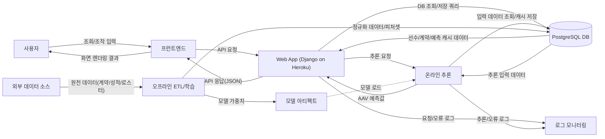
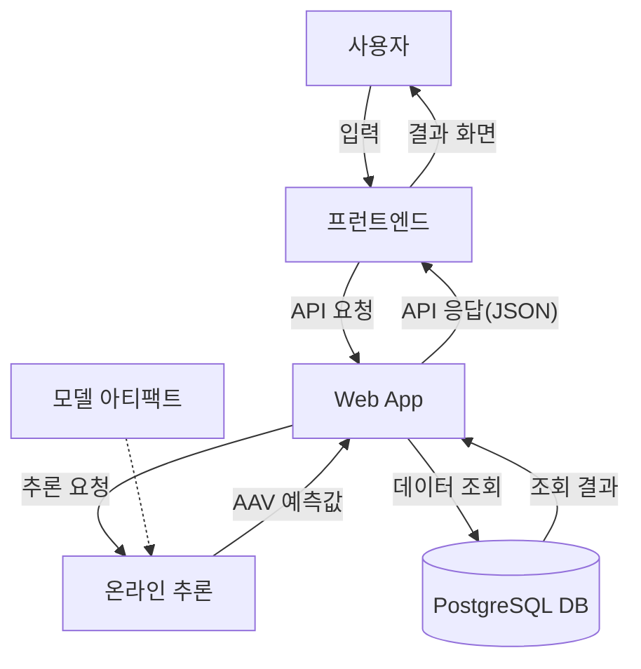
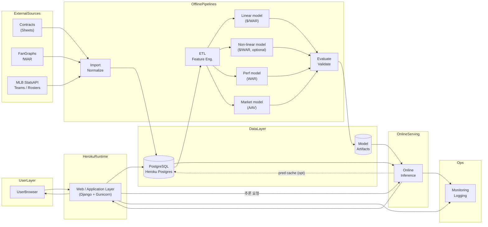
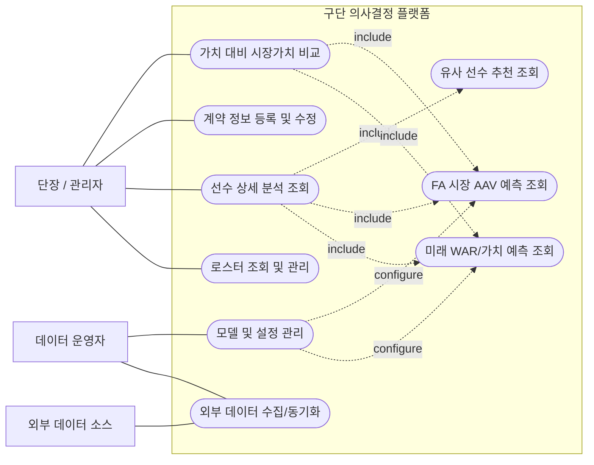
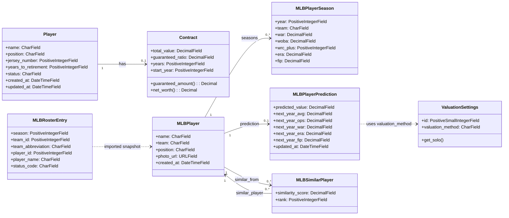
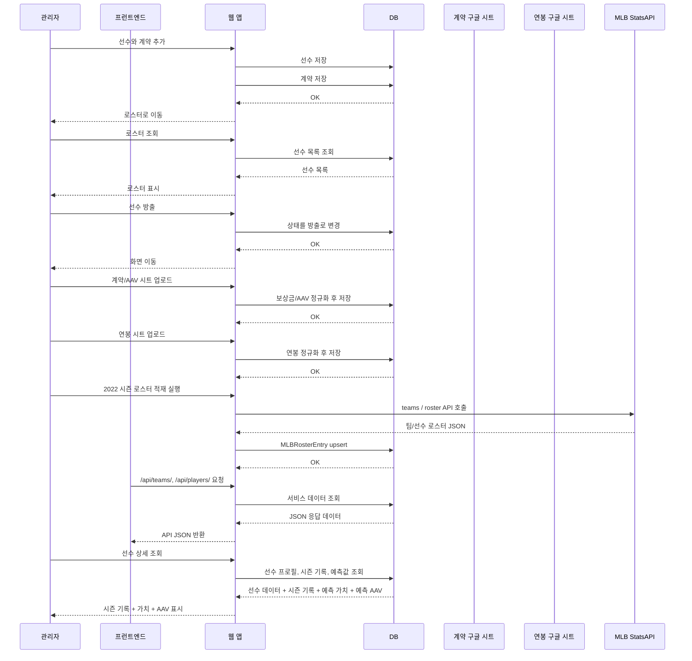
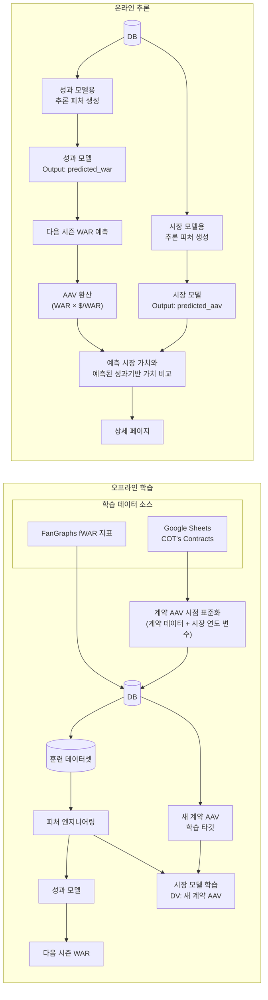
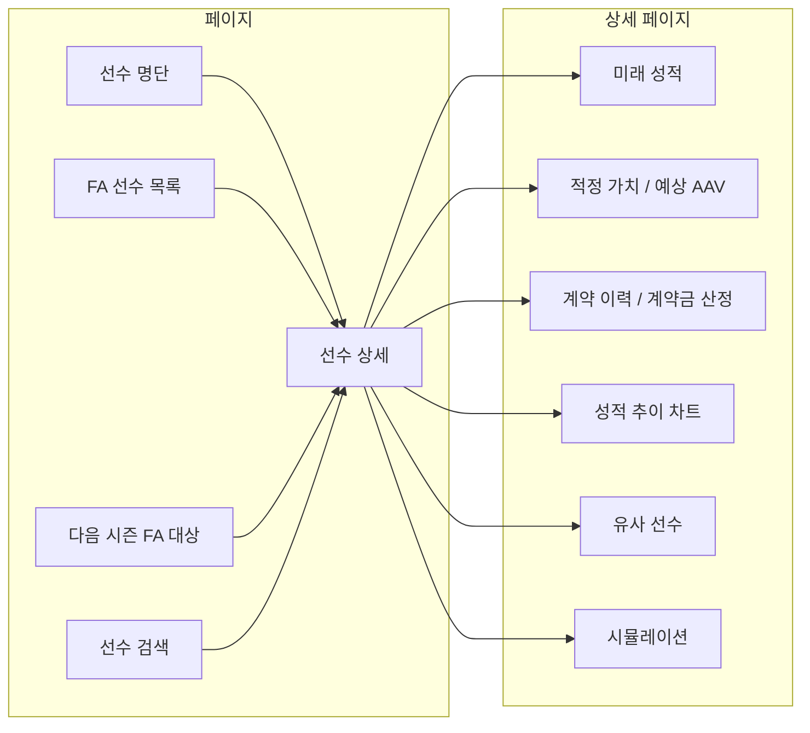
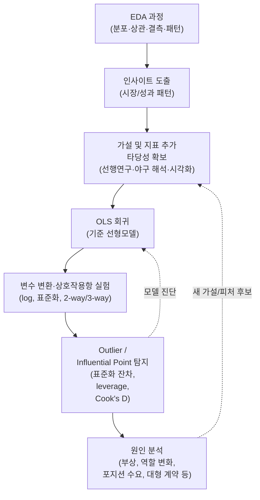

# 구단 의사결정 플랫폼 — 아키텍처

## 1. 개요

이 Django 애플리케이션은 General Manager(단장)가 선수 영입, 유지, 방출과 같은 로스터 의사결정을 지원하도록 설계된 데이터 기반 야구 운영 플랫폼이다. 시스템은 MLB 선수 시즌 기록과 계약 데이터를 통합해 미래 성적을 예측하고, 특히 FA 선수의 시장 계약가치를 추정하며, 이를 선수 상세 분석·시뮬레이션·계약 비교 화면에 연결해 구단 관점의 의사결정을 보조한다.

## 1.1. 운영(배포) 환경 가정

본 문서는 **Heroku 배포**와 **PostgreSQL DB**를 운영 환경의 기본 가정으로 둔다.

- **PaaS**: Heroku
- **Database**: Heroku Postgres (PostgreSQL)
- **Web**: Django + Gunicorn
- **Service Interface**: Django HTTP API (`/api/...`) exposed from the Heroku app
- **Static**: WhiteNoise 또는 외부 스토리지(확장 시 S3 등) 후보
- **Config**: 환경 변수 기반(`DATABASE_URL`, `SECRET_KEY`, `DEBUG`, etc.)

## 2. 서비스 배경

### 2.1. 연구 문제 정의

기존 연구들은 타율이나 출루율과 같은 성적 지표가 연봉에 미치는 영향을 분석해 왔다. 그러나 실제 구단 운영에서 더 직접적인 질문은 “비싼 선수가 누구인가”가 아니라, **FA 시장에서 영입한 선수가 계약 당시 기대한 수익률에 비해 실제로 순수입을 만들었는가**이다. 이 때문에 단장은 선수 영입과 재계약 과정에서 단순 계약가격 예측을 넘어, 계약 비용 대비 사후 성과가 충분했는지 설명할 수 있는 정량적 근거가 필요하다.

과거에는 전통적인 야구 전문가들이 중요하게 여긴 지표들이 실제 승리 기여도와 일치하지 않는 경우가 많았고, 그 결과 노동시장에서 자원이 비효율적으로 배분되었다. 대표적으로 오클랜드 어슬레틱스(Oakland Athletics)는 이러한 시장의 왜곡을 활용해, 당시 저평가되어 있던 출루 능력을 가진 선수들을 낮은 비용으로 영입함으로써 경쟁 우위를 확보했다. 이후 다른 구단들도 이 전략을 모방하면서, 2004년경에는 시장이 점차 조정되어 이러한 가치 왜곡이 상당 부분 해소된 것으로 보고되었다(Hakes & Sauer, 2006).

하지만 오늘날에도 시장이 선수의 실제 경기 기여를 완전히 반영한다고 보기는 어렵다. 선수의 계약 가치는 과거 성적이나 미래 예상 성과뿐 아니라, 마케팅 가치, 스타성, 타 구단과의 경쟁 압력 등 비성적 요인의 영향을 크게 받기 때문이다. 특히 류윤지·편현웅(2023)은 KBO 주전 선수 표본에서 기계학습 기반 외모 호감도 점수가 연봉에는 유의한 영향을 보이지 않았지만, 평균 이상 외모 점수를 가진 선수의 올스타 투표수에는 유의한 관련이 있음을 보고했다. 이는 외모 매력도를 연봉의 직접 결정요인으로 단정하기보다, 선수 인기도와 마케팅 가치의 보조 신호로 조심스럽게 검증할 필요가 있음을 시사한다. 그 결과, 선수가 경기장에서 창출하는 실제 성적 기반 가치와 시장에서 형성된 연봉 또는 계약 가치 사이에는 여전히 차이가 발생할 수 있다.

발표에서의 문제제기는 다음처럼 정리한다. 언론과 팬덤은 FA 계약 직후 유사 선수 계약, 직전 시즌 성적, 시장 시세를 근거로 어떤 영입이 “적정가”라고 평가할 수 있다. 그러나 사후 성과를 반영하면 그 계약이 실제로는 기대수익률을 충족하지 못한 실패 영입이었거나, 반대로 시장이 과소평가한 성공 영입이었을 수 있다. 따라서 본 연구의 핵심 질문은 **“FA 계약 당시 시장과 언론이 합리적인 가격이라고 해석한 영입은, 구단 관점에서 실제 순수입을 만든 성공적인 영입이었는가?”** 이다.

따라서 본 연구는 FA 계약 선수로 표본을 한정하고, 기존의 시장 중심 계약 가치가 선수의 실제 생산성을 얼마나 충실하게 반영하는지 문제를 제기한다. 이를 검토하기 위해 대체 선수(리그 최저 수준의 최소 연봉을 받는 가상의 선수) 대비 팀 승리 기여도를 나타내는 지표인 WAR(Wins Above Replacement) 기반의 성과가치, 시장에서 형성된 AAV, 그리고 사후 실제 순수입을 함께 비교한다(Barnes & Bjarnadóttir, 2016). 또한 현대의 선수 시장에서도 아직 충분히 반영되지 못한 성과 지표가 존재할 가능성에 주목하며, 복합적인 패턴을 학습할 수 있는 모델을 통해 이러한 한계를 보완할 수 있을 것으로 기대한다.

### 2.2. 본 문서·플랫폼의 모델 목표

본 단계의 모델 목표는 **FA 계약 선수의 영입 성공 여부를 기대수익률 대비 실제 순수입으로 평가하는 것**이다.

이를 위해 시장에서 실제로 형성되는 계약가격(`predicted_aav`)과, 선수의 미래 WAR 기반 내재가치(`predicted_value`)를 분리해 추정한다. 이후 계약 총액 대비 예상 순가치로 `expected_roi`를 만들고, 계약 이후 실제 WAR 또는 확보 가능한 수익 대리 지표를 화폐가치로 환산해 `actual_net_income`과 `actual_roi`를 계산한다.

- `contract_cost = guaranteed_total_value` 또는 `AAV x years`
- `expected_net_value = expected_performance_value - contract_cost`
- `expected_roi = expected_net_value / contract_cost`
- `actual_net_income = realized_performance_value - actual_contract_cost`
- `actual_roi = actual_net_income / actual_contract_cost`

직접적인 구단 매출 데이터가 부족한 1차 구현에서는 `realized_performance_value = 실제 계약 기간 WAR x 해당 연도 $/WAR`로 근사하고, 추후 티켓·중계·마케팅 수익 대리 변수가 확보되면 이를 확장한다. 성공적인 영입은 `actual_net_income > 0`이면서 `actual_roi`가 계약 당시 `expected_roi`에 근접하거나 이를 초과한 경우로 본다. 반대로 계약 당시에는 적정가로 보였지만 `actual_net_income < 0`이면 사후적으로 시장 실패 또는 과대평가 사례로 해석한다.

## 3. 아키텍처 다이어그램

### 3.1. 시스템 레이어

### 3.1.1. PPT용 축약 도식 (1슬라이드)

**초축약 도식 (발표 10초 버전)**

`점선(A -> 온라인 추론)`은 모델 로드 경로를 의미한다.

발표 설명 순서는 `사용자 요청 -> 웹앱 처리 -> 추론/DB 참조 -> 결과 반환`으로 두고, 외부 데이터/학습 파이프라인은 보조 흐름으로 짧게 언급한다.

### 3.1.2. 상세 도식 (문서 기준)

이 도식은 플랫폼을 **사용자 인터페이스**, **웹/애플리케이션 계층**, **온라인 추론**, **데이터 저장소**, **운영 모니터링**, **오프라인 학습 파이프라인**, **외부 데이터 소스**의 일곱 영역으로 구분해 보여준다. 사용자는 브라우저 또는 별도 프런트엔드 애플리케이션을 통해 서비스에 접속하고, Heroku 환경에서 실행되는 Django 기반 `Web / Application Layer`가 요청을 수신하는 진입점 역할을 한다. 이 계층은 선수 검색, 로스터 관리, 계약 정보 저장, 설정 관리, 상세 페이지 구성 같은 애플리케이션 로직을 처리하면서 필요한 데이터를 PostgreSQL에서 읽고 저장한다. 또한 선수 가치 계산이나 예측 결과 조회처럼 모델 실행이 필요한 요청은 `Online Inference` 계층으로 전달한다. 온라인 추론 계층은 DB에 저장된 선수 프로필, 시즌 기록, 계약 정보와 모델 아티팩트 저장소의 학습 완료 모델을 함께 참조하여 `predicted_value`, `predicted_aav` 같은 결과를 계산하고, 이를 다시 웹 계층으로 반환한다. 최종 결과는 상세 페이지나 시뮬레이션 화면에 표시되며, 필요하면 예측 캐시 형태로 DB에 저장될 수 있다. 웹 요청 처리와 추론 과정에서 발생하는 로그, 오류, 처리 상태는 `Monitoring / Logging` 계층으로 전달되어 운영 안정성을 관리한다.

오프라인 영역은 실시간 사용자 요청과 분리된 배치형 학습 구조를 의미한다. 계약 시트, FanGraphs의 fWAR 데이터, 그리고 MLB StatsAPI의 팀/로스터 데이터는 먼저 `Import / Normalize` 단계에서 수집되고 형식을 맞춘 뒤 서비스 DB에 적재된다. 현재 구현 기준으로는 `scripts/fetch_mlb_rosters.py`가 시즌 로스터를 CSV/JSON으로 저장할 수 있고, Django management command `python manage.py load_mlb_rosters --season 2022 --replace-season --from-api`가 MLB StatsAPI에서 직접 읽어 `Heroku Postgres`의 로스터 스냅샷 테이블로 적재할 수 있다. 이후 `ETL / Feature Engineering` 단계에서 학습용 피처, 계약가치 표준화 변수, 타깃 변수, 검증용 분할 데이터셋이 만들어진다. 이렇게 준비된 데이터는 `$ / WAR` 선형 모델, 비선형 모델, 성과 예측 모델, 시장가치 예측 모델 학습에 사용되며, 각 결과는 `Evaluate / Validate` 단계에서 성능과 일관성을 검증받는다. 최종 통과한 모델만 아티팩트 저장소에 반영되고, 온라인 추론 계층은 이를 재사용해 실제 서비스 응답을 만든다.

### 3.1.3. UML Use Case Diagram

다음 도식은 Mermaid `flowchart`로 UML 유스케이스 다이어그램 형태를 표현한 것이다. 시스템 경계 내부에는 주요 서비스 기능을, 경계 외부에는 실제 사용자와 운영 주체를 배치한다.

이 유스케이스 기준으로 보면, 서비스의 핵심 사용자는 `단장 / 관리자`이며 실제 의사결정 화면에서는 `선수 상세 분석 조회`가 중심 허브 역할을 한다. 이 화면은 미래 성과 기반 가치, 시장 AAV, 유사 선수 정보를 함께 호출하고, 최종적으로는 `가치 대비 시장가치 비교`로 이어져 영입·재계약·방출 판단을 지원한다. 반면 `데이터 운영자`는 직접 의사결정을 수행하기보다 데이터 적재와 모델/설정 관리 책임을 가지며, 외부 데이터 소스는 동기화 유스케이스를 통해 간접적으로 서비스에 연결된다.

### 3.2. 데이터 모델

### 3.2.1. UML Class Diagram

다음 클래스 다이어그램은 실제 Django 모델 중 서비스 이해에 핵심이 되는 도메인 객체만 요약한 것이다. CSV 적재용 API 보조 테이블(`MLBApiStatLine`, `MLBApiSimilarPlayer`, `MLBApiRecommendedSimilarPlayer`)과 이미지 저장용 `MLBRosterPhoto`는 가독성을 위해 제외했다.

이 구조에서 `Player`와 `Contract`는 팀 내부 로스터 관리 도메인을 담당하고, `MLBPlayer` 계열은 외부 MLB 데이터 기반 분석 도메인을 담당한다. 운영 화면에서 가장 자주 결합되는 축은 `MLBPlayer -> MLBPlayerSeason -> MLBPlayerPrediction`이며, 유사 선수 추천은 자기참조 관계를 별도 엔터티 `MLBSimilarPlayer`로 분리해 표현한다. `ValuationSettings`는 예측값 자체를 저장하는 모델은 아니지만, `$ / WAR` 산정 엔진 선택에 관여하므로 클래스 다이어그램에 함께 두는 편이 실제 서비스 흐름을 설명하기 쉽다.

### 3.3. 요청 흐름

## 4. 데이터 흐름

1. **원천 데이터 수집 및 적재** — `COT's Contracts` 기반 계약 데이터, FanGraphs의 fWAR 및 관련 성적 지표, MLB StatsAPI의 팀/로스터 데이터를 각각 정규화한 뒤 서비스 DB에 적재한다. 이 단계에서는 원본 값을 보존하면서 계약 데이터, 선수 시즌 데이터, 시즌 로스터 스냅샷이 이후 오프라인 학습과 온라인 조회의 공통 기반이 되도록 저장 구조를 맞춘다.

2. **계약가치 표준화** — 서로 다른 시점의 계약 AAV를 비교할 수 있도록 원시 계약값(`nominal_aav`)은 보존하고, 학습용 표준값(`standardized_aav`)을 별도로 관리한다. 1차 구현에서는 연도 변수(`Season_idx`)와 연도별 FA 평균 AAV(`log_market_avg`)를 사용해 시장 환경 변화를 반영한다.

3. **훈련 데이터셋 구성(ETL)** — 모델 학습 시에는 서비스 DB에 적재된 원천/정규화 데이터를 그대로 바로 사용하기보다, 오프라인 `ETL + 검증` 단계를 거쳐 결측 처리, 스키마 정합성 검증, 시즌 정렬, 계약가치 표준화, 타깃 생성, 학습/평가 분할이 반영된 훈련 데이터셋으로 별도 구성한다. 시장 모델용 행은 **새 계약 시점**과 **FA 시장 표본** 규칙으로 한정한다.

4. **모델 학습 결과의 서비스 연결** — 성과 모델과 시장 모델은 오프라인에서 학습·검증을 거친 뒤 아티팩트로 저장되고, 온라인 추론 계층은 이를 사용해 상세 페이지 요청 시 `predicted_war`, `predicted_value`, `predicted_aav`를 계산한다. 최종적으로 선수 상세 페이지에서는 성과 모델 결과와 시장 모델 결과를 함께 보여 주어 성과 전망과 시장 평가를 동시에 해석할 수 있도록 한다.

5. **프런트엔드 연동 방식** — 프런트엔드는 Heroku Postgres에 직접 연결하지 않고, Heroku에 배포된 Django 앱의 HTTP API를 사용한다. 따라서 다른 프런트엔드 개발자에게 전달해야 하는 값은 `DATABASE_URL`이 아니라 실제 서비스 API base URL인 `https://yechuk-65fc9b24a5dd.herokuapp.com` 이다.

## 5. 선수 예측 및 가치 판단 설계

본 프로젝트는 선수 가치 판단을 위해 **성과 모델(Performance Model)** 과 **시장 모델(Market Model)** 을 분리한다. 성과 모델은 선수의 미래 WAR와 핵심 성적 지표를 예측해 `predicted_value`를 만들고, 시장 모델은 성과 예측값과 시장 환경을 함께 사용해 `predicted_aav`를 산출한다. 서비스에서는 두 값을 함께 보여 주며, `시장가치 - 성과기반 예측가치` 차이를 계약 판단 보조 지표로 해석한다. 현 단계의 1차 구현에서는 `Ridge`, `CatBoost`, `Random Forest`, `SVR`, `MLP` 등 해석 가능한 기준선과 비선형 모델을 함께 비교한다.

### 5.1. 데이터셋 구조

선수 예측 모델 학습 및 서비스 반영에 필요한 데이터셋 구조는 다음과 같다. 저장 계층은 `서비스 DB(원천/정규화 데이터)`와 `오프라인 ETL로 생성한 훈련 데이터셋`으로 구분한다.

### 5.1.1. 선수 시즌 데이터 (Player-level)

상세 필드는 `6.4.1. MLBPlayerSeason` 정의를 기준으로 관리한다.

- **타자**: AB, hits, HR, RBI, AVG, OBP, SLG, OPS, fWAR, wOBA, wRC+, BABIP, OPS+
- **투수**: IP, ERA, SO, BB, WHIP, fWAR, FIP, xFIP, K/9, BB/9
- **WAR 계산/검증용 원천 변수**
  - 타자: Batting Runs, Base Running Runs, Fielding Runs, Positional Adjustment, League Adjustment, Replacement Runs, Runs Per Win
  - 투수: Pitcher FIP, League FIP, Pitcher Specific Runs Per Win, Replacement Level, IP, Leverage Multiplier for Relievers, League Correction

WAR 자체를 저장하더라도, 모델 입력 검증과 지표 재계산 가능성을 위해 위 구성 변수 또는 이에 대응하는 파생 가능 원천 데이터를 함께 관리하는 것을 원칙으로 한다.

### 5.1.2. 선수 메타데이터

| 변수 | 설명 | 용도 |
|------|------|------|
| player_id | 선수 ID | 식별 |
| team_id | 소속 구단 | 시즌 기록과 연결 |
| year | 시즌 연도 | 시계열 |
| position | 포지션 | 타자/투수 구분 |
| age | 시즌 기준 나이 | 노화 곡선 반영 |
| handedness | 좌/우/스위치 | 유형 구분 |
| experience | 경력 연차 | 성장/회귀 구간 해석 |

### 5.1.3. 계약 데이터 (Contract-level)

서비스 DB에 두는 계약(Contract-level) 필드는 다음과 같다.

| 변수 | 설명 | 용도 |
|------|------|------|
| player_id | 선수 ID | 식별 |
| year | 시즌 연도 | 시계열 |
| aav | 연평균계약가치 (명목 AAV, Average Annual Value) | 원본 계약 값 보존 |
| standardized_aav | 연도별 시장 환경 차이를 반영해 표준화한 AAV | 시장 모델의 기본 타깃 후보 |
| total_value | 계약 총액 | 계약 구조 파악 |
| guaranteed_ratio | 보장 비율 | 리스크 분석 |
| years | 계약 연수 | 다년 의사결정 참고 |
| base_salary | 기본 연봉 | 계약금/총액 구성요소 분해 |
| signing_bonus | 사이닝보너스 | 계약금 산정 및 계약 구조 표시 |
| incentives | 인센티브/성과급 | 보장액과 조건부 금액 구분 |
| option_value | 구단/선수 옵션 가치 | 다년 계약 시나리오 분석 |
| agent | 에이전트명 | 협상력·시장 프리미엄 분석 |
| is_boras | Scott Boras 에이전트 여부 | AAV 프리미엄 더미 변수 |
| signing_team | 계약 체결 구단 | 팀 페이롤·시장 규모와 연결 |

`AAV(Average Annual Value)`는 계약금 또는 계약 총액(`total_value`)을 계약 연수(`years`)로 나눈 연평균 계약가치다. 예를 들어 5년 총액 1억 달러 계약이면 명목 AAV는 연 2,000만 달러가 된다. 모델 학습에서는 명목 AAV를 보존하되, 연도별 FA 시장 평균이나 연도 고정효과를 사용해 계약 시점별 시장 환경 차이를 반영한다.

**시장 모델 학습용 전처리(ETL·표본 필터)**

시장 모델 학습에 남기는 행은 다음을 만족한다.

1. **`new-contract signing point`** — 모든 시즌 계약 레코드를 그대로 쓰지 않고, 선수가 **실제로 새 계약을 맺는 시점**에 해당하는 관측만 후보로 남긴다.
2. **FA 시장 표본** — **FA(자유계약) 신분**에 해당하는 계약·선수 관측만 남긴다. 계약 체결 시점(또는 해당 시즌)의 **메이저리그 서비스 타임**이 **pre-arb**(통상 경력 초반 2년, 진입 후 3년 자동 갱신 구간) 또는 **arb**(통상 경력 3~5년)이면 제외한다. **pre-arb**는 연봉이 매 시즌 구단 쪽에서 자동 갱신되는 구조에 가까워 **자유 협상 시장에서 형성된 급여**와 같은 의미로 쓰기 어렵고, **arb**는 **선수의 시장 가치를 온전히 반영한 계약**으로 보기 어려운 경우가 많기 때문이다.

**성과기반 예측가치 환산 테이블 (Value Conversion-level)**

| 변수 | 설명 | 용도 |
|------|------|------|
| position_group | 포지션/역할군 (예: SP, RP, CL, C, IF, OF, UT) | WAR 환산 기준 구분 |
| dollar_per_war | 해당 포지션의 평균 `$ / WAR` | `predicted_value` 계산 |
| sample_size | 계수 산출에 사용한 FA 계약 표본 수 | 신뢰도 점검 |
| source_window | 계수 산출에 사용한 연도 범위 | 시장 변화 추적 |
| update_cycle | 계수 재산출 주기 | 운영 관리 |

**포지션별 `$ / WAR` 산출 방식 (선형 + ML 엔진)**

포지션별 `$ / WAR`는 다음 두 계층의 엔진으로 산출하며, 서비스에서는 동일한 인터페이스를 통해 호출한다.

- **선형 회귀 기반 Swartz-inspired 엔진 (기본값)**  
  - 원천 데이터: `data/MLB-Free Agency 1991-2026_consolidated.xlsx` (FA 계약 테이블) + 별도 WAR 테이블(`data/war/player_year_war.csv`).
  - 오프라인 스크립트: `scripts/estimate_position_dollars_per_war.py`.
  - 출처 해석 원칙:
    - 이 식은 특정 학술 논문에서 동일한 형태를 그대로 인용한 회귀식이 아니라, **Matt Swartz의 공개 `$ / WAR` 분석 아이디어**와 일반적인 연봉 회귀 변수 구성을 참고해 프로젝트에서 명시적으로 채택한 선형 사양이다.
    - 따라서 문서와 구현에서는 `Swartz-style`보다 **`Swartz-inspired project specification`**이라는 의미로 해석한다.
  - 모델 사양:
    - 종속 변수: 표준화 또는 명목 AAV (`standardized_aav` 또는 `AAV`).
    - 주요 독립 변수:
      - `WAR_at_signing` = 직전 3시즌 합산 WAR (`t-3..t-1`).
      - `Age`, `Age^2`.
      - `C(Year)` (연도 더미 / 연도 고정효과) — 연도별 계약 시장 환경을 흡수.
      - `C(Position)` (포지션 고정효과).
      - `WAR_at_signing × C(Position)` (포지션별 상호작용) — 포지션별 `$ / WAR` 기울기를 분리하기 위함.
    - 개념식:
      - `standardized_aav = β₀ + β₁·WAR_at_signing + f(Age) + γ_Year + δ_Position + Σ_p θ_p·(WAR_at_signing × 1[Position=p]) + ε`
      - 포지션별 기울기: `$ / WAR(p) = β₁ + θ_p`.
  - 산출물:
    - `data/position_dollars_per_war.csv` — 포지션별 `$ / WAR`, 표본 수, 기준 계수 등의 테이블.
    - `data/position_dollars_per_war.md` — 간단한 요약 보고서.
    - `data/position_dollars_per_war_model.json` — Django 서비스에서 읽어 사용할 수 있는 JSON 페이로드 (포지션별 계수, 연도 범위, 표본 수 등).

- **비선형 ML/DL 기반 엔진 (옵션)**  
  - 모델 예시: Gradient Boosting (XGBoost/LightGBM), Random Forest, MLP 등.
  - 종속 변수: `standardized_aav`, `AAV`, 또는 `log(AAV)`.
  - 입력 특성:
    - `WAR_at_signing`, `Position`, `Age`, `SigningYear` 등 (추가 성과/계약 변수 포함 가능).
  - `$ / WAR` 도출:
    - 학습된 모델을 `AAV = f(WAR, Position, Age, Year, …)` 형태의 **가격 함수**로 보고,
    - 특정 맥락(포지션 p, 나이 a, 연도 y, WAR 수준 w)에서
      - `AAV0 = f(WAR=w, Position=p, Age=a, Year=y, …)`
      - `AAV1 = f(WAR=w+1, Position=p, Age=a, Year=y, …)`
      - `Δ$/WAR_p(a,y,w) = AAV1 − AAV0` 로 국소 기울기(한계 $ / WAR)를 근사.
    - 포지션별/연령대별 평균을 취해 **비선형 엔진 기준의 포지션별 `$ / WAR(p)`**를 얻거나, 선수 개별 맥락에 따라 실시간으로 평가할 수 있다.
  - 해석 도구:
    - 필요 시 SHAP interaction (`WAR × Position`) 등을 사용해 비선형 구조의 포지션별 가격 차이를 요약한다.

서비스 관점에서, 두 엔진 모두 **“포지션 + 맥락 → $ / WAR”** 인터페이스를 제공하며, Django 설정에서 어떤 엔진을 사용할지 선택할 수 있다. 기본값은 **선형 엔진**이며, ML/DL 엔진은 실험/고도화 옵션으로 유지한다.

### 5.1.4. 데이터 출처 (MLB 기준)

- **선수 기록**: MLB 공식 기록, Baseball Savant, Baseball-Reference 등
- **WAR 관련 데이터**: FanGraphs의 WAR/fWAR 및 관련 지표 데이터
- **팀/리그 맥락 정보**: MLB 팀별 시즌 스탯, 리그 평균 지표, 공개 데이터셋
- **계약 정보**: Baseball Prospectus의 [`COT's Contracts`](https://legacy.baseballprospectus.com/compensation/cots/)를 기반으로 사용자가 Google Sheets에서 다운로드한 계약 데이터 ([sheet link](https://docs.google.com/spreadsheets/d/1bXUPBabVf82y0m2KaZ0F9Fno9xwZ2pmepbFvMBX_TEM/)), 구단 공시, 프로젝트 입력 데이터
- **시장 비교 데이터**: FA 계약 사례, 포지션별 AAV 분포, 시즌별 계약가치 인플레이션 지표
- **팀 페이롤 데이터**: AP/공개 자료 기반 시즌별 Opening Day payroll. AAV 시장 모델에서는 `log_payroll`로 변환해 계약 구단의 지불 여력 프록시로 사용한다.
- **성과기반 예측가치 환산 데이터**: FA 계약 데이터에서 추정한 포지션별 `$ / WAR` 계수 테이블

### 5.2. 예측 파이프라인

`6.4.2`와 `6.7`에서 정의한 모델은 **오프라인 학습 단계**와 **온라인 추론 단계**를 구분한다. Google Sheets에서 업로드한 `COT's Contracts` 기반 계약 데이터는 우선 서비스 DB에 정규화 저장된다. 이후 오프라인 `ETL`을 통해 계약 시점별 명목 AAV와 시장 연도 변수를 결합하고, 이를 바탕으로 **시장 모델 학습용 타깃(`새 계약 AAV`)**, **성과 모델 학습용 시즌 데이터셋**, **포지션별 WAR 환산 계수 테이블**로 재구성된다. 실제 상세 페이지 조회 시에는 서비스 DB의 선수 시즌 기록으로부터 성과 모델용 피처와 시장 모델용 피처를 각각 생성하고, 성과 모델과 시장 모델을 **함께 실행**한다. 성과 모델은 `다음 시즌 WAR`와 주요 성적 전망을 산출하고 이를 포지션별 환산 계수에 연결해 `predicted_value`를 만들며, 시장 모델은 별도의 시장/계약 환경 피처를 바탕으로 `predicted_aav`를 산출한다. 최종 계약 의사결정 단계는 이 두 결과를 같이 비교해 사용한다.

### 5.3. 모델별 IV / DV 요약

변수 표기는 Barnes and Bjarnadóttir (2016) 논문 본문 기준의 영문 표현을 우선 사용한다.

**성과 모델 (Performance Model)**

- **DV**: `Next Year's WAR`
- **학습 샘플 단위**: `X_t = [선수의 t-1까지 누적/최근 성과, t시즌 소속 팀 맥락] -> y_t = t시즌 WAR`
- **이적 시 추론 원칙**:
  - 학습 시에는 **실제로 그 시즌 선수가 소속된 팀의 맥락 변수**를 입력에 포함한다.
  - FA/트레이드 대상 선수 평가 시에는 **이적 후보 팀(목적지 팀)의 맥락 변수**를 넣어 `새 팀에서의 WAR`를 추론한다.
- **팀 맥락 변수 원칙**:
  - 팀 승률 하나로 처리하지 않고, **파크 팩터, 예상 수비력, 예상 출전 기회, 역할(타순/선발·불펜 보직), 리그/디비전 맥락**처럼 WAR 형성에 더 직접적으로 연결되는 변수를 우선 사용한다.
  - `미래 실제 팀 승률`처럼 사후적으로만 알 수 있는 값은 데이터 누수이므로 사용하지 않는다. 팀 성과를 넣을 경우에는 `직전 1~3시즌 팀 성과`, `프리시즌 projection`, `시즌 시작 시점 로스터 기반 전력 지표`처럼 **계약/추론 시점에 관측 가능한 값**만 사용한다.

| IV Group | Variable | Description |
|------|------|------|
| Team / Context | `Team` | 해당 시즌 소속 팀 식별자이며 팀별 맥락 차이를 반영 |
| Team / Context | `League` | 리그 환경 차이를 반영 |
| Team / Context | `Year` | 시즌 환경 및 시대 효과를 반영 |
| Team / Context | `Win-Loss Record` | 팀 성과 수준을 나타내는 팀 특성 변수 |
| Team / Context | `Runs Scored` | 팀 공격 환경을 나타내는 변수 |
| Team / Context | `Runs Allowed` | 팀 투수/수비 환경을 나타내는 변수 |
| Team / Context | `Playoff Results` | 팀 경쟁 단계 및 시즌 성과 맥락을 반영 |
| Team / Context | `Payroll` | 팀 시장 규모와 투자 수준의 대리 변수 |
| Team / Context | `Attendance` | 팀 시장 규모의 대리 변수 |
| Recent Performance | `WAR` | 새 계약 직전 시즌 기준으로 가장 중요한 예측 변수 |
| Recent Performance | `Offensive WAR` | 타자 성과 예측에서 중요한 공격 기여 신호 |
| Batter-Specific Metrics | `Power-Speed` | 홈런과 도루 능력을 함께 반영하는 지표 |
| Batter-Specific Metrics | `Walks` | 볼넷 획득 능력과 타석 접근법을 반영 |
| Pitcher-Specific Metrics | `Strikeouts` | 삼진을 통해 타자를 압도하는 능력을 반영 |
| Pitcher-Specific Metrics | `Base Runners Allowed` | 주자 출루를 얼마나 억제하는지 반영 |
| Pitcher-Specific Metrics | `Innings Pitched` | 긴 이닝 소화 능력과 내구성의 대리 지표 |
| Pitcher-Specific Metrics | `Team Wins Contribution` | 팀 승리에 대한 실질 기여를 반영 |
| Background Performance | `Career Statistics` | 누적 및 평균 통산 성적이며 최근 지표보다는 중요도가 낮음 |
| Background Performance | `Playoff Statistics` | 논문 기준으로 성과 모델에서는 영향이 거의 없음 |

**시장 모델 (Market Model)**

- **DV**: `Inflation-adjusted Average Yearly Salary for the New Contract`
- **Training Data Scope**: `new-contract signing point`이며 **시장 모델 학습용 전처리**에서 정의한 **FA 시장 표본** 조건을 만족하는 player-season만 시장 모델 학습에 사용한다.
- **Target Normalization**: 원시 계약값(`nominal_aav`)은 보존하되, 서로 다른 연도 계약의 시장 환경 차이는 `Season_idx`, `log_market_avg`, 연도 고정효과 같은 연도 기준 변수로 반영한다.

| IV Group | Variable | Description |
|------|------|------|
| Salary History | `Current Salary` | 시장 모델에서 가장 중요한 입력 변수 |
| Recent Performance | `WAR_lag1~3`, `WAR_mean`, `WAR_max`, `WAR_trend` | 계약 직전 1~3시즌 종합 가치, 안정성, 피크, 추세를 반영 |
| Batter-Specific Metrics | `wOBA_lag1~2`, `wRC+_lag1`, `ISO_lag1`, `PA_lag1`, `HR_lag1`, `SB_lag1`, `BB%_lag1`, `K%_lag1` | 타자 AAV 예측용 공격 생산성·출장 규모·선구안·파워/스피드 피처 |
| Pitcher-Specific Metrics | `FIP_lag1~2`, `ERA_lag1`, `xFIP_lag1`, `IP_lag1`, `GS_lag1`, `WHIP_lag1`, `SV_lag1`, `SV_mean`, `K_BB_lag1`, `BB/9_lag1`, `HR/9_lag1`, `is_SP` | 투수 AAV 예측용 수비독립 성과, 이닝/역할, 클로저 프리미엄, 제구·피홈런 피처 |
| Background Performance | `Career Statistics` | 누적 및 평균 통산 성적으로 보조적 역할을 함 |
| Background Performance | `Playoff Statistics` | 1차 구현에서는 기본 입력에서 제외하고, 상위 계약 정확도 개선 후보로 둠 |
| Player Context | `Age` | 선수의 잔존 가치와 계약 리스크를 반영 |
| Player Context | `Position` | 포지션별 수요와 희소성을 반영 |
| Market Context | `Season_idx`, `log_market_avg` | 연도별 연봉 인플레이션 및 해당 시즌 FA 시장 크기 반영 |
| Team Context | `log_payroll` | 계약 구단의 지불 여력과 시장 규모를 반영 |
| Contract Context | `Re-signing with Current Team` | 기존 팀과의 재계약 효과를 반영 |
| Contract Context | `is_boras` | Scott Boras 에이전트 여부를 통한 협상 프리미엄 더미 변수 |
| Optional Marketing Context | `appearance_score`, `appearance_score_above_mean` | 선수 사진 기반 외모 매력도와 평균 이상 여부를 실험 변수로만 사용하며, 연봉 직접 효과보다 인기도·마케팅 가치 보조 신호로 검증 |

### 5.4. 입력 데이터

- **시즌별 선수 기록**: 타자/투수 기본 기록과 지표
- **선수 메타데이터**: 포지션, 나이, 경력 연차, handedness, 소속 팀
- **계약 정보**: AAV, 계약 총액, 보장 비율, 계약 연수
- **시장 계약 정보**: 사용자가 Google Sheets에서 내려받은 과거 FA 계약 데이터, 포지션별 AAV 분포, 리그 계약가치 상승률
- **영입 성과 평가 정보**: 계약 이후 실제 WAR, 계약 기간별 실제 지급액, 포지션·연도별 `$ / WAR`, 확보 가능한 경우 관중·인기도·마케팅 수익 대리 변수
- **팀/리그 맥락 정보**: 리그 평균 대비 보정치, 시즌 길이, 출전 규모, 필요 시 부상/결장 대리 변수
- **성과 가치 환산 기준**: FA 계약 데이터에서 역산한 포지션별 `$ / WAR` 환산 계수, 필요 시 승수 한계가치 보정치
- **선택 실험 정보**: MLB 공식 선수 사진 기반 `appearance_score`, 평균 이상 더미, All-Star 투표·검색량·SNS 지표처럼 확보 가능한 인기도 대리 변수. 이 정보는 기본 성과/시장 모델과 분리해 실험 피처셋으로만 관리한다.

### 5.5. 예측 대상 지표

- **타자**: AVG, OBP, SLG, OPS, HR, RBI, WAR, wOBA, wRC+, BABIP
- **투수**: ERA, FIP, xFIP, WHIP, SO, BB, K/9, BB/9, IP, WAR
- **성과 출력**: 다음 시즌 WAR, t+1 ~ t+n 시즌 포인트 예측
- **가치 출력**: `predicted_value`(WAR 기반 내재가치), `predicted_aav`(시장 예상 계약가), `estimated_total_contract_value`(예상 계약 총액), 추천 계약 기간
- **계약 구성 출력**: 기본 연봉, 사이닝보너스, 인센티브, 옵션 등 반영 가능 항목을 구분하고, 초기 구현에서는 확보 가능한 계약 구조 데이터만 표시한다.
- **영입 성공 평가 출력**: `expected_roi`, `actual_net_income`, `actual_roi`, `roi_gap`, `acquisition_outcome`(성공/제한적 성공/실패/시장 과소평가)

### 5.6. 서비스 활용 방식

- **선수 검색/상세**: 미래 성적 카드, 추이 차트, 유사 선수 비교에 사용
- **영입 검토**: 유사 선수 사례와 다음 시즌 전망을 함께 제시
- **계약 검토**: 예측 성과 기반 내재가치와 시장 예상 AAV, 예상 계약 총액/구성요소를 나란히 비교하고, 과대/과소지불 가능성을 해석
- **FA 영입 사후평가**: 계약 당시 기대수익률과 계약 이후 실제 순수입을 비교해 성공적인 영입인지, 시장이 과대평가 또는 과소평가했는지 분류
- **FA 대상 관리**: 다음 시즌 FA 예정 선수 목록을 제공하고, 사용자가 우선 검토할 계약 만료 선수를 빠르게 찾을 수 있게 한다.
- **시뮬레이션**: 사용자가 스탯을 조정했을 때 예측 결과가 어떻게 달라지는지 확인

### 5.7. 해석 원칙

- 예측값만 노출하지 않고, 최근 시즌 추세와 핵심 변수 변화도 함께 보여준다.
- 단일 시즌 성과보다 다년 전망을 우선해 선수의 안정성과 변동성을 함께 본다.
- 계약 의사결정은 예측 성과, 유사 선수 분포, 현재/과거 계약 조건, 예상 AAV, 예상 계약 총액을 함께 고려한다.
- FA 계약 성공 여부는 계약 직후의 시장 평판이 아니라 계약 기간 이후의 `actual_net_income`과 `actual_roi`를 기준으로 평가한다.
- 평가용 데이터 기준과 서비스용 데이터 기준은 분리한다. 모델 성능 평가는 2022년 기준 시점과 2023~2025년 홀드아웃을 사용하고, 실제 서비스는 2026년 현재 확보 가능한 최신 선수·계약 데이터를 사용한다.

### 5.8. WAR 기반 성과기반 예측가치 환산 절차

성과 모델에서 예측된 WAR이 화폐 가치(`predicted_value`)로 이어지는 과정은 다음 순서를 따른다.

1. **미래 WAR 예측**: 성과 모델이 선수의 과거 시즌 데이터와 예측 대상 시즌의 팀 맥락 변수(목적지 팀 기준)를 함께 사용해 `다음 시즌 WAR`를 예측한다. 기본 운영에서는 이 값을 새 계약 구간의 대표적인 연간 성과 기대치로 해석한다.
2. **포지션 식별**: 선수의 주 포지션을 기준으로 포지션별 환산 테이블에서 해당 계수를 찾는다.
3. **포지션별 변환 계수 적용**: 예측 WAR에 해당 포지션의 `$ / WAR` 계수를 곱해 1차 성과기반 예측가치를 계산한다. 이는 동일한 1 WAR이라도 포지션 희소성과 시장 수요에 따라 경제적 가치가 다를 수 있음을 반영한다.
4. **최종 성과기반 예측가치 산출**: 환산 결과를 `predicted_value`로 저장하고, 이후 시장 모델의 `predicted_aav` 및 실제 계약 조건과 비교한다.

연구 참고 사례에서는 투수 중 `CL`, 타자 중 `UT`가 상대적으로 높은 WAR당 달러 가치를 보였으므로, 문서와 구현 모두 포지션 세분화 가능성을 열어 둔다.

### 5.8.1. 계약금/계약 총액 산정 확장

AAV 예측값을 그대로 보여 주는 수준에서 한 단계 확장해, 계약 기간과 계약 구성요소를 함께 계산하는 기능으로 정의한다.

- **입력값**: `predicted_aav`, `predicted_value`, 추천 계약 기간, 선수 나이, 포지션/역할군, 최근 출전 규모(`PA` 또는 `IP`), 과거 계약 이력, 시장 평균 AAV
- **기본 계산식**:
  - `estimated_total_contract_value = predicted_aav x recommended_years`
  - `performance_total_value = predicted_value x recommended_years`
  - `value_gap = estimated_total_contract_value - performance_total_value`
  - `expected_roi = (performance_total_value - estimated_total_contract_value) / estimated_total_contract_value`
  - `actual_net_income = realized_performance_value - actual_contract_cost`
  - `actual_roi = actual_net_income / actual_contract_cost`
  - `roi_gap = actual_roi - expected_roi`
- **구성요소 분해**:
  - 원천 데이터에서 확인 가능한 경우 `base_salary`, `signing_bonus`, `incentives`, `option_value`를 분리 표시한다.
  - 데이터가 부족한 항목은 임의 추정하지 않고 `미확보` 또는 `추정 제외`로 표시한다.
- **서비스 표시**:
  - 선수 상세페이지에서는 시장 예상 계약 총액과 WAR 기반 성과가치 총액을 함께 보여 준다.
  - 사후평가 화면 또는 발표 분석에서는 계약 당시 `expected_roi`와 사후 `actual_net_income`을 나란히 두고, 언론/시장 평가가 적정가였는지 재검증한다.
  - 시뮬레이션 화면에서는 계약 기간 또는 `$ / WAR` 계수를 조정했을 때 총액과 가치 갭이 어떻게 변하는지 즉시 확인할 수 있게 한다.

### 5.9. 구현 로드맵

- **Phase 1**: 데이터 적재 파이프라인 구축 및 서비스 DB/정규화 테이블 적재 (원천/경로는 6.2, 학습용 표준 데이터셋은 6.7.1 참조)
- **Phase 2**: 오프라인 ETL, 피처 엔지니어링, 베이스라인 예측 모델 구축
- **Phase 3**: 유사 선수 기반 예측 + 시계열 모델 학습 및 배포
- **Phase 4**: AAV 추정 모델 구축 및 Django 상세 화면/시뮬레이션 연동
- **Phase 5**: 계약금/계약 총액 산정, 다음 시즌 FA 목록, 과거 계약 이력, 모델 해석/검증 화면 고도화

> **참고**: 각 예측 모델에는 향후 추가 기능을 도입할 수 있다.

### 5.9.1. 단기 개발 일정 반영

2026년 5월 최종 발표 전까지 반영할 구현·검증 우선순위를 모델/백엔드/프런트엔드 연동 기준으로 관리한다.

| 마감 | 담당 영역 | 아키텍처 반영 항목 |
|------|-----------|--------------------|
| 2026-05-03 | 프런트엔드 | 주요 화면 문구의 영어 UI 제공, 배포 환경 반영, 배포 후 핵심 화면 동작 확인 |
| 2026-05-03 | AAV 모델/백엔드 | AAV 예측을 계약금/계약 총액 산정으로 확장하기 위한 입력값, 계산 방식, 결과 표시 방식 정의 |
| 2026-05-03 | AAV 모델/문서화 | 기본 연봉, 인센티브, 사이닝보너스, 옵션 등 계약 구성요소 조사 및 서비스 반영 범위 결정 |
| 2026-05-03 | 문서화/UI | 야구 웹사이트의 선수 성적·계약·비교 시각화와 유사 선수 추천 사례 조사, TabNet 유사도 결과의 표현 방식 결정 |
| 2026-05-03 | AAV 모델/문서화 | 류윤지·편현웅(2023)을 근거로 MLB 공식 선수 사진 기반 외모 매력도 점수를 연봉 직접 변수보다 인기도·마케팅 가치 보조 변수로 검토 |
| 2026-05-10 | 문제정의/AAV 모델 | 연구 문제를 FA 계약 선수의 성공적인 영입 평가로 재정의하고, `expected_roi`, `actual_net_income`, `actual_roi` 기준의 사후평가 지표를 추가 |
| 2026-05-10 | WAR 모델/AAV 모델 | `SCHEDULE.md`의 출전 횟수 반영 모델 개선 항목에 맞춰 타자 `projected_PA`, 투수 `projected_IP`를 WAR/AAV 모델의 핵심 변수로 관리하고 성능 개선 여부를 비교 |
| 2026-05-10 | WAR 모델/백엔드/프런트엔드 | `predicted_war x $/WAR` 기반 성과가치 산정값을 DB에 저장하고 선수 상세페이지에서 `predicted_aav`와 함께 표시 |
| 2026-05-10 | 모델 검증/발표 | 잔차 플롯을 생성하고 큰 잔차 데이터포인트를 선정한 뒤, 오차 원인 가설과 모델 개선 과정을 발표 스토리로 정리 |
| 2026-05-10 | AAV 모델 | OLS/Ridge/Lasso 선형모델에 `2-way`, `3-way` interaction term 후보군을 추가하고 main-effect 사양 대비 홀드아웃 성능, 계수 안정성, 잔차 해석을 비교 |
| 2026-05-10 | AAV 모델 | 2023~2025년 FA 계약 홀드아웃으로 예측 AAV와 실제 AAV를 비교하고 과대/과소 예측 원인 분석 |
| 2026-05-10 | AAV 모델 | SHAP 해석 시 공선성 높은 변수군을 점검하고, 필요 시 변수 묶음 또는 차원축소를 검토 |
| 2026-05-10 | 공통 | 모델 평가 기준 시점(2022)과 실제 서비스 기준 시점(2026)을 분리 |
| 2026-05-10 | 문서화 | 주요 MLB 계약 사례와 선행연구 사례를 조사하고, 유사 선수 추천 결과와 비교 |
| 2026-05-17 | AAV 모델/백엔드/프런트엔드 | 계약금/계약 총액 산정 기능 개발 완료 및 상세 화면 연결 |
| 2026-05-17 | AAV 모델 | 부상 이력, 투수 역할 변화, 시장 수요 쏠림 등 오차 원인 중 반영 가능한 변수를 선별해 모델에 반영 |
| 2026-05-17 | AAV 모델/백엔드/문서화 | 외모 매력도 변수의 AAV 개선 여부와 인기도 대리 타깃 설명력을 분리 비교하고, 유의미하지 않으면 분석 결과만 보조 자료로 제시 |
| 2026-05-17 | 백엔드/프런트엔드 | 다음 시즌 FA 대상 선수 목록과 선수 상세페이지의 과거 계약 이력 제공 |
| 2026-05-17 | 공통 | MLB/야구 업계 종사자 피드백 요청 대상 정리 및 외부 컨택 시도 |

### 5.9.2. Django 백엔드 연동: $ / WAR 엔진 및 설정 페이지

포지션별 `$ / WAR` 계층은 Django 백엔드에 다음 구조로 통합한다.

- **Valuation Settings (전역 설정)**  
  - 모델: `mlb.models.ValuationSettings`
    - 필드:
      - `valuation_method`: `"linear"` 또는 `"ml"` — 어떤 $ / WAR 엔진을 사용할지 지정.
    - 메서드:
      - `get_solo()` — 단일 전역 설정 레코드를 가져오기/생성.
  - UI:
    - URL: `mlb:valuation_settings` (예: `/mlb/settings/valuation/`).
    - 뷰: `mlb.views.valuation_settings_view`
      - `ValuationSettingsForm`을 통해 `valuation_method`를 수정.
    - 템플릿: `mlb/valuation_settings.html`
      - 사용자에게 “선형 회귀(권장)” vs “비선형 ML/DL(실험적)” 옵션을 라디오/셀렉트로 제공.

- **Valuation Service (평가 서비스 계층)**  
  - 모듈: `mlb.valuation`
  - 주요 함수:
    - `get_dollars_per_war(position, age, year, war) -> Decimal | None`
      - 내부에서 `ValuationSettings.get_solo()`를 통해 현재 `valuation_method` 확인.
      - `"linear"`:
        - `data/position_dollars_per_war_model.json`을 읽어 포지션별 `$ / WAR`를 반환.
      - `"ml"`:
        - 추후 ML/DL 가격 함수 구현 시, 동일 시그니처에서 **WAR 주변의 한계 $ / WAR**를 계산해 반환.
        - 초기 단계에서는 선형 엔진 결과를 fallback으로 사용하는 것도 가능.
  - 사용처:
    - 선수 상세 페이지, 계약/시뮬레이션, 로스터 의사결정 로직 등 **모든 가치 환산 코드**는 직접 계수를 참조하지 않고, 이 서비스 함수를 통해 `$ / WAR`를 조회한다.

이렇게 설계함으로써, **데이터/모델 계층(스크립트 기반 선형 회귀 및 ML 모델)**, **서비스 계층(valuation service)**, **프레젠테이션 계층(Django 설정 페이지, 선수 상세 UI)**를 분리하면서도, 사용자는 단순한 설정 변경만으로 선형/비선형 `$ / WAR` 엔진을 전환할 수 있다.

### 5.9.3. Heroku + PostgreSQL 운영 고려사항

운영 환경에서는 **PostgreSQL(Heroku Postgres)** 을 사용하며, 배포 시점에 **migrate / collectstatic** 같은 릴리즈 단계 작업이 필수라는 점을 전제로 한다.

- **DB 연결**
  - 운영: `DATABASE_URL`(Heroku Postgres)가 주 연결 정보가 된다.
  - Django는 `DATABASE_URL`을 파싱해 PostgreSQL로 접속하도록 구성한다(일반적으로 `dj-database-url` 사용).
  - 이 값은 백엔드 런타임 전용이며, 브라우저/프런트엔드에 직접 전달하지 않는다.

- **프런트엔드 연동**
  - 프런트엔드 개발자에게는 Heroku Postgres 접속 문자열이 아니라, Heroku에 배포된 Django 앱의 API base URL을 전달한다.
  - 현재 전달할 실제 base URL: `https://yechuk-65fc9b24a5dd.herokuapp.com`
  - 프런트엔드 환경변수 예시: `VITE_API_BASE_URL=https://yechuk-65fc9b24a5dd.herokuapp.com`
  - 현재 API 진입점 예시: `/api/players/`, `/api/teams/`, `/api/teams/<team_code>/players/`
  - 전체 예시: `https://yechuk-65fc9b24a5dd.herokuapp.com/api/players/`, `https://yechuk-65fc9b24a5dd.herokuapp.com/api/teams/`
  - CORS는 `/api/` 경로 기준으로 처리하며, 운영 시 `CORS_ALLOWED_ORIGINS`에 실제 프런트엔드 도메인을 반영한다.

- **마이그레이션 운영**
  - 모델 변경(예: `ValuationSettings`)은 운영 DB에 반영되어야 하므로,
  - Heroku 배포 파이프라인에서 `python manage.py migrate`를 **릴리즈 단계**에 포함한다.

- **운영 적재 커맨드**
  - 시즌 로스터 스냅샷은 `python manage.py load_mlb_rosters --season 2022 --replace-season --from-api` 형태로 Heroku dyno에서 직접 MLB StatsAPI를 호출해 적재한다.
  - Heroku dyno 파일시스템은 휘발성이므로, 운영 적재는 로컬 CSV 업로드보다 `--from-api` 경로를 우선한다.

- **Static 파일**
  - Heroku dyno 파일시스템은 휘발성이므로, 정적 파일은 `collectstatic` 결과를 애플리케이션 슬러그에 포함시키는 방식으로 제공한다.
  - 초기에는 WhiteNoise를 사용해 `STATIC_ROOT` 기반 정적 파일 서빙을 단순화하고,
  - 필요 시 S3 같은 외부 스토리지로 확장한다.

- **환경 변수(예시)**
  - `SECRET_KEY`, `DEBUG=0`, `ALLOWED_HOSTS`, `DATABASE_URL`
  - 외부 API 토큰/키가 생기면 동일 방식으로 관리한다.

- **프로세스 구성(개념)**
  - `web`: gunicorn으로 Django 실행
  - `release`: migrate/collectstatic 같은 배포 전 작업 실행(필요 시)

## 6. MLB 플랫폼 확장

데이터 기반 MLB 선수 성적 분석 및 시장 가치 예측 플랫폼으로 프로젝트를 확장한다. MLB 통계 데이터를 활용하여 선수의 미래 성적과 적정 가치를 예측하고, 사용자가 활용할 수 있는 웹 서비스를 구축한다.

### 6.1. 고객 요구사항

| 요구사항 | 설명 |
|----------|------|
| 선수 검색 | 특정 MLB 선수 검색 시 미래 성적 + 적정 가치 + 예상 AAV 표시 |
| FA 대상 목록 | 다음 시즌 FA 예정 선수를 목록화하여 우선 검토 대상 식별 |
| 계약 이력 조회 | 선수 상세에서 과거 계약 연도, 소속팀, 기간, AAV, 총액 표시 |
| 계약금/계약 총액 산정 | AAV 예측과 WAR 기반 가치를 바탕으로 계약 총액 및 구성요소 산정 |
| E2E 파이프라인 | 데이터 수집 → 모델 추론 자동화 |
| 심화 통계 | 단순 성적 나열이 아닌 고급 지표 계산 및 활용 |
| 실시간 시뮬레이션 | 사용자가 스탯 임의 조정 시 예측 가치 실시간 계산 |
| 시각화 | 성적 변화 추이, 유사 선수 비교, 예측 가치 |

### 6.1.1. 비기능적 요구사항

- **데이터 정합성**: 외부 API, 계약 시트, 연봉 시트 등 서로 다른 출처의 데이터를 정규화된 스키마로 통합하여 관리할 수 있어야 한다.
- **성능**: 선수 상세 조회는 평균 2초 이내에 응답해야 하며, 사용자가 주요 스탯을 조정하여 수행하는 시뮬레이션은 5초 이내에 결과가 반영되어야 한다. 또한 정상 사용 시 동시 사용자 20명, 최대 동시 사용자 30명 수준에서도 조회 및 시뮬레이션 요청을 안정적으로 처리할 수 있어야 한다.
- **안정성**: 데이터 업로드, 외부 API 호출, 예측 결과 제공 과정에서 오류가 발생하더라도 캐시 데이터나 기본값을 활용하는 fallback 로직을 통해 핵심 기능을 지속적으로 제공할 수 있어야 한다.
- **유지보수성**: 데이터 수집, 전처리, 예측, 시각화 기능은 모듈별로 분리되어야 하며, 모델 교체나 기능 확장이 기존 시스템에 미치는 영향을 최소화할 수 있어야 한다.

### 6.2. 데이터 파이프라인

- **데이터 소스**: `/data` 디렉터리에 업로드되는 파일 (CSV/JSON/XLSX 등) + Lahman Database 파생 파일 + FanGraphs의 WAR/fWAR 및 관련 지표 데이터 + 사용자가 Google Sheets에서 다운로드한 `COT's Contracts` 계약 데이터 + MLB StatsAPI의 시즌 팀/로스터 응답 + MLB 공식 선수 사진 및 인기도 대리 지표(선택 실험)
- **수집 방식**: (1) 파일 기반 배치 임포트, (2) FanGraphs의 WAR/fWAR 및 관련 지표는 별도 정규화 적재 파이프라인으로 서비스 DB에 저장, (3) 계약/AAV 데이터는 사용자가 Google Sheets에서 다운로드한 `COT's Contracts` 스프레드시트를 업로드하고 이를 정규화해 서비스 DB에 적재, (4) MLB 팀/로스터 데이터는 StatsAPI에서 시즌 기준으로 수집해 로스터 스냅샷 테이블에 upsert, (5) 이후 오프라인 `ETL + 검증` 단계에서 명목 AAV와 시장 연도 변수를 결합해 훈련 데이터셋과 시장 기준 데이터셋을 생성, (6) 외모 매력도 변수는 별도 실험 피처셋으로만 생성하고 기본 운영 피처와 분리하며, 가능하면 AAV 타깃과 인기도 대리 타깃을 분리해 검증한다.
- **구현**
  - `scripts/fetch_mlb_rosters.py` — `https://statsapi.mlb.com/api/v1/teams?sportId=1&season=<year>` 및 `.../teams/<teamId>/roster?season=<year>`를 호출해 `data/mlb_rosters_<season>.json`, `data/mlb_rosters_<season>.csv`를 생성한다.
  - `python manage.py load_mlb_rosters --season 2022 --replace-season` — 로컬 CSV/JSON을 서비스 DB에 적재한다.
  - `python manage.py load_mlb_rosters --season 2022 --replace-season --from-api` — 운영 환경에서 MLB StatsAPI를 직접 호출해 Heroku Postgres에 적재한다.
  - `scripts/import_data.py`는 일반적인 `/data` 적재의 placeholder로 유지하고, 실제 로스터 적재는 별도 management command로 분리한다.
- **모델 학습 연계**: 서비스 DB에 적재된 원천/정규화 데이터를 기준으로 오프라인 학습 파이프라인이 훈련 데이터셋과 계약 시장 기준 데이터셋을 생성하며, 세부 기준은 5.9와 6.7.1을 따른다.

### 6.3. UI 구조

### 6.4. MLB 데이터 모델

`3.2.2`의 개념 모델을 실제 서비스 컬럼 수준으로 확장한 정의다.

### 6.4.0. MLBRosterEntry (시즌 로스터 스냅샷)

MLB StatsAPI에서 수집한 시즌별 팀 로스터를 서비스 DB에 저장하는 운영용 스냅샷 테이블이다. 이 테이블은 선수 예측용 장기 시즌 성적 테이블(`MLBPlayerSeason`)과 분리하며, 현재 시즌/특정 시즌의 소속팀, 등번호, 포지션, 상태값을 빠르게 조회하기 위한 목적을 가진다.

| 필드 | 설명 |
|------|------|
| season | 시즌 연도 |
| team_id | MLB StatsAPI 팀 ID |
| team_name | 팀 전체 이름 |
| team_abbreviation | 팀 약어 |
| league_name | 리그명 |
| division_name | 디비전명 |
| player_id | MLBAM 기준 선수 ID |
| player_name | 선수 이름 |
| player_link | StatsAPI player link |
| jersey_number | 등번호 |
| position_code / position_name / position_type / position_abbreviation | 포지션 메타데이터 |
| status_code / status_description | Active, Released, Traded 등 로스터 상태 |
| raw_data | 원본 적재 row(JSON) |

- **유니크 키**: `season + team_id + player_id`
- **적재 방식**: management command에서 `update_or_create` 기반 upsert
- **주의**: 팀별 로스터 스냅샷이므로, 시즌 중 이적한 선수는 서로 다른 팀 기준으로 여러 행이 존재할 수 있다.

### 6.4.1. MLBPlayerSeason (시즌별 성적)

선수 시즌별 기본 성적과 지표를 저장한다.

**타자 기본 지표**

| 필드 | 설명 |
|------|------|
| ab, hits, hr, rbi | 타수, 안타, 홈런, 타점 |
| avg, obp, slg, ops | 타율, 출루율, 장타율, OPS |

**타자 지표**

| 필드 | 설명 |
|------|------|
| fwar | FanGraphs Wins Above Replacement |
| woba | Weighted On-Base Average |
| wrc_plus | wRC+ (100 = 리그 평균) |
| babip | Batting Average on Balls in Play |
| ops_plus | OPS+ (100 = 리그 평균) |
| batting_runs | 공격 득점 기여분 |
| baserunning_runs | 주루 득점 기여분 |
| fielding_runs | 수비 득점 기여분 |
| positional_adjustment | 포지션 보정값 |
| league_adjustment | 리그 보정값 |
| replacement_runs | 대체 선수 대비 보정 득점 |
| runs_per_win | 1승당 환산 득점 |

**투수 기본 지표**

| 필드 | 설명 |
|------|------|
| ip, era, so, bb, whip | 이닝, 평균자책점, 탈삼진, 볼넷, WHIP |

**투수 지표**

| 필드 | 설명 |
|------|------|
| fwar | FanGraphs Wins Above Replacement |
| fip | Fielding Independent Pitching |
| xfip | Expected FIP |
| k_per_9 | 9이닝당 탈삼진 |
| bb_per_9 | 9이닝당 볼넷 |
| league_fip | 리그 평균 FIP |
| pitcher_specific_rpw | 투수 유형별 Runs Per Win |
| replacement_level | 대체 선수 기준값 |
| leverage_multiplier | 구원투수 레버리지 배수 |
| league_correction | 리그 보정값 |

**fWAR 산출 기준**

fWAR(FanGraphs Wins Above Replacement)는 FanGraphs가 사용하는 대체 선수 대비 승리 기여 누적 가치 지표다. 본 프로젝트에서는 WAR를 다룰 때 기본적으로 이 **FanGraphs 기준 fWAR** 구조를 기준 개념으로 사용한다.

- **타자 fWAR**

$$
\text{fWAR} = \frac{\text{Batting Runs} + \text{Base Running Runs} + \text{Fielding Runs} + \text{Positional Adjustment} + \text{League Adjustment} + \text{Replacement Runs}}{\text{Runs Per Win}}
$$

- **투수 fWAR**

$$
\text{fWAR} = \left( \left( \frac{\text{League FIP} - \text{Pitcher FIP}}{\text{Pitcher Specific Runs Per Win}} + \text{Replacement Level} \right) \times \frac{\text{IP}}{9} \right) \times \text{Leverage Multiplier for Relievers} + \text{League Correction}
$$

- **해석 메모**
  - 타자 fWAR는 공격, 주루, 수비, 포지션 보정, 리그 보정, 대체 선수 대비 기여를 종합한다.
  - 투수 fWAR는 FIP 기반 기여, 이닝 규모, 불펜 레버리지, 리그 보정을 함께 반영한다.
  - 본 문서의 WAR 관련 설명은 정확히는 FanGraphs 기준의 fWAR를 의미한다.
  - 실제 구현 시 데이터 소스에 따라 세부 계수와 보정 방식은 달라질 수 있으므로, 원천 데이터 정의와 일치하도록 정규화한다.
  - 따라서 fWAR를 단순 결과값으로만 저장하지 않고, 가능하면 구성 요소 변수도 함께 저장하거나 재현 가능한 형태로 확보해야 한다.

### 6.4.2. 선수 상세 페이지 표시 항목 및 장기 실적 예측 모델

`6.3 UI 구조`의 상세 페이지 컴포넌트(Future/Value/Chart/Similar/Sim)에 바인딩되는 핵심 항목은 다음과 같다.

- **시즌별 성적 테이블**: 기본 지표 + 추가 지표 (타자: fWAR, wOBA, wRC+, BABIP, OPS+ / 투수: fWAR, FIP, xFIP, K/9, BB/9)
- **성적 추이 차트**: 타자(AVG, OPS, HR, fWAR, wRC+) / 투수(ERA, FIP, fWAR)
- **성과 모델 카드**: AVG, HR, OPS, fWAR, wOBA, wRC+ (타자) / ERA, FIP (투수), `predicted_war`, `predicted_value`
- **시장 모델 카드**: `predicted_aav`, 추천 계약 기간, 현재 계약 대비 차이, 가치 갭, 시장 평균 대비 프리미엄/디스카운트
- **계약 정보 카드**: 과거 계약 이력(계약 연도, 소속팀, 계약 기간, AAV, 총액), 예상 계약 총액, 기본 연봉/사이닝보너스/인센티브 등 표시 가능한 구성요소
- **인기도/마케팅 보조 카드(선택)**: All-Star 투표, 검색량, SNS 지표, 선수 사진 기반 `appearance_score` 등 확보 가능한 신호를 별도 실험 화면 또는 설명 영역에 표시
- **FA 대상 카드**: 다음 시즌 FA 예정 여부, 계약 만료 연도, 우선 검토 대상 플래그

선수 상세 페이지에서는 해당 선수의 **N년치 장기 실적 지표 전망**과 **성과기반 예측가치 vs 시장가치 비교**를 함께 보여줄 필요가 있다. 이를 위해 상세 페이지에서 **성과 모델 결과와 시장 모델 결과를 모두 노출**하고, 두 모델을 분리 운영한다. 성과 모델은 최근 스포츠 시계열 예측 연구의 방향을 반영해, 단일 지표 회귀보다 **멀티변수 시즌 시계열 기반 예측**을 기본 원칙으로 잡는다.

- **역할**: 성과 모델은 선수별로 t+1, t+2, … t+N 시즌에 대한 주요 성적 지표와 다음 시즌 WAR를 전망하고, 시장 모델은 이 결과를 입력받아 예상 AAV를 산출한다. 상세 페이지에서는 두 모델의 결과를 나란히 보여 주어 성과 전망과 시장 평가를 함께 해석한다.
- **입력**: 과거 시즌별 성적(MLBPlayerSeason), 선수 속성(포지션, 나이, 경력 연차, handedness 등), 팀·리그 보정 요인. 시장 모델에는 추가로 현재 계약 조건, 과거 계약, 팀 페이롤/시장 규모, 재계약 여부 같은 계약 환경 피처를 넣는다.
- **출력**: N년치 연도별 포인트 예측, `predicted_value`, `predicted_aav`, `estimated_total_contract_value`, 추천 계약 기간. 이 출력은 상세 페이지의 “성과 모델 카드”·“시장 모델 카드”·“계약 정보 카드”·“장기 전망” 영역에 바인딩된다.
- **가치 표시 원칙**: `predicted_value`는 `예측 WAR x 포지션별 $/WAR 계수`로 계산되며, 가능하면 적용된 포지션군과 환산 계수를 함께 노출한다.
- **기본 설계 원칙**:
  - 시즌별 입력을 `2~4년 길이의 sliding window`로 구성해 다음 시즌(t+1) 또는 다년(t+1~t+N) 지표를 예측한다.
  - 타자/투수를 분리 학습하고, 각 포지션군에서 **다중 입력 변수(multivariate features)**를 함께 사용한다.
  - 포인트 예측뿐 아니라, 어떤 입력 변수가 예측에 영향을 주었는지 설명 가능한 구조를 유지한다.
- **구현 위치**: 6.7의 유사 선수 기반 예측·시계열(TFT/LSTM 등) 모델은 성과 모델의 하위 예측기 역할을 하며, 그 결과는 WAR 기반 가치 환산 계층과 시장 모델로 전달된다. 최종 결과는 DB에 저장하거나 API/캐시를 통해 상세 페이지에 제공한다.

**유사 선수 API와 방법론 구분**

현재 선수 상세 API는 TabNet 기반 유사 선수 결과를 제공한다.

- `tabnet_similar_players`
  - 신규 방식
  - 소스 파일: `data/batters_recommendations.csv`, `data/pitchers_recommendations.csv`
  - 계산 방식: TabNet 기반 representation learning + metric learning + cosine similarity

**TabNet 기반 유사 선수 추천 파이프라인**

기존 유사 선수 탐색은 단순 통계 비교나 누적 기록 비교에 가까웠다. 새 방식은 딥러닝 기반 representation learning으로 선수 간 유사도 공간 자체를 학습한다.

- **전체 흐름**:
  - 데이터 전처리
  - 선수 프로파일 생성
  - TabNet 기반 인코딩
  - Metric Learning 학습
  - 임베딩 생성
  - 유사도 계산
  - FA 선수 추천

**데이터 전처리**

- 원본 데이터는 `2018~2022` 시즌별 기록으로 구성한다.
- 동일 선수는 `player_id` 기준으로 통합한다.
- 시즌별 성적은 최근 시즌에 더 높은 가중치를 주는 가중 평균으로 통합한다.
- 숫자형 변수는 `StandardScaler` 등으로 정규화한다.
- 범주형 변수(`Throws`, `Position` 등)는 인코딩한다.
- 결측값은 median으로 보완하고, 이후 남는 `NaN`은 `0`으로 처리한다.

**피처 구성**

| 적용 대상 | 논리 그룹 | 입력 피처 | 해석 |
|------|------|------|------|
| 타자 | 종합 가치 | `WAR` | 선수의 전체 기여도를 요약하는 기준 지표 |
| 타자 | 공격 생산성 | `AVG`, `OPS`, `wRC+`, `wOBA`, `BABIP`, `ISO` | 컨택, 출루·장타, 조정 득점 생산성, 타구 결과를 반영 |
| 타자 | 파워/주루/타점 | `HR`, `RBI` | 장타 생산과 득점 기여를 반영 |
| 타자 | 타석 접근법 | `BB%`, `K%` | 선구안과 삼진 리스크를 반영 |
| 타자 | 타구 품질 | `Exit_Velocity`, `Launch_Angle` | 타구 속도와 발사각 기반의 질적 타격 특성을 반영 |
| 투수 | 종합 가치 | `WAR` | 투수의 전체 기여도를 요약하는 기준 지표 |
| 투수 | 실점 억제 및 투구 품질 | `ERA`, `FIP`, `xERA`, `xFIP`, `WHIP`, `LOB%`, `BABIP` | 실제 실점, 수비독립 지표, 출루 허용, 잔루율과 운 요소를 반영 |
| 투수 | 삼진/볼넷/피홈런 | `K/9`, `BB/9`, `SO`, `HR/9` | 구위, 제구, 피홈런 리스크를 반영 |
| 투수 | 출전 규모와 구속 | `IP`, `velocity` | 이닝 소화량과 구속 기반 물리적 경쟁력을 반영 |
| 공통 | 선수 프로필 | `Age`, `Debut Year`, `Height`, `Weight`, `Position`, `Bats`, `Throws` | 나이, 경력 단계, 신체 조건, 포지션과 handedness를 반영 |

**TabNet 기반 표현 학습**

TabNet은 tabular 데이터에 특화된 딥러닝 모델이며, attention 기반 feature selection으로 샘플별 중요 피처를 선택하면서 representation을 학습한다.

- 참고 논문: `TabNet: Attentive Interpretable Tabular Learning` (`https://arxiv.org/pdf/1908.07442`)
- 입력 흐름:
  - 입력
  - feature selection mask
  - transformation
  - 반복
  - 최종 representation
- `TabNetPretrainer`를 사용해 선수 데이터의 feature 관계를 사전 학습한다.
- 사전 학습된 TabNet 가중치를 초기값으로 사용해 encoder를 구성한다.
- encoder 출력 위에 metric learning을 적용해 embedding 공간에서 선수 간 거리 관계를 학습한다.

즉, 사전 학습 단계에서는 feature 구조를 이해하고, 이후 학습 단계에서는 그 representation 위에서 유사한 선수끼리 가깝고 다른 선수끼리는 멀어지도록 embedding 공간을 정렬한다.

**Metric Learning**

TabNet representation 위에서 선수 간 유사도를 학습하기 위해 metric learning을 적용한다.

- 학습 손실: Triplet Loss
- 샘플 구성:
  - Anchor: 기준 선수
  - Positive: 유사한 선수
  - Negative: 유사하지 않은 선수
- Positive 선정 기준:
  - 같은 포지션
  - 유사한 나이대
  - 유사한 성적
- Negative 선정 기준:
  - 위 조건을 만족하지 않는 선수

손실 함수는 다음과 같다.

`loss = max(0, d(A,P) - d(A,N) + margin)`

이를 통해 Anchor와 Positive는 가깝게, Anchor와 Negative는 멀어지도록 embedding 공간을 학습한다. 최종 추천에는 이 embedding에 대해 cosine similarity를 계산해 사용한다.

**추천 조건과 최종 출력**

- 유사도 계산: `cosine similarity`
- 추천 후보군: `FA 선수만 사용`
- 추가 조건:
  - 동일 포지션
  - 유사한 나이대
- 최종 출력:
  - 각 선수별 `Top-3` 유사 FA 선수 추천

**설명 가능성(Explainable AI)**

TabNet의 feature mask를 활용하면 추천 이유를 어느 정도 해석 가능하다.

- TabNet mask
- 중요 feature 추출
- Top-3 중요 feature 선택
- 실제 값 비교

즉, 모델이 중요하게 본 feature에서 실제로 유사했는지를 보여 주는 방식으로 추천 타당성을 설명할 수 있다.

**평가**

TabNet 기반 유사 선수 추천 파이프라인의 평가지표와 검증 프로토콜은 아직 별도 확정이 필요하다.

**유사 선수 추천 시각화 반영 계획**

유사 선수 추천 결과는 단순 순위 목록만이 아니라 다음 표현 방식을 비교해 최종 UI를 선택한다.

- **기본 목록형**: Top-3 유사 선수, 유사도 점수, 주요 공통 피처를 표 형태로 제공한다.
- **비교 차트형**: 기준 선수와 추천 선수의 핵심 지표(WAR, wOBA/wRC+, FIP/xFIP, 나이, 계약 AAV)를 나란히 비교한다.
- **산점도형**: TabNet embedding 또는 핵심 축소 차원 위에 기준 선수와 유사 후보군을 표시한다.
- **네트워크형(옵션)**: 선수 간 유사도 관계를 edge로 표현하되, 화면 복잡도가 커지면 발표/분석용 보조 자료로만 유지한다.

최종 서비스 기본값은 **목록형 + 비교 차트형**으로 두고, 산점도/네트워크는 사용성 검토 후 확장한다.

### 6.5. 앱 구조

- **roster**: 기존 팀 매니저 (선수 명단, 영입/방출)
- **mlb**: MLB 선수 분석 (검색, 상세, 시뮬레이션, 시각화, 지표 분석)

### 6.6. 참고 서비스(레이아웃) 및 장기 예측 아이디어

향후 MLB **팀 매니징(로스터 구성/계약/연봉 의사결정)** 경험을 고도화하기 위해, 다음 서비스들의 레이아웃과 지표/예측 구성 방식을 참고한다.

- **Baseball Prospectus**
  - 참고: [`https://www.baseballprospectus.com/`](https://www.baseballprospectus.com/)
  - 특징: 장기 실적 예측(예: **PECOTA**, 5년 이상 기간의 성과 분포/리스크를 포함하는 예측)과 깊이 있는 고급 지표 중심의 정보 설계
- **STATIZ**
  - 참고: [`https://www.statiz.co.kr/`](https://www.statiz.co.kr/)
  - 특징: 선수/팀 정보 탐색 동선, 랭킹/리더보드, 지표 중심 테이블 레이아웃

### 6.6.1. 실무 보완 관점: Win Curve와 시장 가격

FanGraphs의 `Win Curves and Player Pricing` 글은, 선수 가격 책정을 평가할 때 **선수가 추가하는 승수의 팀별 한계가치**와 **시장 전체의 승수 가격($/WAR 등)** 을 함께 봐야 한다는 점을 강조한다. 이는 우리 프로젝트에서 적정 가치나 예상 AAV를 단순히 "선수 실력의 절대값"으로만 보지 않고, 팀 상황과 계약 의사결정 맥락까지 포함해 해석해야 함을 보완해 준다.

- **Win Curve 관점**: 추가 1승의 가치는 선형적이지 않으며, 특히 플레이오프 경쟁권에 있는 팀에서 더 커질 수 있다.
- **시장 가격 관점**: 어떤 선수가 특정 팀에 높은 가치를 주더라도, 실제 계약 판단은 FA 시장의 대체 옵션과 평균적인 승수 가격을 함께 고려해야 한다.
- **프로젝트 반영 방향**: 기본 예측 모델은 선수 성과와 AAV를 추정하되, 향후 팀 상태(현재 예상 승수, 포스트시즌 경쟁 구간 여부)와 시장 가격 지표를 추가해 `상황 보정 가치` 또는 `의사결정 보조 지표`로 확장할 수 있다.
- **비고**: 팀원 이시윤 조사

### 6.6.2. 장기(다년) 예측의 의미

본 프로젝트의 적정 가치 판단은 단일 시즌(또는 t+1)만이 아니라 **다년(t+1, t+2, …)** 관점에서 의사결정에 활용될 수 있다.

- **스카우팅/영입**: 단기 폭발력 vs 장기 안정성을 비교
- **계약(연봉) 전략**: 다년 성적 전망에 따라 적정 AAV와 계약 총액/기간 추정
- **리스크 관리**: 분산(불확실성)까지 반영해 “기대값”뿐 아니라 “바닥/천장”을 함께 고려

### 6.7. 선수 미래 실적 예측 모델

선수별 미래 성적(예: AVG, OPS, WAR, ERA, FIP 등)을 산출하기 위해 현 단계에서는 해석 가능한 선형모델과 비선형 트리/부스팅 모델을 함께 비교한다. 투수 WAR 모델은 별도 구현 결과를 반영해 `WAR_next3_avg` 예측을 우선 정리하고, 유사 선수 기반 예측과 시계열 딥러닝은 후속 고도화 후보로 유지한다. 프로젝트 전체의 성능 검증 프레임(정량·정성, 기준 시점·예측 구간)은 **6.7.6**에서 정한다.

`SCHEDULE.md`의 5/10 우선순위와 동일하게, WAR 예측 성능 개선의 핵심 보완점은 **미래 출전 기회 반영**이다. 투수는 예상 이닝(`projected_IP`), 타자는 예상 타석(`projected_PA`)을 주요 변수로 사용하면 부상, 보직 변화, 주전/백업 전환처럼 WAR를 크게 좌우하는 기회량 변화를 모델이 더 잘 반영할 수 있다. 다만 실제 운영 시점에는 미래 실제 `IP/PA`를 알 수 없으므로, 검증에서는 사후 실제값을 쓴 성능 상한선과 사전 예측/시나리오 값을 쓴 운영형 성능을 구분한다.

- **모델 평가 지표**: `R²`, `MAPE`, `RMSE`
- **검증 원칙**: train/validation/test는 연도 기준으로 분리하고, 각 모델군은 정의된 피처셋 안에서 동일한 시계열 분할 조건으로 비교한다. 구체적인 학습·검증 구간과 미래 시즌에 대한 홀드아웃 검증은 **6.7.6**의 기준 시점(2022년) 및 예측 대상 연도(2023–2025년) 설정과 맞춘다.

### 6.7.1. 학습 데이터 — Lahman Database

- **출처**: [Lahman Baseball Database](http://www.seanlahman.com/baseball-archive/statistics/) (역사적 MLB 선수·팀·시즌 기록)
- **용도**: 두 예측 모델 모두 Lahman 데이터를 전처리하여 학습·검증·테스트에 사용
- **연동**: 적재 경로는 6.2의 공통 배치 파이프라인을 사용하고, 학습 파이프라인에서 참조
- **학습 샘플 구성 원칙**:
  - 선수별 시즌 데이터를 시간순으로 정렬하고, `최근 2~4시즌 -> 다음 시즌` 형태의 샘플을 생성한다.
  - 타자와 투수는 지표 체계가 다르므로 별도 데이터셋과 모델로 관리한다.
  - 일정 경기 수/타석/이닝 미만 샘플은 제외하거나 가중치를 낮춰 표본 왜곡을 줄인다.
  - 각 샘플의 입력에는 **예측 대상 시즌의 소속 팀 맥락 변수**를 함께 결합한다. 즉 `선수 과거 기록 + t시즌 팀 특성 -> t시즌 WAR` 구조를 기본 표준으로 삼는다.
  - 팀 맥락 변수는 `파크 팩터`, `예상 수비 수준`, `예상 포지션 경쟁/출전 기회`, `예상 보직`, `리그/디비전`, `직전 팀 성과` 또는 `프리시즌 projection` 등 **사전 관측 가능한 값**만 사용한다.
  - 출전 기회 변수는 투수 `projected_IP`, 타자 `projected_PA`처럼 사전 projection이나 사용자가 설정한 시나리오 입력으로만 넣는다. 실제 미래 시즌 종료 후 확정된 `IP/PA`는 운영 추론 입력으로 쓰지 않고, 성능 상한선 분석 또는 사후평가용으로만 사용한다.
  - 데이터 누수 방지를 위해 train/validation/test는 연도 기준으로 분리한다.

### 6.7.2. 1차 운영 후보 — 선형모델 및 트리/부스팅 모델

- **방식**: 최근 `2~4시즌`의 lag feature, rolling feature, 연령/포지션/경력 변수, 계약·시장 맥락 변수를 입력으로 사용해 다음 시즌 지표 또는 새 계약 AAV를 예측한다.
- **선형모델 후보**: `Linear Regression`, `Ridge`, `Lasso`
- **트리/부스팅 후보**: `CatBoost`, `Random Forest`, `XGBoost`, `LightGBM`
- **기타 비교 후보**: `SVR`, `MLP`
- **AAV 선형모델 확장**: 시장 모델에서 `OLS`, `Ridge`, `Lasso` 같은 선형 계열을 사용할 때는 main-effect 사양만 기준으로 삼지 않고, `2-way` 및 `3-way` 상호작용항을 추가한 사양을 별도 실험군으로 둔다.
- **특징**:
  - 선형모델은 기준선 확보와 계수 해석에 유리하다.
  - CatBoost/GBT 계열은 비선형성과 변수 간 상호작용을 반영하기 쉽다.
  - 선형모델에 상호작용항을 넣으면 트리/부스팅 모델이 자동으로 포착하는 `성과 × 포지션`, `성과 × 나이`, `성과 × 시장환경` 차이를 계수 형태로 직접 검증할 수 있다.
  - 동일 데이터셋에서 두 계열을 함께 비교해야 시장모델과 성과모델 각각의 실제 구조를 확인할 수 있다.
  - 성과 모델에서는 선수 개인 피처 외에 **목적지 팀 맥락 피처**를 함께 넣어야 이적 시나리오 추론이 가능하다.
- **운영 원칙**: 성능 차이가 크지 않으면 해석 가능성과 운영 단순성을 위해 선형모델을 우선 검토하고, 개선 폭이 충분하면 CatBoost/GBT 계열을 채택한다.

### 6.7.3. 모델 해석 및 서비스 반영

- **해석 도구**: 선형모델 계수, GBT의 SHAP/permutation importance, 필요 시 TFT attention weight 등을 활용해 선수별 예측 근거를 저장한다.
- **UI 반영**:
  - “왜 이렇게 예측했는가?”를 최근 3시즌 추세와 핵심 변수 변화로 요약한다.
  - 예: `최근 2년 fWAR 하락`, `K/9 개선`, `출전 이닝 감소` 같은 설명 태그 제공
- **운영 원칙**: 예측값만 노출하지 않고, 핵심 근거 변수와 불확실성 범위를 함께 표시한다.

### 6.7.4. 가치 추정 이중 모델

- **목표**: FA 계약 선수에 한해 선수의 `성과기반 예측가치(predicted_value)`와 `시장 계약가치(predicted_aav)`를 분리 추정하고, 계약 당시 `expected_roi` 대비 사후 `actual_net_income`으로 영입 성공 여부를 평가한다.
- **운영 원칙**: 성과 모델은 시장 가격과 독립적으로 선수의 실력 가치를 추정하고, 시장 모델은 실제 계약 시장에서 형성될 가격을 예측한다. 서비스는 두 값을 모두 저장하고 차이(`market premium / discount`)를 함께 표시한다.

- **성과 모델 (Performance Model)**:
  - **종속 변수(DV)**: 다음 시즌 WAR(`next_year_war`) 또는 중기 평균 WAR(`WAR_next3_avg`). 다년 계약 의사결정에서는 `WAR_next3_avg`를 우선 활용한다.
  - **입력 원칙**: 직전 시즌 및 최근 2~4시즌 성적, 나이, 포지션/역할, 출전 규모, 사전 관측 가능한 팀 맥락 변수를 사용한다. WAR 예측 성능 개선 실험에서는 투수 `projected_IP`, 타자 `projected_PA`처럼 미래 출전 기회 변수를 추가해 기회량 변화가 WAR에 미치는 영향을 반영한다. 세부 피처 구성은 `6.7.1`과 아래 **투수 미래 WAR 모델 구현 기준**을 따른다.
  - **누수 방지 규칙**: `실제 미래 팀 승률`, `실제 시즌 종료 수비 지표`, `실제 최종 보직` 등 사후 확정 변수는 학습·추론 모두에서 제외한다.
  - **출력 및 가치 환산**: `predicted_war` 또는 `WAR_next3_avg`를 산출하고, 포지션별 `$ / WAR` 환산 계수를 적용해 `predicted_value`로 변환한다.

- **시장 모델 (Market Model)**:
  - **종속 변수(DV)**: 새 계약의 연평균 계약가치(`AAV` 또는 `standardized_aav`)
  - **학습 샘플 정의**: 학습 데이터에는 선수가 **새로운 계약을 맺는 시점**의 player-season만 포함하며, **FA 시장 표본** 조건을 만족해야 한다. 계약 기간 중간 시즌이나 임의의 시즌 관측치는 제외한다.
  - **입력 원칙**: 성과 모델의 예측 WAR, 최근/통산 성적, 나이, 포지션, 계약 이력, 시장 AAV 분포, 연도별 시장 환경 변수, 팀 페이롤/시장 규모, 재계약 여부를 사용한다. 세부 구현은 아래 **AAV 시장 모델 1차 구현 기준**을 따른다.
  - **출력**: `predicted_aav`, 추천 계약 기간, `estimated_total_contract_value`

- **서비스 반영**: 선수 상세 페이지와 시뮬레이션 화면에서 성과 모델 결과(`predicted_war`, `predicted_value`)와 시장 모델 결과(`predicted_aav`, 추천 계약 기간, 예상 계약 총액)를 함께 비교해 표시한다. 발표/검증 화면에서는 FA 계약 사례별 `expected_roi`와 `actual_net_income`을 산점도 또는 2x2 매트릭스로 보여 주어, 언론에서 적정가로 평가된 계약이 사후적으로 성공 영입이었는지 설명한다.

**투수 미래 WAR 모델 구현 기준**

투수 미래 WAR 모델은 `C:\Users\junho\Desktop\4학년 1학기\캡스톤\model`의 `pitching_model.py`와 `PITCHING_MODEL_REPORT.md`를 기준으로 관리한다. 이 모델은 투수의 단기 다음 시즌 WAR보다 다년 계약 판단에 더 직접적인 **향후 3년 평균 WAR(`WAR_next3_avg`)** 를 예측한다.

- **데이터 소스**:
  - `model/data/pitching_merged_GPT.csv`
  - FanGraphs 투수 지표와 Lahman 기반 선수/팀/시즌 정보가 결합된 투수 시즌 데이터
- **타깃 정의**:
  - `WAR_next1`, `WAR_next2`, `WAR_next3`는 선수별 시즌 정렬 후 생성하는 중간 산출 컬럼이다.
  - 최종 학습/평가 타깃은 `WAR_next3_avg = mean(WAR_next1, WAR_next2, WAR_next3)`이다.
- **핵심 입력 및 파생 피처**: `visualize_feature_groups.py`의 `logical_grouped` 기준처럼 선수 관련 변수와 팀 맥락 변수를 먼저 나누고, 그 안에서 성과/비성과/파생 방식으로 관리한다.

<table>
  <thead>
    <tr>
      <th>상위 분류</th>
      <th>구분</th>
      <th>세부 그룹</th>
      <th>기준 변수</th>
      <th>파생 방식</th>
      <th>해석</th>
    </tr>
  </thead>
  <tbody>
    <tr>
      <td rowspan="6">Player-related</td>
      <td rowspan="4">Performance</td>
      <td>출전 규모</td>
      <td><code>IP</code>, <code>GS</code>, <code>projected_IP</code></td>
      <td>raw, <code>lag1~3</code>, <code>diff</code>, <code>roll2/3</code>, <code>std3</code>, <code>wavg3</code></td>
      <td>이닝 소화량과 선발 등판 규모를 통해 내구성과 기회량을 반영하며, 예상 이닝은 미래 출전 기회 변화에 따른 WAR 예측 성능 개선 변수로 사용</td>
    </tr>
    <tr>
      <td>투구 품질</td>
      <td><code>FIP</code>, <code>K%</code>, <code>BB</code>, <code>HR/9</code></td>
      <td>raw, <code>lag1~3</code>, <code>diff</code>, <code>roll2/3</code>, <code>std3</code>, <code>wavg3</code></td>
      <td>삼진 능력, 볼넷 억제, 피홈런 억제, 수비독립 실점을 반영</td>
    </tr>
    <tr>
      <td>가치 지표</td>
      <td><code>WAR</code></td>
      <td><code>lag1~3</code>, <code>diff</code>, <code>roll2/3</code>, <code>std3</code>, <code>wavg3</code></td>
      <td>직전 성과 수준, 성과 추세, 최근 2~3년 안정성을 반영</td>
    </tr>
    <tr>
      <td>출전/보직 보조</td>
      <td><code>G</code>, <code>G_p</code>, <code>G_all</code> 등 출전 경기 수 계열</td>
      <td>raw</td>
      <td>시즌 내 실제 출전 형태와 보직 노출 정도를 보조적으로 반영</td>
    </tr>
    <tr>
      <td rowspan="2">Non-performance</td>
      <td>나이/경력</td>
      <td><code>Age</code>, <code>career_year</code></td>
      <td>raw, <code>lag1~3</code>, <code>diff</code>, <code>roll2/3</code>, <code>std3</code>, <code>wavg3</code>, <code>Age_sq</code>, <code>Age_peak_diff_27/29/31</code></td>
      <td>노화 곡선, 전성기와의 거리, 경력 단계별 성과 변화를 반영</td>
    </tr>
    <tr>
      <td>신체/데뷔</td>
      <td><code>height</code>, <code>weight</code>, <code>debut_year</code></td>
      <td>raw</td>
      <td>신체 조건과 커리어 진입 시점을 보조 변수로 사용</td>
    </tr>
    <tr>
      <td>Team-related</td>
      <td>Context</td>
      <td>팀 시즌 맥락</td>
      <td><code>team_win_pct</code>, <code>team_run_diff</code>, <code>attendance</code>, <code>Rank</code>, <code>W</code>, <code>L</code>, <code>R</code>, <code>RA</code>, <code>BPF</code>, <code>PPF</code>, <code>DivWin</code>, <code>WCWin</code>, <code>LgWin</code>, <code>WSWin</code></td>
      <td>raw, <code>lag1~3</code>, <code>diff</code>, <code>roll2/3</code>, <code>std3</code>, <code>wavg3</code></td>
      <td>팀 전력, 득실 환경, 파크 팩터, 시장 규모, 경쟁 단계의 사전 관측 가능한 맥락을 반영</td>
    </tr>
  </tbody>
</table>

현재 `pitching_merged_GPT.csv` 기준 학습 입력은 `GS`가 원천 컬럼에 없으면 자동 제외된다. 즉 표는 설계상 그룹 기준이며, 실제 학습 피처 수와 포함 여부는 전처리 후 생성된 `model/outputs/pitching_feature_groups_logical_wavg_fixed.png`와 리포트 JSON의 `selected_features`를 기준으로 확인한다. 미래 출전 횟수 반영 실험에서는 투수 `projected_IP`, 타자 `projected_PA`를 별도 시나리오/예측 입력으로 추가해 WAR 예측 성능 개선 여부를 비교한다.

- **누수 방지 및 전처리**:
  - 입력에서 `WAR`, `WAR_next1/2/3`, `WAR_next3_avg`, 선수 ID/이름, `AAV`, `debut`, `finalGame`, `bbrefID`, `retroID`, `park`, `bats`, `throws`, `Season`, `yearID` 등을 제외한다.
  - 범주형 변수는 `pd.get_dummies(..., drop_first=True)`로 처리한다.
  - 기본 정책에서는 `Team_` 원-핫 컬럼을 제거해 특정 팀 효과에 과도하게 의존하지 않도록 한다.
  - `inf`는 결측으로 바꾼 뒤 결측 행을 제거하고, 타깃이 0인 행은 학습에서 제외한다.
- **학습/검증 방식**:
  - 기본 분할은 시계열 기반이며, 명시적 검증 실험에서는 `train <= 2020`, `valid = 2021`, `test = 2022`를 사용한다.
  - 하이퍼파라미터 탐색은 Optuna를 사용하며, Validation `R²` 최대화를 기준으로 한다.
  - CatBoost 계열은 `SelectFromModel(CatBoostRegressor, max_features=20)`로 최대 20개 피처를 선택한다.
  - 최종 학습은 필요 시 train+valid를 합쳐 재학습한 뒤 test 시즌을 한 번만 평가한다.
- **모델 후보 및 아티팩트**:
  - 후보 모델: `CatBoost`, `Random Forest`, `Ridge`, `MLP`, `SVR`
  - 저장 경로: `model/outputs/models*/best_model_WAR_next3_avg_*.joblib`
  - 리포트 경로: `model/outputs/pitching_report*.json`
- **대표 성능**:
  - 일반 time split 기준 `model/outputs/pitching_report.json`: CatBoost `RMSE=0.9449`, `MAE=0.6956`, `R²=0.4134`
  - 보고서 기준 `model/outputs/pitching_report_wavg_fixed.json`: CatBoost `RMSE=0.9523`, `MAE=0.7355`, `R²=0.4042`
  - 명시적 `2020/2021/2022` 분할 후 train+valid 재학습 기준: CatBoost `RMSE=0.8991`, `MAE=0.6540`, `R²=0.3284`
  - 동일 조건에서 Random Forest와 Ridge도 비교하되, 최종 운영 후보는 CatBoost를 우선한다.
  - 추가 개선 실험에서는 `SCHEDULE.md`의 “출전 횟수 반영 모델 개선” 항목에 맞춰 미래 출전 기회(`projected_IP`, `projected_PA`)를 반영한 성능을 별도 보고한다. 이 결과는 실제 미래 `IP/PA`를 사용한 상한선과 사전 projection을 사용한 운영형 결과를 구분해 해석한다.
- **서비스 연결**:
  - `WAR_next3_avg`는 다년 계약의 연평균 성과 기대치로 해석하고, `predicted_value = WAR_next3_avg x dollar_per_war(position_group)` 계산에 연결한다.
  - 선수 상세페이지에는 투수 카드에서 `향후 3년 평균 WAR`, 주요 상승/하락 피처, 출전 규모(`IP`, `GS`) 기반 리스크 설명을 함께 표시한다.
- **개선 항목**:
  - 부상 이력/IL 등재, Tommy John 수술 여부 등 내구성 변수 추가
  - 선발/불펜/클로저/셋업맨 역할 세분화
  - 점 추정 외 예측 구간 또는 불확실성 범위 제공

**AAV 시장 모델 1차 구현 기준 (변준영)**

변준영 AAV 보고서는 위 시장 모델의 **1차 구현 베이스라인**으로 반영한다. 이 모델은 2002~2025년 FA 계약 데이터와 FanGraphs 타자/투수 세이버메트릭스, 시즌별 팀 페이롤 데이터를 결합해 FA 계약의 연평균 계약가치(AAV)를 예측한다. 입력 단위는 `FA 계약 1건 + 계약 직전 최대 3시즌 성적`이며, 타자와 투수는 피처 구조가 다르므로 별도 모델로 관리한다.

- **데이터 소스**:
  - `data/MLB-Free Agency 1991-2026_consolidated.xlsx` 또는 동등한 `COT's Contracts` 기반 FA 계약 파일
  - FanGraphs `Batting.csv`, `Pitching.csv` 기반 세이버메트릭스
  - AP/공개 자료 기반 시즌별 팀 페이롤(`log_payroll`)
- **전처리**:
  - `Status="signed"`, `AAV > 1,000`, `Year >= 2002` 조건으로 계약 표본을 필터링한다.
  - 선수 이름을 정규화한 뒤 계약 직전 `lag1~lag3` 시즌 성적을 결합한다.
  - 연도별 FA 평균 AAV를 `log_market_avg`로 변환해 시장 인플레이션/계약 환경 피처로 사용한다.
  - `agent`에서 Scott Boras 여부를 추출해 `is_boras` 더미 변수를 만든다.
- **모델 사양**:
  - 최종 베이스라인은 `Ridge Regression(alpha=0.1)`이며, 입력은 `MinMaxScaler`로 정규화한다.
  - 타깃은 `log(AAV)`이고, 서비스 출력은 `exp(pred_log_aav)`를 통해 달러 단위 `predicted_aav`로 복원한다.
  - `OLS`, `Ridge`, `Lasso` 계열은 다음 선형 사양을 순차 비교한다. `Base`는 주요 main effect와 최소 상호작용(`WAR × Position`)만 포함하고, `2-way`는 `WAR × Age`, `WAR × Position`, `WAR × Season_idx/log_market_avg`, `Age × Position`, `role × performance`를 추가한다. `3-way`는 `WAR × Age × Position`, `WAR × Position × market`, 투수의 `FIP/IP × role × market`, 타자의 `wRC+/PA × Position × market`처럼 시장에서 성과의 가격이 선수 맥락에 따라 달라지는 후보를 제한적으로 추가한다.
  - 상호작용항 생성 전 연속형 변수는 표준화 또는 중심화하고, 범주형 변수는 one-hot 처리한다. OLS는 계수 부호, p-value, 신뢰구간, VIF/condition number를 함께 확인하고, Ridge/Lasso는 동일 interaction feature matrix에서 과적합 완화 효과를 비교한다.
  - 동일 피처셋에서 GBM, ExtraTrees, RandomForest, BayesianRidge, SVR, KNN, MLP, Voting ensemble을 비교한다.
- **주요 피처 그룹**:

| 적용 대상 | 논리 그룹 | 변수 | 해석 |
|------|------|------|------|
| 타자/투수 공통 | 최근 가치 및 추세 | `WAR_lag1~3`, `WAR_mean`, `WAR_max`, `WAR_trend` | 계약 직전 1~3시즌의 종합 기여도, 피크, 상승/하락 추세를 반영 |
| 타자 | 공격 생산성 | `wOBA_lag1~2`, `wRC+_lag1`, `ISO_lag1`, `HR_lag1`, `SB_lag1` | 출루·장타·득점 생산성, 파워와 주루 가치를 반영 |
| 타자 | 타석 규모 및 접근법 | `PA_lag1`, `BB%_lag1`, `K%_lag1` | 출장 규모, 선구안, 삼진 리스크를 반영 |
| 투수 | 투구 품질 | `FIP_lag1~2`, `ERA_lag1`, `xFIP_lag1`, `WHIP_lag1`, `K_BB_lag1`, `BB/9_lag1`, `HR/9_lag1` | 수비독립 성과, 실점 억제, 출루 허용, 제구와 피홈런 리스크를 반영 |
| 투수 | 출전 규모 및 역할 | `IP_lag1`, `GS_lag1`, `SV_lag1`, `SV_mean`, `is_SP`, `WAR_consistency` | 선발/불펜 역할, 이닝 소화량, 마무리 경험, 성과 안정성을 반영 |
| 타자/투수 공통 | 선수 맥락 | `Age`, `Age_at_signing`, 포지션 더미 | 잔존 가치, 노화 리스크, 포지션 희소성과 수요를 반영 |
| 타자/투수 공통 | 시장 맥락 | `Season_idx`, `log_market_avg`, `log_payroll` | 연도별 FA 시장 인플레이션, 해당 시즌 시장 크기, 계약 구단의 지불 여력을 반영 |
| 타자/투수 공통 | 계약·협상 맥락 | `is_boras`, 재계약 여부 | 에이전트 프리미엄과 기존 팀 재계약 효과를 반영 |

- **탐색 실험 결과**:
  - 5-Fold CV 기준 Ridge 성능은 타자 `R²=0.764`, 투수 `R²=0.644`로 보고되었다.
  - GBM은 타자 `R²=0.780`, 투수 `R²=0.675`로 더 높았지만, Ridge는 성능 차이가 크지 않고 계수 해석이 가능하므로 1차 운영 후보로 둔다.
  - 2022년 FA 계약 비교에서는 Carlos Correa, Max Scherzer, Justin Verlander, Marcus Stroman 등 일부 주요 선수에 대해 실제 AAV와 근접한 예측을 보였으나, 부상 이력·역할 변화·포지션 공급 부족·대형 계약 이상값에서는 오차가 커졌다.
- **상호작용항 실험 절차**:
  - 동일한 AAV 훈련 테이블에서 `main-effect`, `2-way interaction`, `2-way + 3-way interaction` 세 사양을 만들고, OLS와 정규화 선형모델(Ridge/Lasso)에 각각 적용한다.
  - 검증은 무작위 K-Fold만으로 끝내지 않고, 최종 제출 기준에서는 시간 순서를 지킨 홀드아웃(`train <= 2022`, `test = 2023~2025`)으로 `R²`, `RMSE`, `MAE`, `MAPE`를 비교한다.
  - OLS는 예측 성능 외에 `Adjusted R²`, `AIC/BIC`, 계수 부호의 야구 해석 가능성, 다중공선성 지표를 함께 기록한다. 상호작용항이 성능을 올려도 계수 방향이 불안정하거나 특정 소표본 포지션에만 의존하면 운영 모델이 아니라 분석 결과로만 남긴다.
  - 채택 기준은 단순 in-sample 개선이 아니라 2023~2025 홀드아웃에서의 오차 감소와 잔차 해석 개선이다. 개선 폭이 작으면 main-effect Ridge를 기본 운영 후보로 유지하고, interaction 모델은 발표용 비교 실험으로 제시한다.
- **서비스 해석 방식**:
  - Ridge 계수는 `exp(beta)-1` 형태로 변환해 “해당 피처 증가가 AAV에 미치는 방향과 상대적 크기”를 설명하는 근거로 사용한다.
  - 선수 상세 페이지에는 `predicted_aav`와 함께 `주요 상승 요인`, `주요 하락 요인`, `시장 평균 대비 프리미엄/디스카운트`를 표시할 수 있다.
- **운영 반영 시 주의**:
  - 보고서의 2022년 비교 결과는 연구용 백테스트로 기록한다.
  - 부상(DL/IL), 불펜 역할 세분화(`CL`, `SU`, `RP`), GBM+SHAP, 2023~2025 추가 검증은 후속 개선 항목으로 관리한다.

**선택 실험 피처: 선수 사진 기반 외모 매력도 및 인기도 신호**

MLB 공식 선수 사진을 활용한 외모 매력도 점수는 **기본 운영 피처가 아니라 선택 실험 피처**로 분리한다. 류윤지·편현웅(2023)은 2009~2018년 KBO 주전 선수 중 올스타 후보 3회 이상 선수 130명을 대상으로 HMT-Net 기반 외모 호감도 점수를 산출하고, 연봉과 올스타 투표수를 종속변수로 둔 확률효과 OLS 회귀를 수행했다. 연구 결과 외모 호감도는 연봉에는 유의하지 않았지만, 평균 이상 외모 점수를 가진 선수의 인기도에는 유의한 관련이 있었다. 따라서 본 프로젝트에서는 외모 매력도를 FA AAV의 직접 결정요인으로 전제하지 않고, **인기도·마케팅 가치 보조 신호가 시장 모델의 잔차 또는 별도 인기도 타깃을 설명하는지** 검증한다.

- **데이터 입력**: MLB 공식 선수 사진 또는 서비스에 이미 저장된 `photo_url` 기반 이미지. 사진 품질, 배경, 표정, 촬영 규격의 차이가 점수 노이즈를 만들 수 있으므로 원본 이미지 품질 메타데이터를 함께 기록한다. 인기도 검증용으로는 확보 가능한 범위에서 All-Star 투표, 검색량, SNS 팔로워/언급량 같은 대리 변수를 별도 수집 후보로 둔다.
- **모델 후보**: 선행연구는 HMT-Net(Hierarchical Multi-task Network)을 사용했으나, 구현 가능성과 공개 모델 접근성을 고려해 SCUT-FBP5500 기반 pretrained facial beauty prediction 모델도 대안으로 검토한다. 산출값은 1~5점 범위의 `appearance_score`와 표본 평균 이상 여부를 나타내는 `appearance_score_above_mean`으로 관리한다.
- **결합 방식**: 기존 AAV 모델의 성적, 나이, 포지션, 계약, 시장 변수와 `appearance_score`를 결합한 실험 피처셋을 만들되, 기본 피처셋과 동일한 연도 기준 검증 조건에서 비교한다. 추가로 `appearance_score`가 AAV 자체보다 `AAV 잔차`, `All-Star 투표`, 검색량 등 인기도 대리 타깃을 더 잘 설명하는지 별도 실험한다.
- **채택 기준**: 2023~2025년 홀드아웃에서 AAV 예측의 `R²`, `RMSE`, `MAPE` 개선이 일관적이고 과적합 징후가 낮을 때만 시장 모델 보조 변수로 반영한다. AAV 개선은 약하지만 인기도 대리 타깃 설명력이 확인되면, 계약가치 산정 핵심 피처가 아니라 선수 상세의 마케팅/인기도 보조 지표로만 표시한다. 개선이 유의미하지 않으면 발표/문서의 분석 결과로만 남긴다.
- **해석상 주의**: KBO 연구 결과를 MLB에 그대로 일반화할 수 없고, 이미지 기반 외모 점수는 윤리적·편향성 문제가 있으므로 자동 의사결정 근거가 아니라 검증용 보조 변수로 제한한다.

### 6.7.5. 모델 선택 및 앙상블

- **성능 비교**: 검증/테스트 세트에서 `R²`, `MAPE`, `RMSE`를 기준으로 모델 정확도를 비교한다.
- **선택 기준**: 공통 후보군은 `6.7.2`를 따르고, 투수 WAR와 AAV 시장 모델은 각 구현 기준의 결과를 우선 기준으로 삼는다.
- **앙상블 옵션**: 여러 모델 계열 예측값의 **평균(또는 가중 평균)**을 사용하여, 안정성과 정확도를 동시에 고려할 수 있음
- **가치 레이어 결합**: 최종 선택된 성적 예측 결과를 `predicted_value` 환산 계층과 시장 모델의 공통 입력으로 사용한다.
- **서비스 반영**: 최종 선택(단일 모델 vs 앙상블)에 따라 선수 상세의 “미래 성적 예측”, “성적 변화 추이” 전망, `predicted_value`, 예상 AAV와 계약 의사결정 지표 계산에 반영

> **연구 참고 방향**: 최근 야구 성적 예측 연구에서는 `과거 2~4시즌의 다변량 입력`, `sliding window 기반 다음 시즌 예측`, `R²/RMSE/MAPE 기반 비교`, `SHAP를 통한 해석`이 유효한 설계로 제시된다. 특히 Sun et al. (2022)의 LSTM 기반 MLB 홈런 예측은 `시즌 시계열 + LSTM`이 실용적인 베이스라인이 될 수 있음을 보여준다. 본 프로젝트는 이를 참고하되, 단일 타깃 예측에 머물지 않고 타자/투수 다지표 예측과 장기 성과 해석으로 확장한다.

### 6.7.6. 성능 평가 (정량·정성 및 기준 시점)

본 프로젝트의 성능 평가는 **정량적 평가**와 **정성적 평가**를 함께 사용해 진행한다. 정량적 평가는 예측 모델의 성능을 수치적으로 검증하기 위한 것이며, 정성적 평가는 시스템이 실제 의사결정 지원 도구로서 얼마나 타당하고 활용 가능한지를 살펴보기 위한 것이다. 객관적인 평가를 위해 **기준 시점은 2022년**으로 설정하고, **2023년부터 2025년까지**의 데이터를 예측 대상으로 삼아 성능을 검증한다.

정량 평가에서는 앞서 6.7에서 정한 지표(`R²`, `MAPE`, `RMSE` 등)와 연도 기준 분할 원칙을 따르되, 학습·튜닝이 끝난 모델에 대해 위 예측 대상 구간에서의 오차·안정성을 보고한다. AAV 시장 모델의 경우 변준영 보고서의 5-Fold CV 및 2022년 FA 비교 결과를 1차 탐색 실험으로 기록하고, 최종 제출/운영 기준 성능은 시간 순서를 지킨 홀드아웃 검증으로 별도 산출한다. 선형 AAV 모델은 `main-effect`, `2-way interaction`, `2-way + 3-way interaction` 사양을 별도 행으로 두고, 성능 개선과 계수 안정성이 동시에 확인되는지 비교한다.

분석 과정은 먼저 EDA로 데이터의 분포와 이상 패턴을 확인하고, 그 결과에서 도출된 인사이트를 바탕으로 가설과 추가 지표의 타당성을 확보한 뒤, OLS 회귀와 변수 변환·상호작용항 실험을 순차적으로 수행한다. 이후 outlier와 influential point를 탐지하고 원인을 분석해, 다음 가설 및 피처 보강으로 다시 연결한다.

모델 개선 과정은 **잔차 기반 가설 검증 루프**로 정리한다. 먼저 기준 모델의 잔차(`actual - predicted`)를 예측값, 연도, 포지션, 나이, 역할, 계약규모별로 시각화한다. 이후 표준화 잔차 절댓값 상위 5~10% 또는 발표 사례 5~10개를 선정하고, 해당 계약이 왜 큰 오차를 보였는지 사례별 원인을 분류한다. 주요 가설은 `부상/IL`, `미래 출전기회(IP/PA) 급변`, `선발-불펜 역할 변화`, `포지션 수요 쏠림`, `스타성/마케팅 프리미엄`, `대형 계약 구조`로 둔다. 이 가설에 맞춰 `projected_IP/PA`, 역할 더미, interaction term, 시장 평균 AAV, 포지션 희소성, 부상 대리 변수, 인기도 보조 변수 등을 추가하고, 동일 홀드아웃에서 성능표와 잔차 플롯을 다시 비교한다.

발표에서는 최종 모델 성능만 제시하지 않고, `기준 모델 -> 잔차 플롯 -> 큰 잔차 사례 원인 분석 -> 개선 변수 추가 -> 재검증` 순서를 하나의 실험 스토리로 보여 준다. 이 구조는 모델 수정이 임의적 튜닝이 아니라 관찰된 오차에 대한 가설 기반 개선이라는 점을 설명한다.

FA 영입 성공 평가는 별도 사후평가 표로 제시한다. 각 FA 계약 사례에 대해 계약 당시 `expected_roi`, 계약 이후 `actual_net_income`, `actual_roi`, `roi_gap`을 계산하고, 언론 또는 시장에서 “적정가”로 평가된 계약이 실제로는 성공 영입이었는지 검토한다. 발표에서는 `expected_roi`를 x축, `actual_net_income`을 y축으로 두는 2x2 산점도를 사용해 `기대한 만큼 성공`, `기대보다 미달`, `시장 과소평가`, `실패 영입`을 구분한다.

## 참고문헌

학술 문헌, 데이터·API, UI 참고 서비스, 기타 링크를 본 문서에서 한곳에 정리한다. 각 항목 아래의 부가 설명은 문서 내 어느 절과 연결되는지와 반영 포인트를 요약한 것이다.

### 학술 문헌 및 분석 기사

- **Hakes, J. K., & Sauer, R. D. (2006).** An economic evaluation of the Moneyball hypothesis. *Journal of Economic Perspectives*, 20(3), 173–186.
  - 적용 영역: 2.1 연구 문제 정의(머니볼·시장 조정 논의)
  - 반영 포인트: 전통 지표와 승리 기여 간 괴리, 출루 능력 저평가와 시장 왜곡, 2004년경 시장 조정에 대한 실증 평가

- **Barnes, S. L., & Bjarnadóttir, M. V. (2016).** Great expectations: An analysis of major league baseball free agent performance. *Statistical Analysis and Data Mining: The ASA Data Science Journal*, 9, 295–309. https://doi.org/10.1002/sam.11311
  - 적용 영역: 2.1 연구 문제 정의, 5.3 모델 IV/DV, 6.6 장기 예측 활용 관점, 6.7 유사 선수 및 FA 성과 해석
  - 반영 포인트: 자유계약선수 성과 기대치와 실제 성과 비교, 계약 의사결정에서 장기 성과 전망의 중요성, 시장 계약과 선수 퍼포먼스 간 간극 해석

- **류윤지, 편현웅. (2023).** 프로야구선수의 외모 프리미엄 효과: 연봉과 인기도를 중심으로. *한국스포츠산업경영학회지*, 28(5), 38–51. https://doi.org/10.31308/KSSM.28.5.38
  - 적용 영역: 2.1 연구 문제 정의, 5.3 시장 모델 선택 피처, 5.4 입력 데이터, 6.2 데이터 파이프라인, 6.4.2 선수 상세 보조 카드, 6.7.4 외모 매력도 실험 피처
  - 반영 포인트: HMT-Net 기반 외모 호감도 측정, 연봉에는 유의하지 않았으나 평균 이상 외모 점수 선수의 올스타 투표수에는 유의한 관련이 있었다는 결과를 바탕으로, 외모 점수를 AAV 핵심 변수가 아니라 인기도·마케팅 가치 보조 실험 변수로 제한

- **Sun, H.-C., Lin, T.-Y., & Tsai, Y.-L. (2022).** *Performance Prediction in Major League Baseball by Long Short-Term Memory Networks.* arXiv. https://doi.org/10.48550/arXiv.2206.09654
  - 적용 영역: 6.7 시계열 예측 모델 설계
  - 반영 포인트: 선수별 시즌 시계열의 sliding window 구성, LSTM 계열 베이스라인 설정, 다음 시즌 예측 문제 정의, RMSE/MAE 기반 비교 평가
  - 비고: 팀원 조윤주 조사

- **Lee, W., & Kim, J. H. (2025).** *Pitcher Performance Prediction Major League Baseball (MLB) by Temporal Fusion Transformer.* *Computers, Materials & Continua*, 83(3), 5393–5412. https://doi.org/10.32604/cmc.2025.065413
  - 적용 영역: 6.7 TFT 기반 성능 예측 모델 설계
  - 반영 포인트: Temporal Fusion Transformer(TFT) 적용, 2~4시즌 길이 입력 시퀀스 비교, RMSE/MAE/MAPE 기반 성능 평가, 설명 가능한 변수 중요도 분석
  - 비고: 팀원 조윤주 조사

- **Cameron, D. (2012, January 25).** *Win Curves and Player Pricing.* FanGraphs. https://blogs.fangraphs.com/win-curves-and-player-pricing/
  - 적용 영역: 6.6.1 계약/AAV 의사결정 보완 관점
  - 반영 포인트: 승수의 팀별 한계가치는 비선형적임, 선수 가격 평가는 팀 내부 가치와 시장 가격을 함께 봐야 함, 팀 상황에 따른 보정 가치 해석
  - 비고: 팀원 이시윤 조사

- **SABR.** *The Sultan of Swag: Babe Ruth as a Financial Investment.* https://sabr.org/journal/article/the-sultan-of-swag-babe-ruth-as-a-financial-investment-4/?utm_source
  - 적용 영역: 참고 후보
  - 반영 포인트: 선수 가치와 재무적 해석 관련 참고 가능 자료
  - 비고: 팀원 이시윤 조사

### 데이터 세트·API·공개 자료

- **Lahman Baseball Database** (역사적 MLB 선수·팀·시즌 기록). http://www.seanlahman.com/baseball-archive/statistics/
  - 적용 영역: 6.7.1 학습 데이터
  - 반영 포인트: 전처리 후 학습·검증·테스트에 사용하는 역사적 시즌 기록 원천

- **Baseball Prospectus. *COT's Contracts*.** https://legacy.baseballprospectus.com/compensation/cots/
  - 적용 영역: 5.1.3 계약 데이터, 6.2 데이터 파이프라인, 6.7.4 가치 추정 이중 모델
  - 반영 포인트: historical contract 데이터 원천, Google Sheets 다운로드 후 적재하는 계약 데이터 소스, AAV 모델의 감독학습 타깃 구성
  - 관련 시트(계약/AAV): https://docs.google.com/spreadsheets/d/1bXUPBabVf82y0m2KaZ0F9Fno9xwZ2pmepbFvMBX_TEM/

- **MLB StatsAPI** (팀/선수/로스터 공개 API). https://statsapi.mlb.com/api/
  - 적용 영역: 3.1 시스템 레이어, 3.3 요청 흐름, 4 데이터 흐름, 5.9.3 Heroku 운영, 6.2 데이터 파이프라인, 6.4.0 MLBRosterEntry
  - 반영 포인트: `2022` 시즌 팀/로스터 수집, `MLBRosterEntry` 스냅샷 적재, 운영 환경에서 `load_mlb_rosters --from-api` 경로 사용

- **Pitching WAR 예측 모델 보고서 및 스크립트.** `C:\Users\junho\Desktop\4학년 1학기\캡스톤\model\PITCHING_MODEL_REPORT.md`, `pitching_model.py`
  - 적용 영역: 6.7.2 1차 운영 후보, 투수 미래 WAR 모델 구현 기준, 6.7.6 성능 평가
  - 반영 포인트: `WAR_next3_avg` 타깃, CatBoost/Random Forest/Ridge/MLP/SVR 비교, Optuna 튜닝, 시계열 분할, CatBoost 기준 최대 20개 피처 선택, 투수 다년 WAR 예측 결과, 미래 출전 기회(`projected_IP`, 타자 확장 시 `projected_PA`) 반영에 따른 성능 개선 실험

- **MLB FA 계약가치(AAV) 예측 모델 연구 보고서.** `MLB_AAV_Report.pdf`
  - 적용 영역: 5.1.3 계약 데이터, 5.3 시장 모델 IV/DV, AAV 시장 모델 1차 구현 기준
  - 반영 포인트: `COT's Contracts` FA 계약 데이터, FanGraphs 성적 데이터, AP 팀 페이롤을 결합한 Ridge Regression 기반 AAV 예측 모델. 타자 `R²=0.764`, 투수 `R²=0.644`의 5-Fold CV 결과와 2022년 FA 계약 비교를 1차 탐색 실험으로 반영
  - 비고: 팀원 변준영 조사

### UI·서비스 참고 및 기타

- **Baseball Prospectus** (레이아웃·지표 참고). https://www.baseballprospectus.com/
  - 적용 영역: 6.6 참고 서비스

- **STATIZ** (정보 탐색·랭킹 레이아웃 참고). https://www.statiz.co.kr/
  - 적용 영역: 6.6 참고 서비스

- **YouTube** (외부 영상 메모). https://www.youtube.com/watch?v=tR-WFirYXh4
  - 확인한 주제: MLB 구단이 FA(자유계약선수)를 평가할 때 과거 성적만 보는 것이 아니라, 미래 퍼포먼스와 예상 가치를 어떻게 투영하는지 설명하는 내용
  - 프로젝트 연결점: 선수의 시장 계약 금액을 그대로 따르기보다, 구단 관점에서 미래 성과 기반의 적정 가치를 추정해야 한다는 문제의식과 맞닿아 있음
  - 비고: 영상 전문을 직접 확보한 것은 아니며, 공개 소개 문구를 바탕으로 핵심 주제를 요약한 메모임. 팀원 변준영 조사
