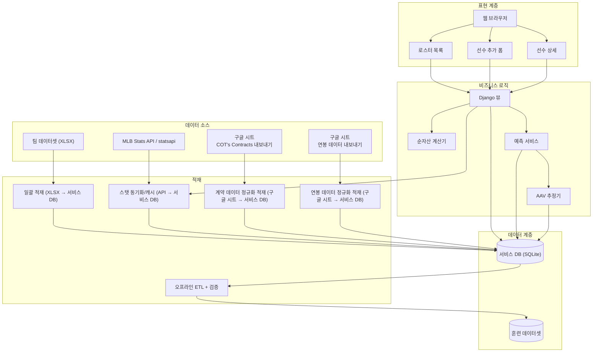
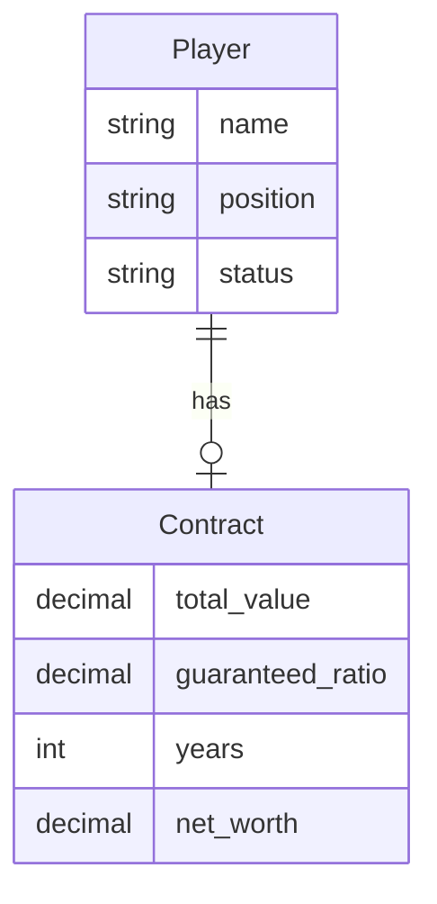
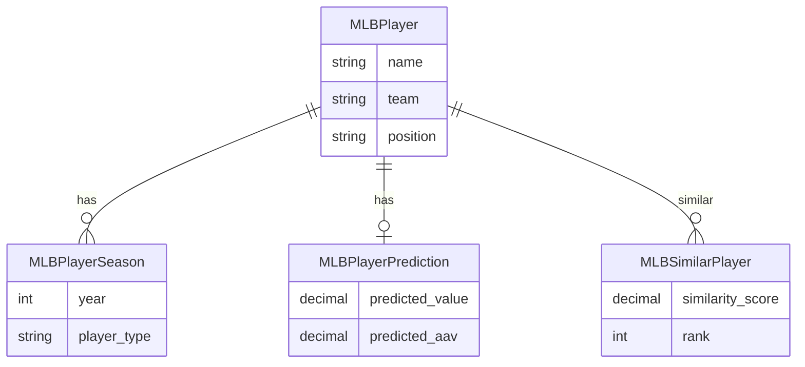
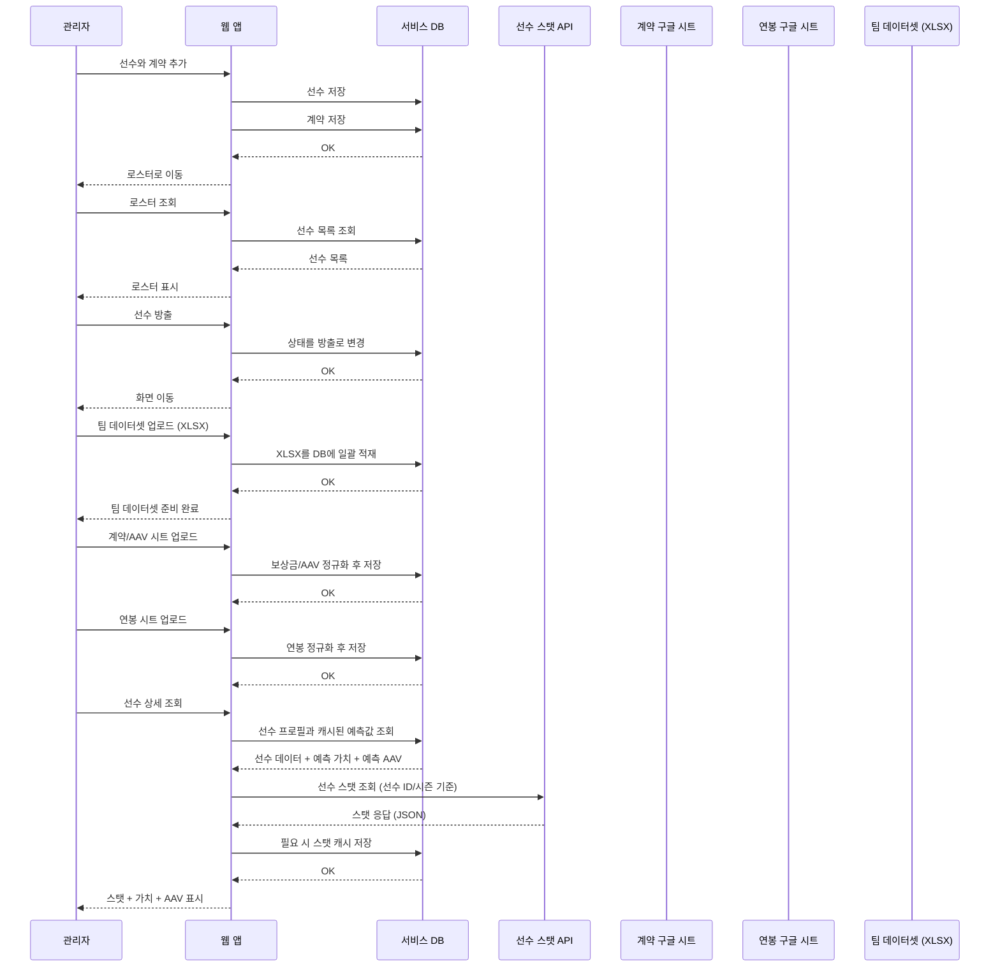
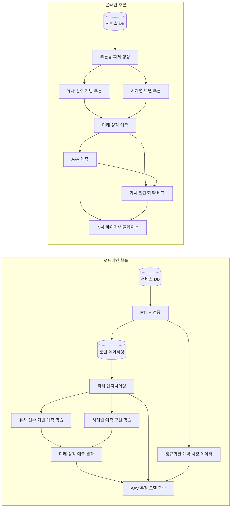
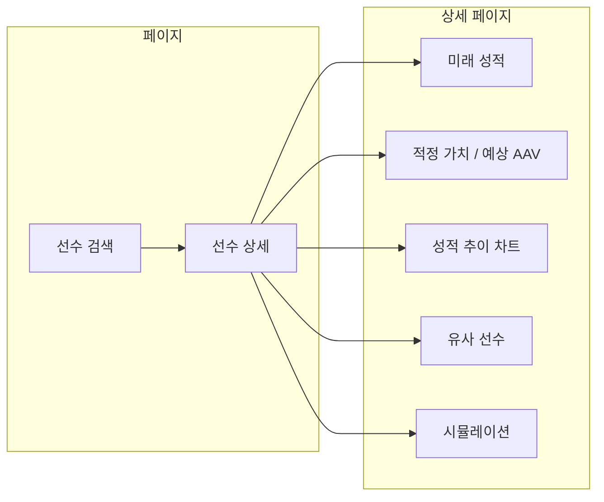

# 구단 의사결정 플랫폼 — 아키텍처

## 1. 개요

이 Django 애플리케이션은 General Manager(단장)가 선수 영입, 유지, 방출과 같은 로스터 의사결정을 지원하도록 설계된 데이터 기반 야구 운영 플랫폼이다. 시스템은 MLB 선수 시즌 기록과 계약 데이터를 통합해 미래 성적을 예측하고, 특히 FA 선수의 시장 계약가치를 추정하며, 이를 선수 상세 분석·시뮬레이션·계약 비교 화면에 연결해 구단 관점의 의사결정을 보조한다.

## 2. 서비스 배경

본 단계의 모델 목표는 **FA 선수의 시장 계약가치를 예측하는 것**이다.

이를 위해 관측된 시장가격(AAV, compensation, salary)으로 형성된 시장계약가치가 선수의 내재가치를 잘 반영한다고 가정한다.

## 3. 아키텍처 다이어그램

### 3.1. 시스템 레이어



### 3.2. 데이터 모델

#### 3.2.1. Roster 앱 (팀 매니저)



#### 3.2.2. MLB 앱 (선수 분석)



세부 필드 정의(타자/투수 지표, 예측 컬럼)는 `6.4 MLB 데이터 모델`에서 단일 기준으로 관리한다.

### 3.3. 요청 흐름



## 4. 데이터 흐름

1. **순자산** — `Contract` 모델은 `total_value`, `guaranteed_ratio`, `years`를 저장한다. `roster/services.py`의 `calculate_net_worth()` 함수가 `net_worth = total_value * guaranteed_ratio * years`로 계산한다. 이 값은 목록 및 상세 화면에 표시되며, 계약(비율, 연수) 수정을 통해 갱신할 수 있다.

2. **팀 데이터셋(XLSX)** — 팀 수준 데이터셋은 XLSX 파일로 관리한다. 사용자는 XLSX를 업로드하고, 시스템은 이를 파싱하여 서비스 DB에 적재한다(배치 임포트). 이 데이터는 팀 승률/수익 모델의 입력(또는 파생 변수 생성)의 기준이 된다.

3. **선수 스탯(API)** — 선수 시즌별 스탯은 외부 API에서 조회해 가져온다. 현재 기준 기본 후보는 **MLB Stats API**이며, Python 연동 시에는 `MLB-StatsAPI` 패키지(`statsapi`)를 우선 검토한다. 웹 요청 시 API를 호출해 최신 스탯을 수신하고, 조회 비용/속도를 위해 결과를 서비스 DB에 캐시(또는 스냅샷 저장)할 수 있다. 초기 구현은 `lookup_player`, `player_stat_data`, `schedule` 같은 고수준 함수 중심으로 시작하고, 필요한 경우 `get`으로 raw JSON 엔드포인트를 직접 호출한다.

4. **훈련 데이터셋 구성(ETL)** — 모델 학습 시에는 서비스 DB에 적재된 원천/정규화 데이터를 그대로 바로 사용하기보다, 오프라인 `ETL + 검증` 단계를 거쳐 결측 처리, 스키마 정합성 검증, 시즌 정렬, 타깃 생성, 학습/평가 분할이 반영된 훈련 데이터셋으로 별도 구성한다.

### 참고: 외부 영상 메모

- YouTube: `https://www.youtube.com/watch?v=tR-WFirYXh4`
- 확인한 주제: MLB 구단이 FA(자유계약선수)를 평가할 때 과거 성적만 보는 것이 아니라, 미래 퍼포먼스와 예상 가치를 어떻게 투영하는지 설명하는 내용
- 우리 프로젝트와의 연결점: 선수의 시장 계약 금액을 그대로 따르기보다, 구단 관점에서 미래 성과 기반의 적정 가치를 추정해야 한다는 문제의식과 맞닿아 있음
- 비고: 영상 페이지 전문을 직접 확보한 것은 아니고, 공개 소개 문구를 바탕으로 핵심 주제를 요약한 메모임
- 비고: 팀원 변준영 조사

## 5. 선수 예측 및 가치 판단 설계

본 프로젝트는 시장 수익을 직접 환산하는 방식 대신, 선수의 과거 시즌 기록과 지표를 바탕으로 **미래 성적을 예측**하고 이를 계약 정보와 함께 해석하는 구조를 사용한다. 문서 내 "적정 가치(predicted_value)"와 `predicted_aav`는 단일 수익 공식이 아니라, 미래 성적 전망과 비교 기준을 종합한 의사결정용 지표로 다룬다.

### 5.1. 예측 파이프라인



`6.4.2`와 `6.7`에서 정의한 모델은 **오프라인 학습 단계**와 **온라인 추론 단계**를 구분한다. Google Sheets에서 업로드한 `COT's Contracts` 기반 계약 데이터와 salary 데이터는 우선 서비스 DB에 정규화 저장되고, 이후 오프라인 `ETL`을 통해 **AAV 모델 학습용 타깃/시장 기준 데이터**와 훈련 데이터셋으로 재구성된다. 실제 상세 페이지 조회 시에는 서비스 DB의 선수 시즌 기록으로부터 추론용 피처를 생성하고, 그 결과를 이미 학습된 AAV 모델에 넣어 `predicted_aav`와 계약 의사결정 지표를 산출한다.

### 5.2. 입력 데이터

- **시즌별 선수 기록**: 타자/투수 기본 기록과 지표
- **선수 메타데이터**: 포지션, 나이, 경력 연차, handedness, 소속 팀
- **계약 정보**: 연봉, 계약 총액, 보장 비율, 계약 연수
- **시장 계약 정보**: 사용자가 Google Sheets에서 내려받은 과거 FA 계약 데이터, 포지션별 연봉 분포, 리그 연봉 상승률
- **급여 정보**: 사용자가 Google Sheets에서 내려받은 salary 데이터
- **팀/리그 맥락 정보**: 리그 평균 대비 보정치, 시즌 길이, 출전 규모, 필요 시 부상/결장 대리 변수

### 5.3. 예측 대상 지표

- **타자**: AVG, OBP, SLG, OPS, HR, RBI, WAR, wOBA, wRC+, BABIP
- **투수**: ERA, FIP, xFIP, WHIP, SO, BB, K/9, BB/9, IP, WAR
- **장기 출력**: t+1 ~ t+n 시즌 포인트 예측, 필요 시 P10/P50/P90 같은 구간 예측
- **계약 출력**: predicted AAV, 추천 계약 기간, 계약 범위 밴드

### 5.4. 서비스 활용 방식

- **선수 검색/상세**: 미래 성적 카드, 추이 차트, 유사 선수 비교에 사용
- **영입 검토**: 유사 선수 사례와 다음 시즌 전망을 함께 제시
- **계약 검토**: 예측 성과와 현재 계약 조건을 나란히 비교하고 예상 AAV를 제시
- **시뮬레이션**: 사용자가 스탯을 조정했을 때 예측 결과가 어떻게 달라지는지 확인

### 5.5. 해석 원칙

- 예측값만 노출하지 않고, 최근 시즌 추세와 핵심 변수 변화도 함께 보여준다.
- 단일 시즌 성과보다 다년 전망을 우선해 선수의 안정성과 변동성을 함께 본다.
- 계약 의사결정은 예측 성과, 유사 선수 분포, 현재 계약 조건, 예상 AAV를 함께 고려한다.

### 5.6. 데이터셋 구조

선수 예측 모델 학습 및 서비스 반영에 필요한 데이터셋 구조는 다음과 같다. 저장 계층은 `서비스 DB(원천/정규화 데이터)`와 `오프라인 ETL로 생성한 훈련 데이터셋`으로 구분한다.

#### 5.6.1. 선수 시즌 데이터 (Player-level)

상세 필드는 `6.4.1. MLBPlayerSeason` 정의를 기준으로 관리한다.

- **타자**: AB, hits, HR, RBI, AVG, OBP, SLG, OPS, fWAR, wOBA, wRC+, BABIP, OPS+
- **투수**: IP, ERA, SO, BB, WHIP, fWAR, FIP, xFIP, K/9, BB/9
- **WAR 계산/검증용 원천 변수**
  - 타자: Batting Runs, Base Running Runs, Fielding Runs, Positional Adjustment, League Adjustment, Replacement Runs, Runs Per Win
  - 투수: Pitcher FIP, League FIP, Pitcher Specific Runs Per Win, Replacement Level, IP, Leverage Multiplier for Relievers, League Correction

WAR 자체를 저장하더라도, 모델 입력 검증과 지표 재계산 가능성을 위해 위 구성 변수 또는 이에 대응하는 파생 가능 원천 데이터를 함께 관리하는 것을 원칙으로 한다.

- **비고**: 팀원 변준영 조사 중

#### 5.6.2. 선수 메타데이터

| 변수 | 설명 | 용도 |
|------|------|------|
| player_id | 선수 ID | 식별 |
| team_id | 소속 구단 | 시즌 기록과 연결 |
| year | 시즌 연도 | 시계열 |
| position | 포지션 | 타자/투수 구분 |
| age | 시즌 기준 나이 | 노화 곡선 반영 |
| handedness | 좌/우/스위치 | 유형 구분 |
| experience | 경력 연차 | 성장/회귀 구간 해석 |

#### 5.6.3. 계약/보상 데이터 (Contract-level)

| 변수 | 설명 | 용도 |
|------|------|------|
| player_id | 선수 ID | 식별 |
| year | 시즌 연도 | 시계열 |
| compensation | 보상(연봉+계약금+보너스+alpha) | 계약 시장 예측 모델의 타깃, 예측 성과와 계약 조건 비교 |
| salary | 시즌 연봉 | 연봉 이력 추적, 계약 구조 비교, 보조 입력 |
| aav | 연평균계약가치 (Average Annual Value) | AAV 예측 모델의 직접 타깃 |
| total_value | 계약 총액 | 계약 구조 파악 |
| guaranteed_ratio | 보장 비율 | 리스크 분석 |
| years | 계약 연수 | 다년 의사결정 참고 |

#### 5.6.4. 데이터 관계

```
Player (player_id) ─┬─ 1:N ─ MLBPlayerSeason (player_id, year)
                    │
                    └─ 1:1 ─ Contract (player_id, year)
```

#### 5.6.5. 데이터 출처 (MLB 기준)

- **선수 기록**: MLB 공식 기록, Baseball Savant, Baseball-Reference, MLB Stats API 등
- **팀/리그 맥락 정보**: MLB 팀별 시즌 스탯, 리그 평균 지표, 공개 데이터셋
- **계약 정보**: Baseball Prospectus의 [`COT's Contracts`](https://legacy.baseballprospectus.com/compensation/cots/)를 기반으로 사용자가 Google Sheets에서 다운로드한 계약 데이터 ([sheet link](https://docs.google.com/spreadsheets/d/1bXUPBabVf82y0m2KaZ0F9Fno9xwZ2pmepbFvMBX_TEM/)), 구단 공시, 공개 연봉 데이터, 프로젝트 입력 데이터
- **급여 정보**: 사용자가 Google Sheets에서 다운로드한 salary 데이터 ([sheet link](https://docs.google.com/spreadsheets/d/12XSXOQpjDJDCJKsA4xC1e_9FlS11aeioZy_p1nqpclg/))
- **시장 비교 데이터**: FA 계약 사례, 포지션별 AAV 분포, 시즌별 연봉 인플레이션 지표

### 5.7. 구현 로드맵

- **Phase 1**: 데이터 적재 파이프라인 구축 및 서비스 DB/정규화 테이블 적재 (원천/경로는 6.2, 학습용 표준 데이터셋은 6.7.1 참조)
- **Phase 2**: 오프라인 ETL, 피처 엔지니어링, 베이스라인 예측 모델 구축
- **Phase 3**: 유사 선수 기반 예측 + 시계열 모델 학습 및 배포
- **Phase 4**: AAV 추정 모델 구축 및 Django 상세 화면/시뮬레이션 연동

> **참고**: 각 예측 모델에는 향후 추가 기능을 도입할 수 있다.

### 5.8. 이론적 근거

- 선수 미래 성적 예측과 비교 가능한 선수 탐색을 중심으로 모델 구조를 설계한다.
- 상세 서지 정보와 예측 모델 관련 참고 논문은 `6.7.8. 참고문헌`에 통합 정리한다.

## 6. MLB 플랫폼 확장

데이터 기반 MLB 선수 성적 분석 및 시장 가치 예측 플랫폼으로 프로젝트를 확장한다. MLB 통계 데이터를 활용하여 선수의 미래 성적과 적정 가치를 예측하고, 사용자가 활용할 수 있는 웹 서비스를 구축한다.

### 6.1. 고객 요구사항

| 요구사항 | 설명 |
|----------|------|
| 선수 검색 | 특정 MLB 선수 검색 시 미래 성적 + 적정 가치 + 예상 AAV 표시 |
| E2E 파이프라인 | 데이터 수집 → 모델 추론 자동화 |
| 심화 통계 | 단순 성적 나열이 아닌 고급 지표 계산 및 활용 |
| 실시간 시뮬레이션 | 사용자가 스탯 임의 조정 시 예측 가치 실시간 계산 |
| 시각화 | 성적 변화 추이, 유사 선수 비교, 예측 가치 |

### 6.2. 데이터 파이프라인

- **데이터 소스**: `/data` 디렉터리에 업로드되는 파일 (CSV/JSON/XLSX 등) + Lahman Database 파생 파일 + MLB Stats API 응답(JSON) + 사용자가 Google Sheets에서 다운로드한 `COT's Contracts` 계약 데이터 + salary 데이터
- **수집 방식**: (1) 파일 기반 배치 임포트, (2) 선수 스탯은 `statsapi` 기반 API 호출로 온디맨드 조회(필요 시 서비스 DB 캐시), (3) 계약/AAV 데이터는 사용자가 Google Sheets에서 다운로드한 `COT's Contracts` 스프레드시트를 업로드하고 이를 정규화해 서비스 DB에 적재, (4) salary 데이터도 별도 Google Sheets 스프레드시트를 업로드해 정규화 적재, (5) 이후 오프라인 `ETL + 검증` 단계에서 훈련 데이터셋과 시장 기준 데이터셋을 생성
- **구현**: `scripts/import_data.py` — Python 스크립트로 `/data` → 서비스 DB 적재 (팀 데이터셋 XLSX 포함). 훈련 데이터셋 생성은 별도 오프라인 ETL 작업으로 분리한다.
- **모델 학습 연계**: 서비스 DB에 적재된 원천/정규화 데이터를 기준으로 오프라인 학습 파이프라인이 훈련 데이터셋과 계약 시장 기준 데이터셋을 생성하며, 세부 기준은 5.7과 6.7.1을 따른다.

#### 6.2.1. API 연동 참고 자료

향후 선수/팀/일정/리더보드 데이터를 API로 불러올 때는 아래 자료를 기준으로 구현한다.

- **주 구현 기준**: [`toddrob99/MLB-StatsAPI Wiki`](https://github.com/toddrob99/MLB-StatsAPI/wiki) — `statsapi` 사용법, 함수 목록, 파라미터 정의 확인용
- **패키지 저장소**: [`toddrob99/MLB-StatsAPI`](https://github.com/toddrob99/MLB-StatsAPI) — 래퍼 구조와 이슈 확인용
- **한글 빠른 참고**: [`[MLB Stats API] 파이썬 패키지로 MLB Stats API 사용해보기`](https://minding-deep-learning.tistory.com/64) — 설치, 기본 예제, 자주 쓰는 함수 개요 확인용
- **영상 참고(라이브 스탯 확장)**: [`YouTube 영상`](https://www.youtube.com/watch?v=dy_8wKNhAgo) — 실시간 MLB stats 조회 흐름을 확인하는 보조 자료. 향후 경기 중 스코어보드, play-by-play, live boxscore 같은 실시간 기능 확장 시 참고 후보로 둔다.

초기 화면/API 연결 시 우선 검토할 함수는 다음과 같다.

- `statsapi.lookup_player`: 선수 검색 자동완성/이름 검색
- `statsapi.player_stat_data`: 선수 상세 페이지용 시즌/통산 스탯 조회
- `statsapi.schedule`: 날짜/팀 기준 경기 일정 조회
- `statsapi.league_leader_data`: 리더보드/랭킹 데이터 조회
- `statsapi.get`: 고수준 함수로 부족한 엔드포인트를 raw JSON으로 직접 조회

라이브 기능이 필요해지면 아래 범주의 엔드포인트도 추가 검토한다.

- 실시간 경기 상태(scoreboard)
- 경기 상세 feed / play-by-play
- 실시간 boxscore / linescore

### 6.3. UI 구조



### 6.4. MLB 데이터 모델

`3.2.2`의 개념 모델을 실제 서비스 컬럼 수준으로 확장한 정의다.

#### 6.4.1. MLBPlayerSeason (시즌별 성적)

선수 시즌별 기본 성적과 지표를 저장한다.

**타자 기본 지표**

| 필드 | 설명 |
|------|------|
| ab, hits, hr, rbi | 타수, 안타, 홈런, 타점 |
| avg, obp, slg, ops | 타율, 출루율, 장타율, OPS |

**타자 지표**

| 필드 | 설명 |
|------|------|
| fwar | FanGraphs Wins Above Replacement |
| woba | Weighted On-Base Average |
| wrc_plus | wRC+ (100 = 리그 평균) |
| babip | Batting Average on Balls in Play |
| ops_plus | OPS+ (100 = 리그 평균) |
| batting_runs | 공격 득점 기여분 |
| baserunning_runs | 주루 득점 기여분 |
| fielding_runs | 수비 득점 기여분 |
| positional_adjustment | 포지션 보정값 |
| league_adjustment | 리그 보정값 |
| replacement_runs | 대체 선수 대비 보정 득점 |
| runs_per_win | 1승당 환산 득점 |

**투수 기본 지표**

| 필드 | 설명 |
|------|------|
| ip, era, so, bb, whip | 이닝, 평균자책점, 탈삼진, 볼넷, WHIP |

**투수 지표**

| 필드 | 설명 |
|------|------|
| fwar | FanGraphs Wins Above Replacement |
| fip | Fielding Independent Pitching |
| xfip | Expected FIP |
| k_per_9 | 9이닝당 탈삼진 |
| bb_per_9 | 9이닝당 볼넷 |
| league_fip | 리그 평균 FIP |
| pitcher_specific_rpw | 투수 유형별 Runs Per Win |
| replacement_level | 대체 선수 기준값 |
| leverage_multiplier | 구원투수 레버리지 배수 |
| league_correction | 리그 보정값 |

#### 6.4.1.1. fWAR 산출 기준

fWAR(FanGraphs Wins Above Replacement)는 FanGraphs가 사용하는 대체 선수 대비 승리 기여 누적 가치 지표다. 본 프로젝트에서는 WAR를 다룰 때 기본적으로 이 **FanGraphs 기준 fWAR** 구조를 기준 개념으로 사용한다.

- **타자 fWAR**

$$
\text{fWAR} = \frac{\text{Batting Runs} + \text{Base Running Runs} + \text{Fielding Runs} + \text{Positional Adjustment} + \text{League Adjustment} + \text{Replacement Runs}}{\text{Runs Per Win}}
$$

- **투수 fWAR**

$$
\text{fWAR} = \left( \left( \frac{\text{League FIP} - \text{Pitcher FIP}}{\text{Pitcher Specific Runs Per Win}} + \text{Replacement Level} \right) \times \frac{\text{IP}}{9} \right) \times \text{Leverage Multiplier for Relievers} + \text{League Correction}
$$

- **해석 메모**
  - 타자 fWAR는 공격, 주루, 수비, 포지션 보정, 리그 보정, 대체 선수 대비 기여를 종합한다.
  - 투수 fWAR는 FIP 기반 기여, 이닝 규모, 불펜 레버리지, 리그 보정을 함께 반영한다.
  - 본 문서의 WAR 관련 설명은 정확히는 FanGraphs 기준의 fWAR를 의미한다.
  - 실제 구현 시 데이터 소스에 따라 세부 계수와 보정 방식은 달라질 수 있으므로, 원천 데이터 정의와 일치하도록 정규화한다.
  - 따라서 fWAR를 단순 결과값으로만 저장하지 않고, 가능하면 구성 요소 변수도 함께 저장하거나 재현 가능한 형태로 확보해야 한다.

#### 6.4.2. 선수 상세 페이지 표시 항목 및 장기 실적 예측 모델

`6.3 UI 구조`의 상세 페이지 컴포넌트(Future/Value/Chart/Similar/Sim)에 바인딩되는 핵심 항목은 다음과 같다.

- **시즌별 성적 테이블**: 기본 지표 + 추가 지표 (타자: fWAR, wOBA, wRC+, BABIP, OPS+ / 투수: fWAR, FIP, xFIP, K/9, BB/9)
- **성적 추이 차트**: 타자(AVG, OPS, HR, fWAR, wRC+) / 투수(ERA, FIP, fWAR)
- **미래 성적 예측 카드**: AVG, HR, OPS, fWAR, wOBA, wRC+ (타자) / ERA, FIP (투수)
- **계약 가치 카드**: predicted AAV, 추천 계약 기간, 현재 계약 대비 차이

선수 상세 페이지에서는 해당 선수의 **N년치 장기 실적 지표 전망**을 보여줄 필요가 있다. 이를 위해 **장기 실적 예측 모델**을 둔다. 이 모델은 최근 스포츠 시계열 예측 연구의 방향을 반영해, 단일 지표 회귀보다 **멀티변수 시즌 시계열 기반 예측**을 기본 원칙으로 잡는다.

- **역할**: 선수별로 t+1, t+2, … t+N 시즌에 대한 주요 성적 지표(타자: AVG, OPS, HR, fWAR, wOBA, wRC+ 등 / 투수: ERA, FIP, fWAR 등) 전망과, 이를 바탕으로 한 예상 AAV를 산출한다.
- **입력**: 과거 시즌별 성적(MLBPlayerSeason), 선수 속성(포지션, 나이, 경력 연차, handedness 등), 팀·리그 보정 요인. 학습 단계에서는 계약 데이터와 시장 AAV 데이터를 함께 사용할 수 있고, 추론 단계에서는 선수 시즌 기록과 선수 속성으로부터 생성한 피처를 사용한다.
- **출력**: N년치 연도별 포인트 예측(및 향후 분포 예측 P10/P50/P90 등), predicted AAV, 추천 계약 범위. 이 출력은 상세 페이지의 “미래 성적 예측”·“장기 전망” 영역에 바인딩된다.
- **기본 설계 원칙**:
  - 시즌별 입력을 `2~4년 길이의 sliding window`로 구성해 다음 시즌(t+1) 또는 다년(t+1~t+N) 지표를 예측한다.
  - 타자/투수를 분리 학습하고, 각 포지션군에서 **다중 입력 변수(multivariate features)**를 함께 사용한다.
  - 포인트 예측뿐 아니라, 어떤 입력 변수가 예측에 영향을 주었는지 설명 가능한 구조를 유지한다.
- **구현 위치**: 6.7의 유사 선수 기반 예측·시계열(TFT/LSTM 등) 모델과 연계하거나, 이들의 결과를 다년으로 확장한 파이프라인으로 구성한다. 성적 예측 결과는 별도의 AAV 추정 레이어로 전달되며, 최종 결과는 DB에 저장하거나 API/캐시를 통해 상세 페이지에 제공한다.

### 6.5. 앱 구조

- **roster**: 기존 팀 매니저 (선수 명단, 영입/방출)
- **mlb**: MLB 선수 분석 (검색, 상세, 시뮬레이션, 시각화, 지표 분석)

### 6.6. 참고 서비스(레이아웃) 및 장기 예측 아이디어

향후 MLB **팀 매니징(로스터 구성/계약/연봉 의사결정)** 경험을 고도화하기 위해, 다음 서비스들의 레이아웃과 지표/예측 구성 방식을 참고한다.

- **Baseball Prospectus**
  - 참고: [`https://www.baseballprospectus.com/`](https://www.baseballprospectus.com/)
  - 특징: 장기 실적 예측(예: **PECOTA**, 5년 이상 기간의 성과 분포/리스크를 포함하는 예측)과 깊이 있는 고급 지표 중심의 정보 설계
- **STATIZ**
  - 참고: [`https://www.statiz.co.kr/`](https://www.statiz.co.kr/)
  - 특징: 선수/팀 정보 탐색 동선, 랭킹/리더보드, 지표 중심 테이블 레이아웃

#### 6.6.1. 실무 보완 관점: Win Curve와 시장 가격

FanGraphs의 `Win Curves and Player Pricing` 글은, 선수 가격 책정을 평가할 때 **선수가 추가하는 승수의 팀별 한계가치**와 **시장 전체의 승수 가격($/WAR 등)** 을 함께 봐야 한다는 점을 강조한다. 이는 우리 프로젝트에서 적정 가치나 예상 AAV를 단순히 "선수 실력의 절대값"으로만 보지 않고, 팀 상황과 계약 의사결정 맥락까지 포함해 해석해야 함을 보완해 준다.

- **Win Curve 관점**: 추가 1승의 가치는 선형적이지 않으며, 특히 플레이오프 경쟁권에 있는 팀에서 더 커질 수 있다.
- **시장 가격 관점**: 어떤 선수가 특정 팀에 높은 가치를 주더라도, 실제 계약 판단은 FA 시장의 대체 옵션과 평균적인 승수 가격을 함께 고려해야 한다.
- **프로젝트 반영 방향**: 기본 예측 모델은 선수 성과와 AAV를 추정하되, 향후 팀 상태(현재 예상 승수, 포스트시즌 경쟁 구간 여부)와 시장 가격 지표를 추가해 `상황 보정 가치` 또는 `의사결정 보조 지표`로 확장할 수 있다.
- **비고**: 팀원 이시윤 조사

#### 6.6.2. 장기(다년) 예측의 의미

본 프로젝트의 적정 가치 판단은 단일 시즌(또는 t+1)만이 아니라 **다년(t+1, t+2, …)** 관점에서 의사결정에 활용될 수 있다.

- **스카우팅/영입**: 단기 폭발력 vs 장기 안정성을 비교
- **계약(연봉) 전략**: 다년 성적 전망에 따라 적정 AAV와 계약 총액/기간 추정
- **리스크 관리**: 분산(불확실성)까지 반영해 “기대값”뿐 아니라 “바닥/천장”을 함께 고려

#### 6.6.3. (향후) PECOTA 유사 접근을 위한 구현 방향

PECOTA 같은 다년 예측을 직접 재현하는 것은 범위가 크므로, 다음과 같은 단계적 접근을 고려한다.

- **Step A — 포인트 예측 확장**: t+1만이 아니라 t+2~t+5까지의 주요 지표를 예측(선수 노화/회귀 포함)
- **Step B — 분포 예측**: 한 값이 아니라 구간/분포(예: P10/P50/P90)로 성과를 산출
- **Step C — 팀 매니징 통합**: 다년 성과 분포와 계약(AAV/연봉/옵션)을 결합해 기대치와 리스크를 표시

### 6.7. 선수 미래 실적 예측 모델

선수별 미래 성적(예: AVG, OPS, WAR, ERA, FIP 등)을 산출하기 위해 **세 가지 예측 모델 계열**을 테스트하고, 그 결과를 서비스에 반영할 계획이다. 학습·평가 데이터는 **Lahman Database**를 사용하되, 최근 연구 사례처럼 시즌별 다변량 시계열 구성을 우선 검토한다.

- **모델 평가 지표**: `R²`, `MAPE`, `RMSE`

#### 6.7.1. 학습 데이터 — Lahman Database

- **출처**: [Lahman Baseball Database](http://www.seanlahman.com/baseball-archive/statistics/) (역사적 MLB 선수·팀·시즌 기록)
- **용도**: 두 예측 모델 모두 Lahman 데이터를 전처리하여 학습·검증·테스트에 사용
- **연동**: 적재 경로는 6.2의 공통 배치 파이프라인을 사용하고, 학습 파이프라인에서 참조
- **학습 샘플 구성 원칙**:
  - 선수별 시즌 데이터를 시간순으로 정렬하고, `최근 2~4시즌 -> 다음 시즌` 형태의 샘플을 생성한다.
  - 타자와 투수는 지표 체계가 다르므로 별도 데이터셋과 모델로 관리한다.
  - 일정 경기 수/타석/이닝 미만 샘플은 제외하거나 가중치를 낮춰 표본 왜곡을 줄인다.
  - 데이터 누수 방지를 위해 train/validation/test는 연도 기준으로 분리한다.

#### 6.7.2. 모델 1 — 유사 선수 기반 예측 (PECOTA 유사)

- **방식**: 관심 선수와 **과거 선수들 중에서 가장 유사한 선수(들)**를 찾고, 그 유사 선수들의 **이후 시즌 실적 지표**를 참고하여 관심 선수의 미래 실적을 예측
- **특징**: PECOTA와 유사한 “비교 가능한 선수(comparables)” 기반 접근. 유사도는 성적·포지션·나이 등으로 정의
- **출력**: 선수별 t+1, t+2, … 에 대한 실적 지표(및 필요 시 분포)

#### 6.7.3. 모델 2 — 시계열 딥러닝 (TFT 우선, LSTM 계열 비교)

- **방식**: 선수별 **시즌 시계열**(과거 연도별 지표)을 입력으로 하여, **Temporal Fusion Transformer(TFT)** 를 1차 후보로 사용하고 LSTM/GRU/BiLSTM 계열을 비교 베이스라인으로 둔다.
- **연구 맥락**: Sun et al. (2022)은 MLB 타자의 홈런 수 예측에 대해 `과거 5시즌 -> 다음 시즌` 형태의 `sliding window + LSTM` 구성을 적용해 선형회귀 및 기존 예측 시스템 대비 경쟁력 있는 성능을 보고했다. 본 프로젝트는 이 접근을 `LSTM 계열 베이스라인` 참고 사례로 사용하되, 홈런 단일 지표를 넘어 타자/투수 다지표 예측으로 확장한다.
- **특징**:
  - 순차 패턴, 노화 곡선, 최근 시즌 가중치를 데이터로 학습한다.
  - 정적 변수(포지션, 나이대, 투타 정보)와 시계열 변수(시즌 성적)를 함께 다룰 수 있다.
  - attention 기반 구조와 feature importance 분석을 통해 예측 근거를 설명하기 쉽다.
- **입력 변수 예시**:
  - 타자: AVG, OBP, SLG, OPS, HR, RBI, fWAR, wOBA, wRC+, BABIP, PA, age
  - 투수: ERA, FIP, xFIP, WHIP, SO, BB, K/9, BB/9, IP, fWAR, age
  - 공통 보조 변수: 팀, 리그 평균 대비 보정치, 시즌 길이, 부상/결장 대리 변수(확보 가능 시)
- **평가 방식**:
  - 시퀀스 길이 `2, 3, 4시즌`을 비교한다.
  - 지표별 `R²`, `MAPE`, `RMSE`를 기본 평가 지표로 사용한다.
  - 단순 직전 시즌 유지, 평균 회귀, LSTM 계열을 함께 비교해 TFT 채택 여부를 결정한다.
- **출력**: 선수별 t+1, t+2, … 에 대한 실적 지표(및 필요 시 불확실성 구간)

#### 6.7.4. 모델 3 — 설명 가능한 시계열 회귀

- **방식**: XGBoost/LightGBM 같은 트리 기반 회귀로 lag feature와 rolling feature를 입력받아 다음 시즌 지표를 예측한다.
- **특징**:
  - 적은 데이터에서도 안정적으로 동작할 가능성이 높다.
  - SHAP 기반 변수 중요도 해석이 용이하다.
  - 딥러닝 모델보다 서빙 비용이 낮아 초기 운영 모델로 적합할 수 있다.
- **역할**: 딥러닝 성능 검증용 강한 베이스라인이자, 해석 가능성 중심 운영 대안

#### 6.7.5. 모델 해석 및 서비스 반영

- **해석 도구**: TFT attention weight, SHAP, permutation importance 등을 활용해 선수별 예측 근거를 저장한다.
- **UI 반영**:
  - “왜 이렇게 예측했는가?”를 최근 3시즌 추세와 핵심 변수 변화로 요약한다.
  - 예: `최근 2년 fWAR 하락`, `K/9 개선`, `출전 이닝 감소` 같은 설명 태그 제공
- **운영 원칙**: 예측값만 노출하지 않고, 핵심 근거 변수와 불확실성 범위를 함께 표시한다.

#### 6.7.6. AAV 추정 모델

- **목표**: 미래 성적 예측 결과와 시장 계약 데이터를 바탕으로 FA 선수의 예상 AAV와 시장 계약가치를 추정한다.
- **학습 방식**: 오프라인 학습을 기본으로 하며, historical contract dataset으로 모델을 학습한 뒤 서비스에서는 학습 완료된 모델만 사용해 추론한다.
- **전제**: 이 모델은 `FA 선수 시장계약가치 예측`을 목표로 하며, 관측된 계약가격으로 형성된 시장계약가치가 선수의 내재가치를 잘 반영한다고 가정한다.
- **입력**:
  - 학습 시: 6.7.2~6.7.4의 성적 예측 결과, 최근 시즌 핵심 지표, 나이/포지션/서비스 타임/FA 여부, 사용자가 Google Sheets에서 내려받은 `COT's Contracts` 기반 과거 계약 정보, salary 이력 데이터, 포지션별 시장 AAV 분포, 시즌별 연봉 인플레이션
  - 추론 시: 선수 성적 피처와 이미 학습된 AAV 모델
- **학습 타깃**:
  - `aav`: 연평균계약가치
  - `compensation`: 총 보상 규모(보조 타깃 또는 비교 지표)
- **모델 후보**:
  - 베이스라인: XGBoost/LightGBM 회귀
  - 확장안: MLP 기반 tabular 딥러닝
  - 범위 추정: Quantile Regression 또는 분위수 예측
- **출력**: `predicted_aav`, 추천 계약 기간, 계약 범위 밴드(P10/P50/P90)
- **서비스 반영**: 선수 상세 페이지와 시뮬레이션 화면에서 현재 계약과 predicted AAV를 비교해 표시한다.

#### 6.7.7. 모델 선택 및 앙상블

- **성능 비교**: 검증/테스트 세트에서 `R²`, `MAPE`, `RMSE`를 기준으로 성적 예측 모델의 정확도를 비교하여, 더 성능이 좋은 모델을 단일 모델로 사용할 수 있음
- **앙상블 옵션**: 세 모델 계열 예측값의 **평균(또는 가중 평균)**을 사용하여, 안정성과 정확도를 동시에 고려할 수 있음
- **AAV 레이어 결합**: 최종 선택된 성적 예측 결과를 AAV 추정 모델의 입력으로 사용한다.
- **서비스 반영**: 최종 선택(단일 모델 vs 앙상블)에 따라 선수 상세의 “미래 성적 예측”, “성적 변화 추이” 전망, 예상 AAV와 계약 의사결정 지표 계산에 반영

> **연구 참고 방향**: 최근 야구 성적 예측 연구에서는 `과거 2~4시즌의 다변량 입력`, `sliding window 기반 다음 시즌 예측`, `R²/RMSE/MAPE 기반 비교`, `SHAP를 통한 해석`이 유효한 설계로 제시된다. 특히 Sun et al. (2022)의 LSTM 기반 MLB 홈런 예측은 `시즌 시계열 + LSTM`이 실용적인 베이스라인이 될 수 있음을 보여준다. 본 프로젝트는 이를 참고하되, 단일 타깃 예측에 머물지 않고 타자/투수 다지표 예측과 장기 성과 해석으로 확장한다.

#### 6.7.8. 참고문헌 및 외부 참고자료

- Sun, H.-C., Lin, T.-Y., Tsai, Y.-L. (2022). *Performance Prediction in Major League Baseball by Long Short-Term Memory Networks*. arXiv. https://doi.org/10.48550/arXiv.2206.09654
  - 적용 영역: 6.7 시계열 예측 모델 설계
  - 반영 포인트: `선수별 시즌 시계열의 sliding window 구성`, `LSTM 계열 베이스라인 설정`, `다음 시즌 예측 문제 정의`, `RMSE/MAE 기반 비교 평가`
  - 비고: 팀원 조윤주 조사
- Lee, W., Kim, J. H. (2025). *Pitcher Performance Prediction Major League Baseball (MLB) by Temporal Fusion Transformer*. **Computers, Materials & Continua**, 83(3), 5393-5412. https://doi.org/10.32604/cmc.2025.065413
  - 적용 영역: 6.7 TFT 기반 성능 예측 모델 설계
  - 반영 포인트: `Temporal Fusion Transformer(TFT) 적용`, `2~4시즌 길이 입력 시퀀스 비교`, `RMSE/MAE/MAPE 기반 성능 평가`, `설명 가능한 변수 중요도 분석`
  - 비고: 팀원 조윤주 조사
- Barnes, S. L., and Bjarnadóttir, M. V. (2016). *Great expectations: An analysis of major league baseball free agent performance*. **Statistical Analysis and Data Mining: The ASA Data Science Journal**, 9, 295-309. https://doi-org-ssl.eproxy.sejong.ac.kr/10.1002/sam.11311
  - 적용 영역: 6.6 장기 예측 활용 관점, 6.7 유사 선수 및 FA 성과 해석 참고
  - 반영 포인트: `자유계약선수 성과 기대치와 실제 성과 비교`, `계약 의사결정에서 장기 성과 전망의 중요성`, `시장 계약과 선수 퍼포먼스 간 간극 해석`
- SABR. *The Sultan of Swag: Babe Ruth as a Financial Investment*. https://sabr.org/journal/article/the-sultan-of-swag-babe-ruth-as-a-financial-investment-4/?utm_source
  - 적용 영역: 참고 후보
  - 반영 포인트: `선수 가치와 재무적 해석 관련 참고 가능 자료`
  - 비고: 팀원 이시윤 조사
- Cameron, D. (2012-01-25). *Win Curves and Player Pricing*. FanGraphs. https://blogs.fangraphs.com/win-curves-and-player-pricing/
  - 적용 영역: 6.6.1 계약/AAV 의사결정 보완 관점
  - 반영 포인트: `승수의 팀별 한계가치는 비선형적임`, `선수 가격 평가는 팀 내부 가치와 시장 가격을 함께 봐야 함`, `팀 상황에 따른 보정 가치 해석`
  - 비고: 팀원 이시윤 조사
- Baseball Prospectus. *COT's Contracts*. https://legacy.baseballprospectus.com/compensation/cots/
  - 적용 영역: 5.6.3 계약/보상 데이터, 6.2 데이터 파이프라인, 6.7.6 AAV 추정 모델
  - 반영 포인트: `historical compensation 데이터 원천`, `Google Sheets 다운로드 후 적재하는 계약 데이터 소스`, `AAV/보상 모델의 감독학습 타깃 구성`, `salary 원천 데이터`
  - 관련 시트:
    - 계약/AAV 시트: https://docs.google.com/spreadsheets/d/1bXUPBabVf82y0m2KaZ0F9Fno9xwZ2pmepbFvMBX_TEM/
    - salary 시트: https://docs.google.com/spreadsheets/d/12XSXOQpjDJDCJKsA4xC1e_9FlS11aeioZy_p1nqpclg/
