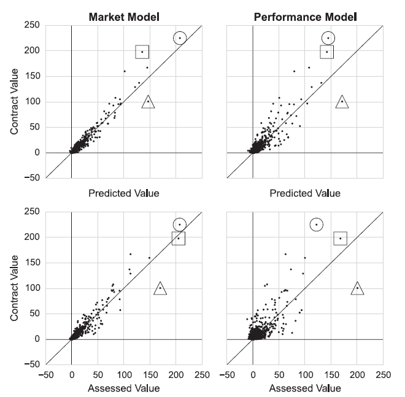

## 주요 피드백 및 대응방안

| 주요 피드백 | 대응방안 |
| --- | --- |
| 문제정의를 더 명확히 해야 함 | 표본을 FA 계약 선수로 한정하고, 성공적인 영입을 계약 당시 기대수익률 대비 사후 실제 순수입으로 정의함 |
| 과대 지불과 과소 지불의 해석을 보여줘야 함 | WAR * $/WAR, AAV 직접 예측(시장모델), MRP 접근을 함께 비교하고, 잔차를 기준으로 과대/과소 지불 사례를 해석함 |
| AAV 선형모델이 변수 간 결합 효과를 충분히 반영하지 못함 | AAV 선형모델에 interaction term과 다양한 feature transformation을 추가해, 변수 간 관계를 더 유연하게 반영할 수 있는지 실험함 |
| 모델 성능 결과만 제시되어 개선 근거와 해석이 부족함 | 선행연구 변수 기반 예측 → 잔차 플롯 → 큰 잔차 사례 선정 → 원인 가설 수립 → feature engineering → 동일 홀드아웃 재검증으로 이어지는 모델 개선 과정의 스토리를 추가함 |

## 1. 방향 전환

남은 기간에는 신규 서비스 기능을 더 붙이기보다 모델의 논리, 검증, 해석 가능성을 강화하는 데 집중함. 

현재 서비스 기능을 추가하는 것이 점수 상승 대비 작업량이 크고, 모델의 설득력이 부족하면 프로젝트의 핵심 기여가 약해 보일 수 있기 때문임. 이동훈 교수님은 논리와 모델 파트를 중점적으로 보실 가능성이 크고, 신승협 교수님은 상대적으로 플랫폼의 상품성, 서비스 완성도, 실제 사용 가능성을 더 볼 수 있음. 다만 부가적인 서비스 기능을 덜 추가한다고 해서 곧바로 큰 감점으로 이어질 가능성은 낮다고 판단함.

다만 두 교수님의 평가 관점 차이가 실제로 큰지는 아직 확인이 필요함. 금요일 미팅에서는 모델 논리 강화와 서비스 상품성 보강 중 어느 쪽을 더 우선해야 하는지, 그리고 부가 기능을 줄이고 모델 해석에 집중하는 전략이 감점 리스크를 만들지 직접 확인해야함.

## 2. 집중할 업무

### 2.0 세 가지 가치평가 접근 정리

<table>
  <thead>
    <tr>
      <th>핵심 가정</th>
      <th>접근</th>
      <th>의미</th>
    </tr>
  </thead>
  <tbody>
    <tr>
      <td rowspan="2">계약가치가 선수의 가치를 잘 반영하는 참값이라고 가정함</td>
      <td>WAR * $/WAR</td>
      <td>선수의 성과 지표인 WAR를 시장의 승리당 가격으로 환산해 계약가치를 설명함</td>
    </tr>
    <tr>
      <td>AAV 직접 예측(시장모델)</td>
      <td>선수 특성과 성과 지표를 이용해 시장이 실제로 부여한 연평균 계약가치(AAV)를 직접 예측함</td>
    </tr>
    <tr>
      <td>계약가치가 선수의 실제 가치를 항상 잘 반영하지는 못한다고 가정함</td>
      <td>MRP 접근</td>
      <td>한계수입생산성(Marginal Revenue Product)을 기준으로 시장 계약가치와 별도의 경제적 가치를 추정함</td>
    </tr>
  </tbody>
</table>

앞의 두 접근은 시장 계약가치를 참값에 가깝게 보는 관점이고, MRP 접근은 시장 계약가치가 선수의 실제 경제적 가치를 왜곡할 수 있다고 보는 관점임. 따라서 세 접근을 함께 제시하면 단순 모델 비교를 넘어서, "선수 가치는 시장 가격인가, 생산성 기반 경제 가치인가"라는 두 가지 철학을 비교할 수 있음.

### 2.1 명확한 문제정의

개인적인 판단으로는 arbitration, pre-arbitration, free agent 신분 선수를 모두 다루지 않고 **FA 신분 선수에 한해 적절한 계약가치를 지급하는 문제**로 좁힌 것만으로도 충분히 specific한 문제정의에 가까움. 이동훈 교수님은 MLB 업계 배경지식이 상대적으로 부족해 이 주제도 넓게 느낄 수 있지만, 실제 MLB 계약 구조에서는 FA 계약만 별도로 떼어 보는 것 자체가 의미 있는 범위 축소임.

더 좁히는 방향도 이론적으로는 가능하지만, 특정 포지션, 특정 연령대, 특정 계약규모로 추가 제한하면 표본 수가 급격히 줄어 모델 학습과 검증의 설득력이 약해질 수 있음.

금요일 미팅에서는 신승협 교수님 입장에서도 “FA 계약 선수의 적정 계약가치 평가”가 충분히 구체적인 문제인지, 혹은 더 좁혀야 한다면 데이터 부족을 감수할 만큼 특정 하위 범위가 필요한지 확인함.

### 2.2 과대/과소 지불 해석 시각화

과대 지불과 과소 지불 해석은 scatterplot과 특정 선수 시계열 차트를 함께 사용해 보여줌.

- **Scatterplot**: x축은 모델 예측가치 또는 성과 기반 평가가치, y축은 실제 계약가치 또는 사후 평가가치로 둠. 대각선 위의 점은 실제 계약가치가 모델 예측가치보다 큰 과대 지불 가능 사례, 대각선 아래의 점은 실제 계약가치가 모델 예측가치보다 낮은 과소 지불 가능 사례로 해석함.
- **주요 사례 표시**: Derek Jeter, Alex Rodriguez, Albert Pujols처럼 선행연구에서 강조한 사례나 우리 데이터에서 잔차가 큰 FA 계약을 별도 마커로 표시함. 이렇게 하면 전체 분포와 개별 사례를 동시에 설명할 수 있음.
- **시계열 차트**: 특정 선수 1명을 선택해 계약 전후 WAR, 예상 성과가치, 실제 계약가치, 사후 성과가치를 시간 순서로 보여줌. scatterplot이 전체 분포를 보여준다면, 시계열 차트는 왜 해당 계약이 과대/과소 지불로 해석되는지 개별 서사를 제공함.

Source: Barnes and Bjarnadóttir (2016).

### 2.3 AAV 선형모델 상호작용항 보강

AAV 직접 예측 모델에는 interaction term과 다양한 feature transformation을 추가해, 성과의 시장가격이 선수 맥락에 따라 달라지는지를 확인함.

### 2.4 잔차 기반 모델 개선 스토리

모델 개선 과정은 다음 스토리로 제시함.

1. **선행연구 변수 기반 기준모델 학습**
2. **잔차 플롯 확인**
3. **큰 잔차 데이터포인트 선정**
4. **원인 가설 수립**
5. **feature engineering**
6. **재검증**
