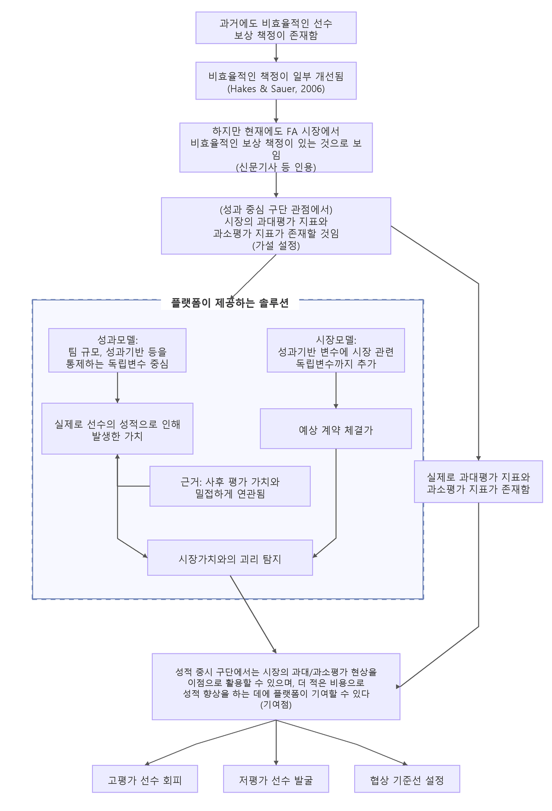
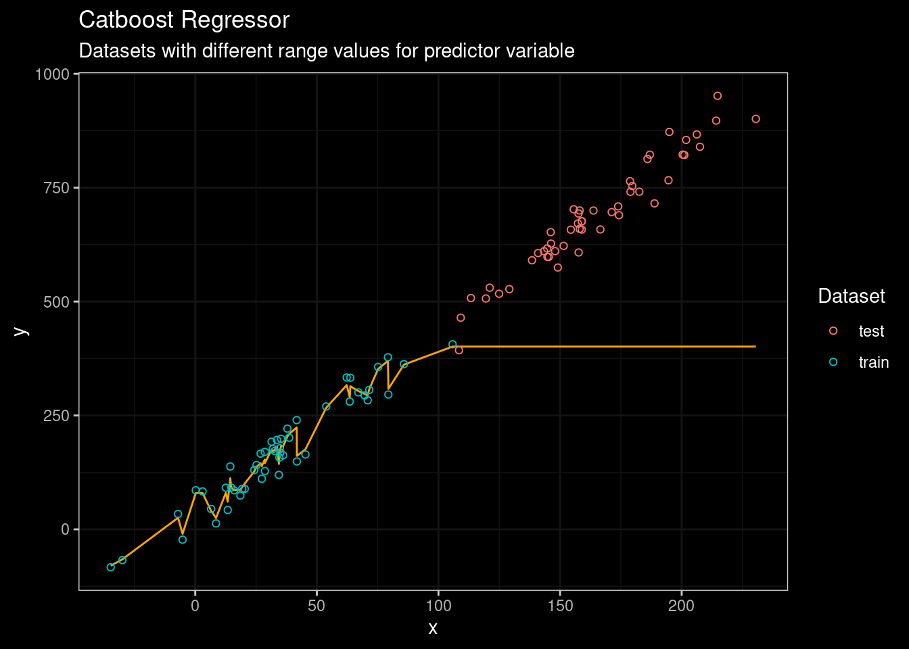
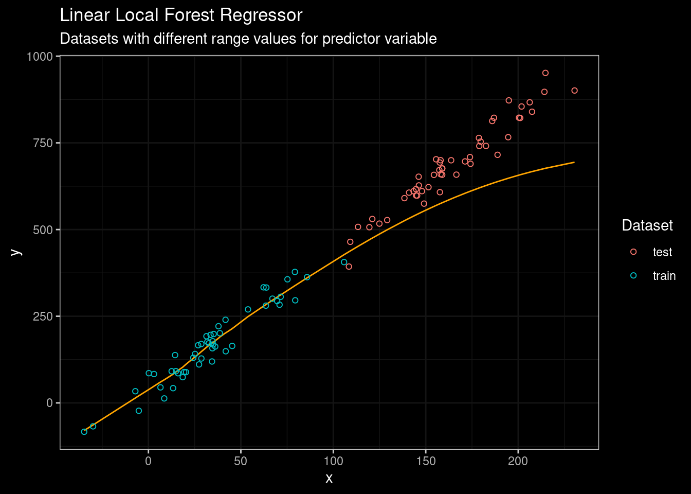
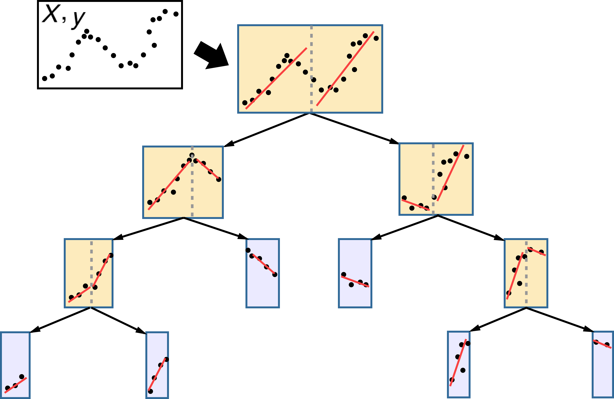
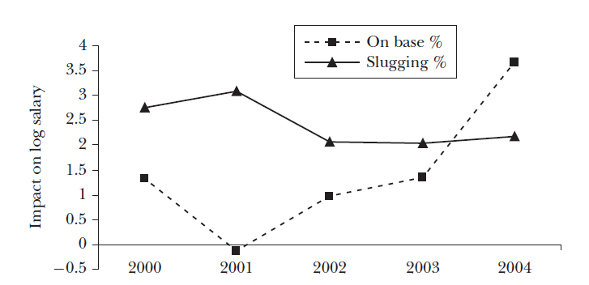
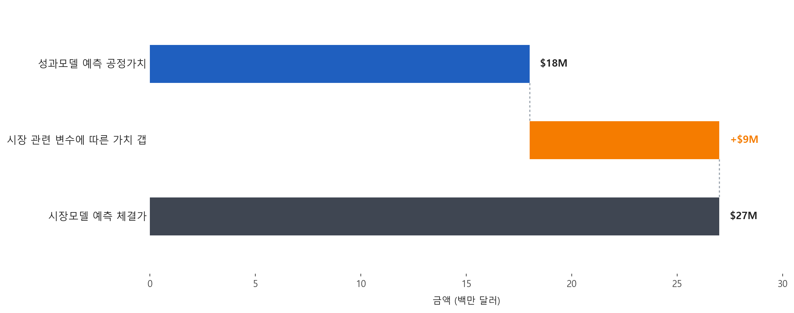

# 성과모델과 시장모델의 결합 아이디어

## 1. 문제정의

성적 중심 구단에서 시장에서 비효율적으로 평가된 선수들을 선별하여 비용 대비 고성과 선수들을 찾아내는 것.

우리가 지금까지는 팀의 매출 최대화에 관심이 있었는데, 성적이 부진한 팀에서는 사실 매출의 증대보다는 성적 증진이 더 중요할 수 있다. 구하기 힘든 팀의 매출 데이터에 집중할 바에는 차라리 성적 중시 구단은 팀의 성적 증진이 제1 목표라고 가정하고, 비용 대비 고성과 선수를 영입하는 것이 더 좋은 솔루션일 수 있다.

이때 두 모델의 역할은 다르다. 성과모델은 선수가 실제로 팀에 제공하는 가치를 잘 예측해야 하고, 시장모델은 선수가 시장에서 얼마에 계약될지를 잘 예측해야 한다. 사후 평가가 필요한 이유도 여기에 있다. 성과모델의 예측 가치가 시장모델보다 사후 평가 가치와 더 밀접하게 연관되어 있다면, 성과모델은 영입해야 할 선수와 피해야 할 선수를 식별하는 데 더 신뢰할 수 있는 도구라는 근거가 된다. 반대로 시장모델이 계약가치를 더 잘 예측한다면, 이는 FA 시장에서 필요한 가격 기준선을 제공하는 역할을 맡는다. 그래야 시장의 비효율적인 현상을 최대로 활용(exploit)할 수 있다.

### 프로젝트 논리 도식

## 2. 성과모델과 시장모델의 비교

이 비교는 성과모델을 기준선으로 두고, 시장모델이 여기에 시장 관련 독립변수를 추가한 확장형이라는 점에서 일종의 ablation study처럼 해석할 수 있다.

| 항목 | 성과모델 (Performance Model) | 시장모델 (Market Model) |
| --- | :---: | :---: |
| 성과 기반 독립변수 | O | O |
| 팀 관련 변수 | O | O |
| 시장 관련 변수 | | O |

*현재는 피처 그룹을 성과+팀 관련 변수 vs 성과+팀 관련 변수+α 등으로 구분했는데, 특히 시장모델에 들어가는 피처 그룹을 더 세분화하여 모델을 하나 더 만들 수 있다.*

Barnes & Bjarnadóttir (2016) 기준으로 보면, 여기서 말하는 팀 관련 변수는 다음과 같이 범주화할 수 있다.

| 팀 관련 변수 범주 | 세부 변수 예시 |
| --- | --- |
| 팀 규모 대리 변수 | 팀 전체 연봉 총액 (Team Payroll), 팀 관중 수 (Team Attendance) |
| 재계약 여부 | 기존 구단과의 재계약 여부 (Players re-signed by current teams) |
| 팀 성적 및 경기 데이터 | 승패 기록 (Win-loss record), 득점 및 실점 (Runs scored and allowed), 포스트시즌 결과 (Playoff results) |

### 모델 선택 원칙: 외삽 가능성

성과모델과 시장모델은 모두 과거 데이터를 바탕으로 미래의 금액 값을 예측한다는 점에서, 훈련 데이터의 최고 연봉 근처에서 예측이 멈추는 모델은 실제 활용에 한계가 있다. 특히 최근 시즌을 예측할 때는 훈련 데이터에 없던 규모의 초대형 계약이 등장할 수 있으므로, 두 모델 모두 훈련 구간 밖에서도 값이 뻗어 나갈 수 있는 외삽 가능성을 갖춰야 한다. 따라서 앞으로는 단순히 테스트 성능이 좋은 모델을 고르는 데서 멈추지 않고, 지금까지 우선적으로 보았던 CatBoost 같은 비선형 모델도 포함해 외삽 가능성을 함께 만족하는지 기준으로 다시 실험할 필요가 있다.

  
  

- `CatBoost`는 관측 데이터 밖에서는 상수로 예측
- `Linear Local Forest`는 관측 공간 끝단의 추세를 연장하여 일정 구간 동안은 추세를 유지함

## 3. 성과모델 (Performance Model): 공정 가치를 계산하는 레이어

성과모델은 선수의 최근 성적과 미래 기여도를 바탕으로, 해당 선수가 평균적인 시장 환경에서 어느 정도 가치를 가져야 하는지를 추정하는 모델이다. 선수의 실력과 생산성을 기준으로 **공정 가치 (Fair Value)** 를 계산하는 데 있다.

성과모델은 WAR, 출전 규모, 포지션, 나이, 최근 몇 년간의 추세 같은 성과 중심 데이터를 입력으로 사용한다.

`predicted_fair_value = 성과모델이 추정한 공정 가치`

성적 증진을 목표로 하는 구단은 선수가 실제로 팀에 제공할 값어치를 산정할 수 있어야 한다. 구단 입장에서 성과모델의 예측값은 내부 기준선 역할을 한다. 특정 선수가 실제로 얼마에 계약될지와 별개로, 우리 모델이 보기에 이 선수의 성적 수준이 정당화하는 금액이 얼마인지를 먼저 확보하는 것이다.

성적 기반 모델이 필요한 이유도 여기에 있다. 시장 가격만으로 선수를 평가하면 이미 시장이 반영한 편향과 프리미엄을 그대로 받아들이게 된다. 반면 성과모델은 경기장에서 만들어진 생산성과 승리 기여도를 기준으로 가치를 다시 세우기 때문에, 시장이 놓치고 있는 부분을 식별하는 출발점이 된다.

성과모델의 타당성은 사후 평가 데이터셋에서 확인할 수 있다. Barnes and Bjarnadóttir (2016)는 예측된 초과가치 `pSV`와 실제 성과 평가 기반 초과가치 `SV`를 비교하고, 두 값의 부호가 일치하는 계약 비율을 **일관성 (consistency, ξ)** 으로 정의한다. 논문에서는 성과모델이 시장모델보다 `pSV`와 `SV`의 상관이 더 높고 `consistency`도 더 높게 나타났다고 설명한다. 즉 성과모델은 시장가치 모델보다 실제가치를 더 일관되게 예측했으며, 이는 영입 및 회피 대상을 식별하는 데 더 신뢰할 수 있는 도구임을 뒷받침한다.

## 4. 시장모델 (Market Model): 예상 체결가를 계산하는 레이어

시장모델은 실제 FA 시장에서 계약이 어느 수준에서 체결될지를 예측하는 모델이다. 성과모델이 실력 중심의 기준가격을 만든다면, 시장모델은 현실 시장에서의 체결가격을 보여 준다.

성적 증진을 목표로 하는 구단도 선수의 내부 가치를 아는 것만으로는 충분하지 않다. 실제 시장에서 해당 선수가 얼마에 거래되어야 할지 가늠할 수 있는 수치가 있어야 협상 상한선, 영입 우선순위, 회피 여부를 판단할 수 있다. 이를 위해 시장모델이 필요하다.

따라서 시장모델의 성능은 실제 성과가 아니라 계약가치 예측에서 평가하는 것이 자연스럽다. 사후 평가에서는 성과모델이 실제가치를 더 잘 예측해야 하지만, 계약 데이터에서는 시장모델이 성과모델보다 계약가치를 더 잘 예측해야 한다.

우리 프로젝트는 이 모델을 통해 현재 시장에서 과대평가되고 있는 지표와 과소평가되고 있는 지표를 찾아낼 필요가 있다. 어떤 성적 지표가 실제 승리 기여도보다 과도한 프리미엄을 받고 있는지, 반대로 어떤 지표가 선수의 가치에 비해 충분히 반영되지 않는지를 보여줘야 GM 관점의 활용성이 커진다.

과대평가 지표와 과소평가 지표는 한 시점의 표로만 보여주는 것보다, 시계열 변화로 함께 제시하는 편이 더 설득력이 있다. 특정 지표가 어느 시기에는 저평가되다가 이후 시장에 반영되는지, 반대로 한동안 과도한 프리미엄을 받다가 조정되는지를 보여주면 시장 효율화가 얼마나 진행됐는지 설명하기 쉬워진다.

## 5. 두 모델의 결합: 가치 갭 해석

두 모델을 결합하면 선수마다 **가치 갭 (Value Gap)** 을 계산할 수 있다. 이 값은 시장이 책정할 가격과 성과 기반 공정 가치의 차이를 의미한다.

`value_gap = predicted_market_price - predicted_fair_value`

- `value_gap > 0`: 시장에서 더 비싸게 팔릴 가능성이 큰 선수
- `value_gap < 0`: 실력 대비 싸게 살 가능성이 있는 선수

이 차이는 구단이 단순히 "좋은 선수"를 찾는 데서 멈추지 않고, "좋은 가격에 영입 가능한 선수", 더 나아가 시장이 충분히 주목하지 않는 선수를 찾도록 만들어 준다.

플랫폼은 여기서 성과모델의 결괏값과 시장모델의 결괏값을 함께 제시한다. 의사결정자는 두 값을 나란히 비교하면서, 예상 시장 체결가보다 더 싸게 데려올 수 있는 선수를 우선적으로 탐색할 수 있다.

### 플랫폼 제시 예시: Horizontal Waterfall Chart

위와 같이 성과모델의 예측값과 시장모델의 예측값을 함께 보여 주고, 그 사이의 차이를 시장 관련 변수에 따른 가치 갭 bar 하나로 제시하면, 의사결정자가 두 모델의 차이를 훨씬 직관적으로 해석할 수 있다.

## 6. 구단 활용 방식: 회피 대상과 공략 대상을 구분

구단은 두 값의 차이를 이용해 세 가지 방식으로 의사결정을 개선할 수 있다.

| 활용 목적 | 해석 방식 | 구단 행동 |
| --- | --- | --- |
| 고평가 선수 회피 | 시장모델 값이 성과모델 값보다 크게 높음 | 시장 프리미엄이 과도하면 영입 경쟁을 피하거나 상한선을 낮춤 |
| 저평가 선수 발굴 | 성과모델 값이 시장모델 값보다 높음 | 실력 대비 싸게 살 수 있는 후보로 우선 검토함 |
| 협상 기준선 설정 | 두 값의 차이가 작음 | 내부 적정선과 시장 가격이 비슷하므로 합리적 협상 범위를 설정함 |

발표나 보고서에서는 이 지점에서 한 단계 더 나아가야 한다. 단순히 가치 갭이 있다는 사실만 말하는 것이 아니라, 실제 사례와 지표 해석을 함께 보여줘야 한다. 최근 FA 계약 사례 중 `value_gap`이 크게 양수인 선수와 크게 음수인 선수를 각각 제시하고, 그 차이를 만든 핵심 지표가 무엇인지 설명해야 한다. 그렇게 해야 "시장이 놓친 선수"가 추상적인 표현이 아니라 실제 영입 후보로 읽힌다.
