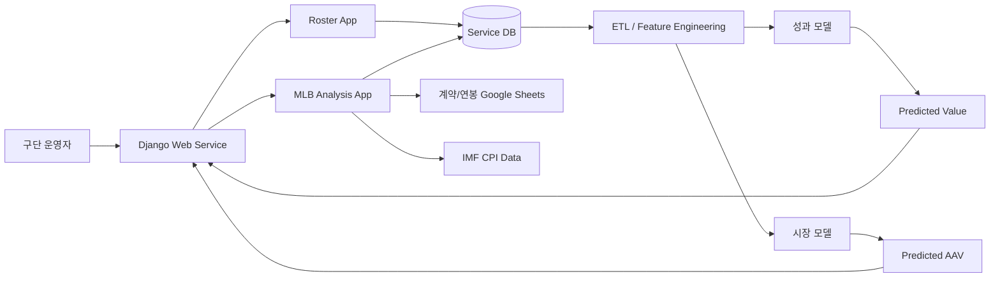

# 구단 의사결정 지원 플랫폼 제안서

## 1. 배경 및 필요성

프로야구 구단의 선수 영입, 재계약, 방출 의사결정은 높은 비용이 수반되지만, 실제 현장에서는 여전히 과거 성적의 단순 비교, 직관적 판단, 시장 분위기에 의존하는 경우가 많다. 특히 자유계약선수(FA)의 경우 현재 성적이 좋아 보여도 향후 성과 하락 가능성, 포지션별 희소성, 시장 인플레이션, 팀 상황에 따라 실제 적정 계약 가치는 크게 달라질 수 있다. 계약 당시 언론이나 시장에서 “적정가 영입”으로 평가되더라도, 사후 실제 성과가 계약비용을 정당화하지 못하면 구단 관점에서는 실패 영입이 될 수 있다.

본 프로젝트는 이러한 문제를 해결하기 위해, 선수의 미래 경기력과 시장 계약가치를 분리하여 추정하고 이를 하나의 화면에서 비교할 수 있는 데이터 기반 구단 의사결정 지원 플랫폼을 제안한다. 제안 시스템은 MLB 선수 시즌 기록, 계약 정보, 연봉 정보, 물가 보정 데이터 등을 통합하여 단장이 보다 합리적으로 선수 가치를 평가하고 계약 전략을 수립할 수 있도록 지원하는 것을 목표로 한다.

기존 단순 로스터 관리 도구와 달리 본 시스템은 현재 성적이 좋은 선수를 보여주는 데 그치지 않고, 향후 기여 가능성, 시장에서 형성될 계약 규모, 우리 팀 기준의 과대지불 또는 과소지불 가능성까지 함께 해석할 수 있도록 정보를 제공한다는 점에서 필요성이 크다.

## 2. 문제 정의

현재 구단 의사결정 과정에는 세 가지 핵심 문제가 존재한다. 첫째, 선수의 미래 성과와 실제 시장 계약가격이 명확히 분리되어 해석되지 않는다. 둘째, FA 계약 당시 기대수익률과 계약 이후 실제 순수입을 함께 비교하는 체계가 부족하다. 셋째, 선수 영입 및 재계약 판단을 지원하는 정량적 근거가 부족해 계약 리스크를 객관적으로 설명하기 어렵다.

본 프로젝트가 해결하고자 하는 문제는 다음과 같다.

- 선수의 과거 기록만으로는 미래 성과를 신뢰성 있게 판단하기 어렵다. 특히 WAR는 실력 지표뿐 아니라 실제 출전 기회에 크게 좌우되므로, 투수의 예상 이닝(IP)과 타자의 예상 타석(PA)을 반영해야 부상·보직 변화·주전/백업 전환에 따른 성과 변화를 설명할 수 있다.
- 시장 계약금액은 선수 실력 외에도 나이, 포지션, 연봉 이력, 팀 재정 상황, 물가 변동 등 다양한 요인의 영향을 받는다.
- 구단은 선수의 내재 성과가치와 시장가격뿐 아니라, 계약 당시 기대수익률 대비 사후 실제 순수입까지 비교해야 하지만 이를 통합적으로 보여주는 시스템이 부족하다.
- 실제 운영 환경에서는 검색, 상세 분석, 비교, 시뮬레이션, 로스터 반영이 하나의 흐름으로 이어져야 하나 현재는 기능이 분절되어 있다.

따라서 본 시스템은 FA 계약 선수를 핵심 표본으로 두고, 선수의 미래 WAR 및 핵심 성적 지표를 예측하는 성과 모델과 예상 계약 AAV를 추정하는 시장 모델을 분리 설계한다. WAR 예측 모델은 `SCHEDULE.md`의 출전 횟수 반영 개선 방향과 동일하게 투수 `projected_IP`, 타자 `projected_PA`를 주요 변수로 관리한다. 이후 `expected_roi`, `actual_net_income`, `actual_roi`를 계산해 어떤 FA 영입이 성공적이었는지, 적정가처럼 보였던 계약에서 시장 실패가 발생했는지 평가한다.

## 3. 개발 목표 및 요구사항 분석

### 3.1 개발 목표

본 시스템의 최종 목표는 구단 운영자가 선수의 성과가치와 시장가치를 동시에 검토하여 영입, 유지, 방출 여부를 판단할 수 있는 웹 기반 의사결정 지원 플랫폼을 개발하는 것이다. 최종 산출물은 Django 기반 웹 서비스, 선수/계약/연봉 데이터베이스, 예측 모델 결과를 제공하는 분석 모듈, 상위 수준 시스템 구성도 및 프로젝트 산출 문서로 구성된다.

구체적으로는 다음 기능을 제공하는 것을 목표로 한다.

- 선수 검색 및 상세 조회
- 시즌별 기록과 미래 성적 예측 제공
- WAR 기반 성과가치(`predicted_value`) 산출
- 시장 계약가치(`predicted_aav`) 예측
- 현재 계약 대비 가치 차이 해석
- 로스터 관리 및 계약 의사결정 시뮬레이션

### 3.2 기능적 요구사항

- 구단 운영자는 로스터에 선수를 등록, 수정, 방출 상태로 관리할 수 있어야 한다.
- 사용자는 선수 이름, 팀, 포지션 기준으로 MLB 선수를 검색할 수 있어야 한다.
- 시스템은 선수 상세 화면에서 시즌별 기록, 주요 지표 추이, 미래 성적 예측, 유사 선수 정보를 제공해야 한다.
- 시스템은 계약 데이터와 연봉 데이터를 업로드하여 정규화 저장할 수 있어야 한다.
- 시스템은 선수의 미래 WAR 예측값을 기반으로 성과가치를 계산할 수 있어야 한다.
- 시스템은 과거 계약/연봉/시장 정보를 바탕으로 예상 AAV를 계산할 수 있어야 한다.
- 시스템은 `predicted_value`와 `predicted_aav`를 비교하여 계약 판단 보조 지표를 제공해야 한다.
- 사용자는 일부 지표를 조정하여 시뮬레이션 결과 변화를 확인할 수 있어야 한다.

### 3.3 비기능적 요구사항

- 데이터 정합성: 외부 API, 계약 시트, 연봉 시트 등 서로 다른 출처의 데이터를 동일 스키마로 관리할 수 있어야 한다.
- 성능: 선수 상세 조회는 평균 2초 이내에 응답해야 하며, 사용자가 주요 스탯을 조정하여 수행하는 시뮬레이션은 5초 이내에 결과가 반영되어야 한다. 또한 정상 사용 시 동시 사용자 20명, 최대 동시 사용자 30명 수준에서도 조회 및 시뮬레이션 요청을 안정적으로 처리할 수 있어야 한다.
- 안정성: 데이터 업로드, 외부 API 호출, 예측 결과 제공 과정에서 오류가 발생하더라도 캐시 데이터나 기본값을 활용하는 fallback 로직을 통해 핵심 기능을 지속적으로 제공할 수 있어야 한다.
- 유지보수성: 데이터 수집, 전처리, 예측, 시각화 기능은 모듈별로 분리되어야 하며, 모델 교체나 기능 확장이 기존 시스템에 미치는 영향을 최소화할 수 있어야 한다.

## 4. 시스템 아키텍처 개요 및 평가 기준

### 4.1 시스템 아키텍처 개요

본 시스템은 웹 서비스 계층, 데이터 저장 계층, 데이터 수집/정제 계층, 예측 모델 계층으로 구성된다. 사용자는 Django 웹 애플리케이션에서 로스터 관리와 선수 분석 기능을 사용하며, 시스템은 외부 데이터 소스와 내부 DB를 연계해 예측 결과를 제공한다.

상위 수준 동작 흐름은 다음과 같다. 외부 데이터와 사용자 업로드 데이터를 DB에 정규화 저장한 뒤, ETL 과정을 통해 학습 및 추론용 피처를 생성한다. 성과 모델은 다음 시즌 WAR와 주요 성적을 예측하고, 시장 모델은 계약 및 연봉 맥락을 포함해 예상 AAV를 산출한다. 이후 두 결과를 상세 화면과 시뮬레이션 화면에 제공하여 실제 계약 판단을 지원한다.

### 4.2 평가 기준

본 프로젝트의 목표 달성 여부는 정량적 지표와 정성적 지표를 함께 사용해 평가한다.

정량적 성능지표는 다음과 같이 설정한다.

- 성과 모델: WAR 및 주요 지표 예측에서 `RMSE`, `MAPE`, `R²`를 산출한다.
- 시장 모델: `real_aav` 예측에 대해 `RMSE`, `MAPE`, `R²`를 측정한다.
- 서비스 성능: 선수 상세 조회 평균 응답시간, 시뮬레이션 5초 이내 완료율, 동시 사용자 20명 및 최대 30명 환경에서의 안정 동작 여부, 데이터 업로드 처리 성공률을 측정한다.
- 데이터 품질: 결측치 처리율, 스키마 검증 통과율, CPI 보정 적용률을 측정한다.

정성적 성능지표는 다음과 같이 설정한다.

- 사용자가 선수 가치와 시장가치를 쉽게 비교할 수 있는가
- 예측 결과에 대한 설명 가능성이 확보되는가
- 잔차가 큰 사례를 찾아 오차 원인 가설을 세우고, 이를 반영한 모델 개선 전후 결과를 설명할 수 있는가
- 로스터 의사결정 흐름이 검색-분석-비교-판단으로 자연스럽게 이어지는가
- 시뮬레이션 결과가 실제 의사결정 논의에 활용 가능한 수준인가

최종적으로 다음 조건을 만족하면 목표를 달성한 것으로 판단한다.

- 성과 모델과 시장 모델이 모두 동작하고 상세 페이지에 결과가 통합 표시될 것
- 계약 가치 비교 기능이 실제 영입/재계약 판단 근거로 활용 가능할 것
- 사용자 관점에서 핵심 기능이 오류 없이 시연 가능할 것
- 데이터 흐름과 시스템 구조가 이후 고도화 연구로 확장 가능할 것

## 5. 수행 계획

### 5.1 주차별 일정

프로젝트는 학사일정의 주요 마일스톤에 맞추어 총 16주 기준으로 수행한다. 특히 3월 20일 계획서 제출, 4월 17일 중간발표, 4월 24일 중간보고서 제출, 6월 5일 최종 시연 및 포스터 발표, 6월 19일 최종보고서 제출을 기준점으로 단계별 산출물을 준비한다.

| 주차 | 기간/마일스톤 | 수행 내용 | 산출물 |
|------|------|------|------|
| 1주차 | 3월 6일 - 주제 선정 및 팀 매칭 | 프로젝트 주제 확정, 팀 구성, 개발 방향 논의 | 주제안, 팀 구성안 |
| 2주차 | 3월 7일 ~ 3월 19일 | 요구사항 구체화, 데이터 소스 조사, 시스템 범위 및 역할 분담 확정 | 요구사항 초안, 일정표 |
| 3주차 | 3월 20일 - 프로젝트 계획서 제출 | 제안서 작성 및 아키텍처 초안 정리 | 프로젝트 계획서 |
| 4~5주차 | 3월 말 ~ 4월 초 | Django 기본 구조 정비, DB 스키마 설계, 로스터 기능 점검, 외부 데이터 연동 준비 | 앱 구조 초안, DB 모델 |
| 6주차 | 4월 둘째 주 | MLB 선수 데이터 수집 연동, 계약/연봉 데이터 정규화, ETL 파이프라인 1차 구축 | 데이터 적재 모듈, 전처리 코드 |
| 7주차 | 4월 17일 - 중간발표 | 시스템 진행 상황 정리, 시연용 프로토타입 준비, 중간발표 자료 제작 | 중간발표 자료, 프로토타입 |
| 8주차 | 4월 24일 - 중간보고서 제출 | 중간발표 피드백 반영, 성과 모델 및 시장 모델 1차 결과 정리 | 중간보고서 |
| 9~11주차 | 4월 말 ~ 5월 중순 | 성과 모델 고도화, 시장 모델 구현, 가치 비교 로직 개발 | WAR 예측 결과, AAV 예측 결과 |
| 12~13주차 | 5월 중순 ~ 5월 말 | 상세 화면, 차트, 시뮬레이션, 통합 테스트, 성능 개선 | 시연 가능 통합 버전 |
| 14주차 | 6월 5일 - 발표영상자료 / 창의설계경진대회 포스터 발표 및 시연회 | 발표 영상, 포스터, 시연 시나리오 및 최종 데모 준비 | 발표 영상, 포스터, 시연본 |
| 15주차 | 6월 초 ~ 6월 중순 | 결과 분석, 문서 보완, 최종보고서 작성 | 최종보고서 초안 |
| 16주차 | 6월 19일 - 최종보고서 제출 | 최종 산출물 제출 및 발표 후 보완사항 정리 | 최종보고서 |

### 5.2 역할 분담

| 이름 | 주요 역할 |
|------|------|
| 문준호 | 팀장, 백엔드 총괄, Django 구조 설계, DB 모델링, 전체 일정 및 산출물 관리 |
| 변준영 | 데이터 수집 및 정제, 선수 시즌 데이터 구조 정리, ETL 파이프라인 지원 |
| 이재욱 | 프런트엔드 구현, 화면 구성, 차트/시각화, 사용자 인터페이스 개선 |
| 이시윤 | 계약 가치 분석, 시장 데이터 조사, 평가 기준 정리, 발표 및 문서화 지원 |
| 조윤주 | 성과 예측 모델 및 시장 예측 모델 구현, 학습/평가 지표 도출 |

### 5.3 기대 효과

본 프로젝트가 완료되면 구단 운영자는 선수의 과거 성적 조회를 넘어 미래 성과가치와 시장계약가치를 동시에 비교할 수 있게 된다. 이는 선수 영입과 재계약 과정에서 과대지출 위험을 줄이고, 보다 설명 가능한 데이터 기반 의사결정을 가능하게 한다. 또한 본 시스템은 향후 유사 선수 추천, 장기 성과 분포 예측, 팀 상황 반영 가치 분석 등으로 확장 가능한 기반 플랫폼으로 활용될 수 있다.
